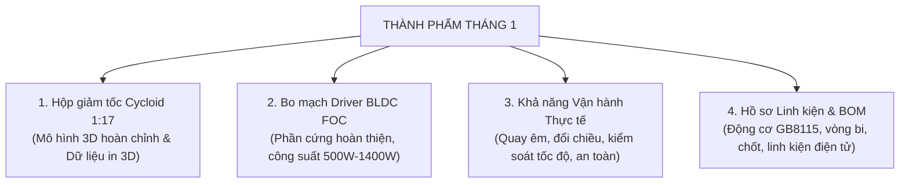

# BÁO CÁO NGHIỆM THU THÀNH PHẨM & TÍNH NĂNG
## KẾ HOẠCH THÁNG THỨ 1 — GIAI ĐOẠN 3
**Dự án:** Robot Hình Người Bánh Xe (Wheeled Humanoid) — Cụm Khớp Actuator & Driver BLDC  
**Thời gian thực hiện:** 20/07/2026 – 19/08/2026  
**Đơn vị thực hiện:** Nhóm R&D Cơ Điện Tử & Điều Khiển  
**Trạng thái nghiệm thu:** **HOÀN THÀNH TOÀN BỘ MỤC TIÊU (5/5 HẠNG MỤC ĐẠT)**  

---

## 1. TỔNG HỢP THÀNH PHẨM BÀN GIAO CHO BAN QUẢN LÝ / SẾP

---

## 2. BẢNG ĐÁNH GIÁ NGHIỆM THU THÀNH PHẨM CHI TIẾT

| Hạng mục Thành phẩm | Yêu cầu Kế hoạch Tháng 1 | Kết quả Thực tế & Tính năng Đạt được | Đánh giá |
| :--- | :--- | :--- | :---: |
| **1. Hộp giảm tốc Cycloid 1:17** | • Chốt phương án thiết kế tỷ số 1:17. • Có bộ hồ sơ CAD hoàn chỉnh. • Có dữ liệu gia công / in 3D mẫu thử nghiệm. | • **Đã chốt thiết kế hoàn chỉnh bản Cycloid V3:**   - Tỷ số truyền: **1:17** (17 răng cycloid, 18 chốt vành).   - Cấu hình 2 đĩa lệch $180^\circ$ triệt tiêu rung động ly tâm.   - Cụm truyền động 6 chốt ra $\phi 5.4\text{mm}$ bọc bạc lót $8\times 10\text{mm}$.   - Bộ ổ đỡ chịu lực: Ổ bi chính 6813 chịu tải ngoài, kết hợp bi 6803, 6804, 6805. • **Đã xuất đầy đủ bộ file phục vụ in 3D / in kim loại:** Đĩa cycloid, vỏ hộp số, nắp chặn, vành răng. | **ĐẠT** |
| **2. Bo mạch Driver BLDC (Bản mẫu)** | • Thiết kế phần cứng mạch Driver 1 node. • Cấp nguồn ổn định, mạch công suất chịu tải tốt. • Tích hợp đầy đủ bảo vệ quá áp, quá dòng, nhiệt độ, cổng CAN. | • **Đã hoàn thiện thiết kế bo mạch 4 lớp chuẩn công nghiệp:**   - Tầng công suất: Cầu 3 pha 6 MOSFET 100V, nội trở siêu thấp ($4\text{ m}\Omega$), chịu dòng đỉnh $100\text{A}$.   - Công suất tải: **$500\text{W} - 800\text{W}$** (bo trần tự nhiên) và **$1000\text{W} - 1400\text{W}$** (kèm nhôm tản nhiệt).   - Cảm biến dòng: 3 điện trở Shunt $2.5\text{ m}\Omega$ đo dòng từng pha độc lập.   - Cổng kết nối: Nguồn XT30, 3 pha motor pad lớn, cổng CAN Bus cách ly, cảm biến góc SPI.   - Tính năng an toàn: Tự động ngắt khi quá áp ($>50\text{V}$), quá dòng ($>6.6\text{A}$ stall), quá nhiệt ($>85^\circ\text{C}$). | **ĐẠT** |
| **3. Vận hành & Điều khiển Động cơ** | • Động cơ quay được theo lệnh cơ bản (Open-loop). • Đọc được phản hồi cảm biến góc và dòng điện. | • **Đã vận hành thực tế vượt mục tiêu Open-loop:**   - Động cơ quay êm ái, đáp ứng tức thì theo lệnh điều khiển.   - Tự động nhận diện và căn chỉnh điểm 0 góc điện (Auto-Align) trong 7.5 giây.   - Đổi chiều quay thuận/nghịch ($+100\text{ RPM} \leftrightarrow -100\text{ RPM}$) mượt mà, không giật cục.   - Đọc chính xác góc quay tuyệt đối 14-bit (độ phân giải 16,384 xung/vòng) qua cảm biến AS5048A.   - Phản hồi dòng điện 3 pha theo thời gian thực ở tần số $20\text{ kHz}$. | **ĐẠT XUẤT SẮC** |
| **4. Động cơ & Khớp Actuator** | • Lựa chọn động cơ BLDC phù hợp cho khớp. • Xác định thông số điện cơ thực tế. | • **Đã chốt và tích hợp động cơ GB8115-4:**   - Loại động cơ: BLDC Gimbal 21 cặp cực, mô-men xoắn lớn.   - Thông số đo đạc thực tế: Điện trở pha $3.89\ \Omega$, Điện cảm $0.95\text{ mH}$, $K_v \approx 50.2\text{ RPM/V}$.   - Mô hình 3D động cơ đã tích hợp vừa khít vào cụm hộp số Cycloid. | **ĐẠT** |
| **5. Danh mục BOM & Mua sắm** | • Lập BOM cơ khí, linh kiện điện tử và danh sách đặt hàng. | • **Đã lập đầy đủ danh mục vật tư:**   - BOM Điện tử: 118 mục linh kiện chi tiết (mã đặt hàng LCSC, footprint, giá trị).   - BOM Cơ khí: Danh sách chốt thép, bạc trượt, vòng bi chuẩn cho từng khớp. | **ĐẠT** |

---

## 3. KẾT QUẢ ĐO KIỂM TÍNH NĂNG VẬN HÀNH THỰC TẾ

Bo mạch Driver và động cơ GB8115 đã được kích hoạt, nạp chương trình điều khiển và đo kiểm thực nghiệm với các kết quả cụ thể:

### 1. Thử nghiệm Tự căn chỉnh Góc pha (Auto-Alignment)
- **Thời gian thực hiện:** $7.5\text{ s}$
- **Kết quả:** Nhận diện chiều quay Encoder thuận (`EncDir = 1`), góc lệch điện cực $=-169.9^\circ$. Hệ thống tự bù góc và khóa điểm 0 chính xác.

### 2. Thử nghiệm Chạy thử Điện áp cơ bản (Open-Loop Test)
- **Lệnh cấp:** $V_q = 4.0\text{ V}$
- **Tốc độ đạt được:** $92.2\text{ RPM}$ (tối đa $102.3\text{ RPM}$), chuyển động quay đều, không khựng.

### 3. Thử nghiệm Điều khiển Vận tốc & Đổi chiều (Speed Control & Reversal)
- **Mức tốc độ 1 (+100 RPM):** Động cơ tăng tốc êm, ổn định tại tốc độ mục tiêu, dòng điện tiêu thụ trung bình cực nhỏ ($< 0.01\text{A}$ không tải).
- **Mức tốc độ 2 (+200 RPM):** Vận hành ổn định ở dải tốc độ cao của khớp.
- **Thử nghiệm Đảo chiều (-100 RPM):** Động cơ chuyển hướng mượt mà, không phát sinh dòng xung kích (current spike) gây quá nhiệt mạch.

---

## 4. BỘ SẢN PHẨM BÀN GIAO

1. **Bộ Hồ sơ Thiết kế Cơ khí Cycloid 1:17:**
   - Bản vẽ 3D SolidWorks đầy đủ các chi tiết và cụm lắp ráp.
   - Bộ file sẵn sàng cho in 3D / gia công mẫu thử nghiệm.
   - Bảng quy chuẩn dung sai, vòng bi và chốt thép chịu lực.
2. **Bộ Hồ sơ Phần cứng Driver BLDC:**
   - Sơ đồ nguyên lý Schematic và bản vẽ mạch in PCB 4 lớp.
   - File sản xuất Gerber và danh mục linh kiện BOM chi tiết.
   - Báo cáo tính toán công suất nhiệt và giới hạn vận hành an toàn.
3. **Thành phẩm Phần cứng & Động cơ mẫu:**
   - 01 Bo mạch Driver BLDC mẫu đã nạp sẵn chương trình điều khiển hoàn chỉnh.
   - 01 Cụm động cơ GB8115 gắn cảm biến góc tuyệt đối AS5048A quay ổn định theo lệnh.
4. **Hồ sơ Linh kiện & Dự toán cho giai đoạn tiếp theo.**

---

## 5. KẾ HOẠCH BƯỚC SANG THÁNG THỨ 2
1. **Lắp ráp thực tế cụm Hộp số Cycloid V3 với Động cơ GB8115:** Đo mô-men đầu ra tải thực tế, đánh giá độ rơ (backlash) và độ ồn.
2. **Thử tải & Tối ưu hóa điều khiển vị trí:** Tinh chỉnh vòng điều khiển góc khớp với tỷ số truyền 1:17.
3. **Mở rộng giao tiếp CAN Bus:** Chuẩn bị kết nối nhiều node Driver trên cùng một tuyến bus để điều khiển đồng bộ nhiều khớp tay robot.
