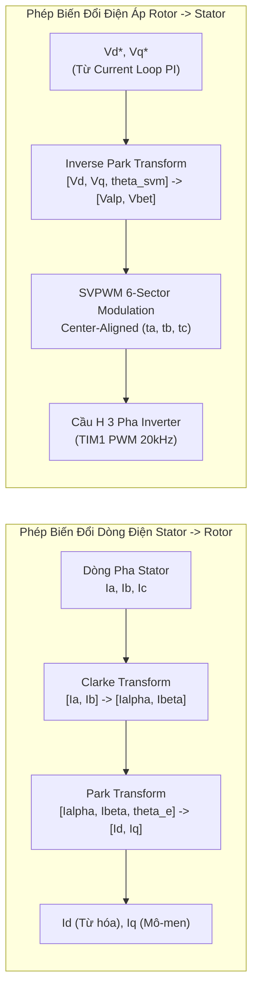

# ĐÍNH CHÍNH & CẨM NANG TOÁN HỌC ĐIỀU KHIỂN FOC ĐỘNG CƠ BLDC GIMBAL 21 CẶP CỰC (21 POLE PAIRS) TRONG ROBOT HUMANOID

> **Tài liệu Kỹ thuật Chuyên sâu & Chuẩn mực Điều khiển Chuyên gia (Expert-Verified)**  
> **Dự án**: Wheeled-Humanoid Robot — Khớp Chân & Khớp Bánh Xe  
> **Phần cứng**: Driver STM32G4 FOC + DRV8353 + AS5048A (SPI) + BLDC Gimbal GB8115-4 (21 Pole Pairs) + Hộp số Cycloid 1:17  
> **Tác giả**: Đội ngũ Nghiên cứu & Phát triển Điều khiển Robot Wheeled-Humanoid  

---

## MỤC LỤC
1. [Tổng Quan & Đính Chính Bản Chất Vật Lý Vùng Lặp Điều Khiển](#1-tổng-quan--đính-chính-bản-chất-vật-lý-vùng-lặp-điều-khiển)
   - [1.1. Bối Cảnh & Đánh Giá Phương Pháp Voltage-Mode FOC](#11-bối-cảnh--đánh-giá-phương-pháp-voltage-mode-foc)
   - [1.2. So Sánh Bản Chất: Voltage-Mode FOC vs. Cascaded Closed-Loop FOC](#12-so-sánh-bản-chất-voltage-mode-foc-vs-cascaded-closed-loop-foc)
2. [Cơ Sở Toán Học & Toàn Bộ Thuật Toán Biến Đổi FOC](#2-cơ-sở-toán-học--toàn-bộ-thuật-toán-biến-đổi-foc)
   - [2.1. Không Gian Tọa Độ & Các Phép Biến Đổi Clarke / Park](#21-không-gian-tọa-độ--các-phép-biến-đổi-clarke--park)
   - [2.2. Điều Chế Vector Không Gian (SVPWM 6-Sector)](#22-điều-chế-vector-không-gian-svpwm-6-sector)
   - [2.3. Hiệu Chuẩn Góc Điện & Bù Sóng Hài Encoder (128-point LUT)](#23-hiệu-chuẩn-góc-điện--bù-sóng-hài-encoder-128-point-lut)
3. [Mô Hình Động Lực Học & Đòn Bẩy Sai Số Góc Điện 21 Cặp Cực](#3-mô-hình-động-lực-học--đòn-bẩy-sai-số-góc-điện-21-cặp-cực)
   - [3.1. Phương Trình Vi Phân Động Cơ BLDC trong Hệ Tọa Độ d-q](#31-phương-trình-vi-phân-động-cơ-bldc-trong-hệ-tọa-độ-d-q)
   - [3.2. Cơ Chế Tự Cân Bằng Back-EMF và Giới Hạn Dưới Tải Động Biến Thiên](#32-cơ-chế-tự-cân-bằng-back-emf-và-giới-hạn-dưới-tải-động-biến-thiên)
4. [Phân Tích Toán Học & Lọc Nhiễu Lượng Tử Hóa Cho Động Cơ 21 Cặp Cực](#4-phân-tích-toán-học--lọc-nhiễu-lượng-tử-hóa-cho-động-cơ-21-cặp-cực)
   - [4.1. Cơ Chế Tăng Băng Nhiễu Lượng Tử Hóa Khi Sai Phân Thô](#41-cơ-chế-tăng-băng-nhiễu-lượng-tử-hóa-khi-sai-phân-thô)
   - [4.2. Mạch Bám Pha PLL Tracking Filter Bậc 2 (20 kHz Fast ISR)](#42-mạch-bám-pha-pll-tracking-filter-bậc-2-20-khz-fast-isr)
   - [4.3. Bù Pha Trễ Phần Cứng 1.5 Ts Trong Inverse Park (Phase Advance)](#43-bù-pha-trễ-phần-cứng-15-ts-trong-inverse-park-phase-advance)
5. [Thiết Kế Vòng Lặp Dòng Điện Nhanh 20 kHz & Cấu Hình DRV8353](#5-thiết-kế-vòng-lặp-dòng-điện-nhanh-20-khz--cấu-hình-drv8353)
   - [5.1. Lấy Mẫu ADC Tại Đáy PWM (TIM_COUNTER_ZERO) & Giới Hạn Max Duty](#51-lấy-mẫu-adc-tại-đáy-pwm-tim_counter_zero--giới-hạn-max-duty)
   - [5.2. Tính Toán Gain CSA DRV8353 & Đặt Cực Vòng Dòng (Pole Placement)](#52-tính-toán-gain-csa-drv8353--đặt-cực-vòng-dòng-pole-placement)
   - [5.3. Thuật Toán Anti-Windup & Bão Hòa Điện Áp (Back-Calculation)](#53-thuật-toán-anti-windup--bão-hòa-điện-áp-back-calculation)
6. [Mô Hình Bù Ma Sát Hộp Số Cycloid 1:17 & Anti-Cogging](#6-mô-hình-bù-ma-sát-hộp-số-cycloid-117--anti-cogging)
   - [6.1. Bù Ma Sát Tĩnh & Cản Nhớt Bằng Hàm Tanh Mượt Qua Điểm 0](#61-bù-ma-sát-tĩnh--cản-nhớt-bằng-hàm-tanh-mượt-qua-điểm-0)
   - [6.2. Hiệu Chuẩn Tự Động & Lọc Sóng Hài Anti-Cogging LUT (512 Điểm)](#62-hiệu-chuẩn-tự-động--lọc-sóng-hài-anti-cogging-lut-512-điểm)
7. [Kiến Trúc Điều Khiển Vị Trí Khớp Chân Robot (MIT Impedance PD)](#7-kiến-trúc-điều-khiển-vị-trí-khớp-chân-robot-mit-impedance-pd)
8. [Ma Trận Thông Số Vàng Chuẩn Chuyên Gia (Expert Golden Parameters Matrix)](#8-ma-trận-thông-số-vàng-chuẩn-chuyên-gia-expert-golden-parameters-matrix)
9. [Lộ Trình Triển Khai Firmware STM32G4 Hoàn Chỉnh](#9-lộ-trình-triển-khai-firmware-stm32g4-hoàn-chỉnh)

---

## 1. TỔNG QUAN & ĐÍNH CHÍNH BẢN CHẤT VẬT LÝ VÙNG LẶP ĐIỀU KHIỂN

### 1.1. Bối Cảnh & Đánh Giá Phương Pháp Voltage-Mode FOC
Trong thiết kế hệ thống truyền động cho khớp chân và bánh xe của robot Wheeled-Humanoid, việc điều khiển động cơ BLDC Gimbal có số cặp cực cao (như dòng **GB8115-4 với 21 cặp cực**) đòi hỏi sự chính xác tuyệt đối ở các vòng lặp điều khiển FOC (Field-Oriented Control).

Tài liệu kỹ thuật tiền đề từng đề xuất phương pháp loại bỏ hoàn toàn vòng lặp dòng điện (Current Loop), gỡ bỏ khâu tích phân ($I$-term) và vi phân ($D$-term) trong vòng lặp tốc độ, chỉ sử dụng điều khiển điện áp trực tiếp (**Voltage-Mode FOC**) kết hợp thuật toán *"Adaptive Startup Boost"* và dựa vào đặc tính tự cân bằng của sức điện động ngược (Back-EMF).

> [!IMPORTANT]
> **ĐÍNH CHÍNH BẢN CHẤT KỸ THUẬT:**
> Phân tích sâu dưới góc độ lý thuyết điều khiển tự động và thực tiễn kỹ thuật chuyên sâu cho thấy phương pháp **Voltage-Mode FOC thực chất là một giải pháp tình thế** nhằm dập tắt dao động khi chưa giải quyết được triệt để vấn đề nhiễu cảm biến, chứ **chưa phải là chuẩn mực của các chuyên gia điều khiển động cơ servo robot**.
>
> Điểm cốt lõi nằm ở bản chất phản ứng động lực học của hệ thống dưới tải biến thiên:
> - Mặc dù hệ số cản dịu tự nhiên từ Back-EMF $B_{bemf} = \frac{3}{2} PP^2 \frac{\lambda_m^2}{R}$ được phóng đại lên $21^2 = 441$ lần ở trạng thái xác lập, chế độ điều khiển điện áp thuần túy (Voltage Mode) biến động cơ thành một **hệ hở về mặt mô-men xoắn (Open-loop torque)**.
> - Khi robot chịu tải trọng động biến thiên liên tục (như phản lực từ mặt đường lên khớp bánh xe), phương pháp này không thể đáp ứng được khả năng **triệt tiêu nhiễu tải (Load Disturbance Rejection)** và nguy cơ quá dòng sinh nhiệt vẫn tồn tại khi điện trở cuộn dây $R$ tăng theo nhiệt độ.

---

### 1.2. So Sánh Bản Chất: Voltage-Mode FOC vs. Cascaded Closed-Loop FOC

```
SƠ ĐỒ SO SÁNH KIẾN TRÚC ĐIỀU KHIỂN:

1. Chế độ Điện Áp Trực Tiếp (Voltage-Mode FOC - Giải pháp tình thế):
Target RPM ---> [Speed PI / Adaptive] ===> Vq Command ---> [Inv Park / SVPWM] ---> Inverter
                (Không có vòng dòng)      (Không kiểm soát được dòng điện thực tế)

2. Chế độ Điều Khiển Tầng Chuẩn Chuyên Gia (Cascaded Closed-Loop FOC):
Pos Target ---> [Position Loop (MIT Impedance PD)] 
                     |
                 Vel Target
                     |
                     v
             [Velocity Loop + 2nd-order PLL] + [Friction (tanh) & Cogging Feedforward]
                     |
                  Iq_cmd (Lệnh dòng sinh mô-men chính xác)
                     |
                     v
          +--> [Fast Current PI (20kHz Fast ISR)] ===> Vd*, Vq* ---> [Inv Park / SVPWM] ---> Inverter
          |    (Đo dòng Low-side Shunt Ia, Ib tại TIM_COUNTER_ZERO)
          +--- Phản hồi dòng Id, Iq thực tế
```

| Tiêu Chí So Sánh | Phương Pháp Điện Áp Trực Tiếp (Voltage-Mode FOC) | Phương Pháp Điều Khiển Tầng Chuẩn Chuyên Gia (Cascaded Closed-Loop FOC) |
|:---|:---|:---|
| **Bản chất điều khiển** | Áp đặt vector điện áp $V_q$, coi dòng điện $I_q$ là biến phụ thuộc tự do. | Điều khiển trực tiếp dòng điện sinh mô-men $I_q$ và dòng từ hóa $I_d = 0$. |
| **Khả năng bám mô-men** | Suy giảm khi cuộn dây bị nóng làm tăng điện trở $R$ ($I_q = \frac{V_q - e}{R(T)}$). | Mô-men đầu ra tuyến tính với $I_q$ ($\tau_e = K_t I_q$), hoàn toàn không phụ thuộc nhiệt độ. |
| **Ứng xử khi va đập / tải nặng** | Dòng điện tăng tự do theo $I_q = \frac{V_q - e_{bemf}}{R}$, dễ vượt ngưỡng dòng nghẽn $I_{stall}$. | Vòng lặp dòng điện giới hạn chính xác dòng $I_q \le I_{max}$, bảo vệ công suất an toàn tuyệt đối. |
| **Xử lý nhiễu cảm biến** | Bỏ khâu $I/D$, hạ $K_p$ cực thấp để tránh hiện tượng Hunting. | Sử dụng bộ bám pha **2nd-order PLL (20 kHz)** để triệt tiêu nhiễu góc. |
| **Khả năng bù Ma sát & Cogging** | Khó áp dụng chính xác do không kiểm soát trực tiếp lực xoắn. | Rất dễ dàng bằng cách cộng trực tiếp mô-men bù vào dòng tham chiếu $I_{q\_cmd}$. |

---

## 2. CƠ SỞ TOÁN HỌC & TOÀN BỘ THUẬT TOÁN BIẾN ĐỔI FOC

### 2.1. Không Gian Tọa Độ & Các Phép Biến Đổi Clarke / Park



#### Phép Biến Đổi Clarke (3 Pha $\to$ 2 Pha Tĩnh $\alpha-\beta$):
Giả thiết hệ 3 pha đối xứng không có dây trung tính ($I_a + I_b + I_c = 0 \implies I_c = -I_a - I_b$):
$$\begin{bmatrix} I_\alpha \\ I_\beta \end{bmatrix} = \begin{bmatrix} 1 & 0 \\ \frac{1}{\sqrt{3}} & \frac{2}{\sqrt{3}} \end{bmatrix} \begin{bmatrix} I_a \\ I_b \end{bmatrix} \implies \begin{cases} I_\alpha = I_a \\ I_\beta = \frac{1}{\sqrt{3}} (I_a + 2 I_b) \end{cases}$$

#### Phép Biến Đổi Park (Tĩnh $\alpha-\beta \to$ Quay Đồng Bộ $d-q$):
Chiếu dòng điện stator lên hệ trục tọa độ quay cùng từ trường rotor theo góc điện $\theta_e$:
$$\begin{bmatrix} I_d \\ I_q \end{bmatrix} = \begin{bmatrix} \cos\theta_e & \sin\theta_e \\ -\sin\theta_e & \cos\theta_e \end{bmatrix} \begin{bmatrix} I_\alpha \\ I_\beta \end{bmatrix} \implies \begin{cases} I_d = I_\alpha \cos\theta_e + I_\beta \sin\theta_e \\ I_q = -I_\alpha \sin\theta_e + I_\beta \cos\theta_e \end{cases}$$

#### Phép Biến Đổi Inverse Park (Quay Đồng Bộ $d-q \to$ Tĩnh $\alpha-\beta$):
Áp đặt vector điện áp $[V_d^*, V_q^*]^T$ từ bộ điều khiển dòng điện trở lại hệ trục stator:
$$\begin{bmatrix} V_\alpha \\ V_\beta \end{bmatrix} = \begin{bmatrix} \cos\theta_{svm} & -\sin\theta_{svm} \\ \sin\theta_{svm} & \cos\theta_{svm} \end{bmatrix} \begin{bmatrix} V_d^* \\ V_q^* \end{bmatrix}$$

---

### 2.2. Điều Chế Vector Không Gian (SVPWM 6-Sector)
Điện áp xoay chiều cực đại không méo dạng trong chế độ điều chế vector không gian:
$$V_{max\_linear} = \frac{V_{bus}}{\sqrt{3}} \approx 0.577 \cdot V_{bus} \approx 13.86\,\text{V} \quad (\text{với } V_{bus} = 24.0\,\text{V})$$

Chuẩn hóa vector điều chế:
$$m_\alpha = \frac{V_\alpha}{V_{bus}}, \quad m_\beta = \frac{V_\beta}{V_{bus}}$$

6 Sector được xác định bằng thuật toán phân chia hình học phẳng:
- Tính các đại lượng hình chiếu: $U_1 = m_\beta$, $U_2 = \frac{\sqrt{3}}{2} m_\alpha - \frac{1}{2} m_\beta$, $U_3 = -\frac{\sqrt{3}}{2} m_\alpha - \frac{1}{2} m_\beta$.
- Tính thời gian dẫn $T_a, T_b, T_c$ và căn giữa đối xứng (Center-Aligned PWM) để triệt tiêu sóng hài chẵn và tối thiểu hóa dòng gợn (Current Ripple).

---

### 2.3. Hiệu Chuẩn Góc Điện & Bù Sóng Hài Encoder (128-point LUT)
Để khóa trục $d$ của rotor thẳng hàng với pha $A$ của stator, áp đặt vector điện áp tĩnh:
$$V_d = V_{align} \approx 4.5\,\text{V}, \quad V_q = 0, \quad \theta_{apply} = 0$$

Góc bù điện $\theta_0$ được tính bằng:
$$\theta_0 = \left( PP \cdot \text{encoder\_dir} \cdot \theta_{m\_raw} \right) \pmod{2\pi} = \left( 21 \cdot \text{dir} \cdot \theta_{m\_raw} \right) \pmod{2\pi}$$

Trong vận hành thời gian thực, góc điện được bù sai số phi tuyến tính cơ học (128-point LUT theo phương pháp MIT Mini Cheetah):
$$\theta_{m\_corrected} = \theta_{m\_raw} + \text{LUT}[\lfloor \theta_{m\_raw} \cdot \frac{128}{2\pi} \rfloor]$$
$$\theta_e = \left( 21 \cdot \text{dir} \cdot \theta_{m\_corrected} - \theta_0 \right) \pmod{[-\pi, +\pi]}$$

---

## 3. MÔ HÌNH ĐỘNG LỰC HỌC & ĐÒN BẨY SAI SỐ GÓC ĐIỆN 21 CẶP CỰC

### 3.1. Phương Trình Vi Phân Động Cơ BLDC trong Hệ Tọa Độ d-q
$$\begin{cases}
V_d = R I_d + L_d \frac{dI_d}{dt} - \omega_e L_q I_q \\
V_q = R I_q + L_q \frac{dI_q}{dt} + \omega_e L_d I_d + \lambda_m \omega_e
\end{cases}$$

Trong đó:
- $R = 3.90\,\Omega$: Điện trở pha
- $L_d = L_q = L = 1.20\,\text{mH}$: Điện cảm pha
- $\lambda_m = 0.01160\,\text{Wb}$: Từ thông liên kết rotor (Flux Linkage)
- $PP = 21$: Số cặp cực (42 cực từ)
- $\omega_e = 21 \cdot \omega_m$: Vận tốc góc điện ($\text{rad/s}$)

Mô-men xoắn điện từ sinh ra trên trục động cơ:
$$\tau_e = \frac{3}{2} PP \left[ \lambda_m I_q + (L_d - L_q) I_d I_q \right] = \frac{3}{2} \cdot 21 \cdot \lambda_m I_q = K_t I_q$$

$$K_t = \frac{3}{2} \cdot 21 \cdot 0.01160 \approx 0.3654\,\text{N}\cdot\text{m/A}$$

---

### 3.2. Cơ Chế Tự Cân Bằng Back-EMF và Giới Hạn Dưới Tải Động Biến Thiên

Ở chế độ Voltage-Mode ($V_d = 0, I_d \approx 0$), phương trình vi phân chuyển động cơ học là:
$$J \frac{d\omega_m}{dt} + \left( B + \frac{3}{2} \cdot 21^2 \cdot \frac{\lambda_m^2}{R} \right) \omega_m + \tau_L = \frac{63}{2} \cdot \frac{\lambda_m}{R} V_q$$

Hệ số cản nhớt tự nhiên từ Back-EMF:
$$B_{bemf} = \frac{3}{2} \cdot 21^2 \cdot \frac{\lambda_m^2}{R} = \frac{3}{2} \cdot 441 \cdot \frac{0.01160^2}{3.90} \approx 0.0228\,\text{N}\cdot\text{s/rad}$$

---

## 4. PHÂN TÍCH TOÁN HỌC & LỌC NHIỄU LƯỢNG TỬ HÓA CHO ĐỘNG CƠ 21 CẶP CỰC

### 4.1. Cơ Chế Tăng Băng Nhiễu Lượng Tử Hóa Khi Sai Phân Thô
Mối quan hệ giữa góc điện ($\theta_e$) và góc cơ ($\theta_m$) thông qua số cặp cực $PP = 21$:
$$\theta_e = 21 \cdot \theta_m$$

Với cảm biến từ tính AS5048A có độ phân giải 14-bit ($16384$ xung/vòng):
- Bước lượng tử hóa góc cơ: $\Delta\theta_m = \frac{2\pi}{16384} \approx 0.0003835\,\text{rad} \approx 0.022^\circ$.
- **Bước lượng tử hóa góc điện**: $\Delta\theta_e = 21 \cdot \Delta\theta_m \approx 0.008053\,\text{rad} \approx 0.4614^\circ$.

Khi ước lượng vận tốc bằng phương pháp sai phân Euler thô ($\omega = \frac{\Delta\theta}{\Delta t}$) ở chu kỳ $T_s = 1\,\text{ms}$ ($1\,\text{kHz}$):
$$\Delta\omega_e = \frac{0.008053}{0.001} \approx 8.053\,\text{rad/s} \approx 76.9\,\text{ERPM} \approx 3.66\,\text{RPM cơ}$$

---

### 4.2. Mạch Bám Pha PLL Tracking Filter Bậc 2 (20 kHz Fast ISR)
Chạy trực tiếp bộ lọc PLL bậc 2 ở tần số $20\,\text{kHz}$ ($T_s = 50\,\mu\text{s}$):

$$\begin{cases}
\Delta\theta = \text{norm\_angle}(\theta_e - \hat{\theta}_e) \\
\hat{\theta}_e(k) = \hat{\theta}_e(k-1) + \left[ \hat{\omega}_e(k-1) + K_{pll\_1} \cdot \Delta\theta \right] \cdot T_s \\
\hat{\omega}_e(k) = \hat{\omega}_e(k-1) + K_{pll\_2} \cdot \Delta\theta \cdot T_s
\end{cases}$$

#### Tính Toán Thông Số PLL Tối Ưu (Expert-Verified):
Chọn tần số tự nhiên $\omega_n = 200\,\text{rad/s}$ ($f_n \approx 32\,\text{Hz}$) và hệ số cản dịu $\zeta = 0.707$:
$$K_{pll\_1} = 2 \zeta \omega_n = 2 \times 0.707 \times 200 \approx 283.0$$
$$K_{pll\_2} = \omega_n^2 = 200^2 = 40000.0$$

* **Độ trễ pha:** Ở tần số dao động cơ khí ($3 - 5\,\text{Hz}$), trễ pha $< 3^\circ$, không gây mất ổn định.
* **Khả năng lọc nhiễu:** Cản lọc $40\,\text{dB/dec}$ đối với nhiễu lượng tử hóa $> 100\,\text{Hz}$, cho tín hiệu vận tốc phẳng tuyệt đối.

---

### 4.3. Bù Pha Trễ Phần Cứng 1.5 Ts Trong Inverse Park (Phase Advance)
Tổng độ trễ từ lúc đọc cảm biến AS5048A đến khi điện áp thực sự tác động lên cuộn dây qua thanh ghi đệm kép (Preload/Shadow) của TIM1 STM32G4 là:
$$T_{delay} = 1.5 \times T_s = 1.5 \times 50\,\mu\text{s} = 75\,\mu\text{s}$$

* $0.5 T_s$: Độ trễ trung bình từ thời điểm cập nhật PWM đến tâm chu kỳ Center-Aligned PWM.
* $1.0 T_s$: Độ trễ chu kỳ do giá trị PWM tính ở chu kỳ $k$ chỉ nạp sang Shadow register ở sự kiện Update của chu kỳ $k+1$.

Công thức bù góc điện chính xác $100\%$:
$$\theta_{svm} = \theta_e + 1.5 \cdot \omega_e \cdot T_s = \theta_e + 1.5 \cdot \omega_e \cdot 0.00005\,\text{s}$$

---

## 5. THIẾT KẾ VÒNG LẶP DÒNG ĐIỆN NHANH 20 kHz & CẤU HÌNH DRV8353

### 5.1. Lấy Mẫu ADC Tại Đáy PWM (TIM_COUNTER_ZERO) & Giới Hạn Max Duty
* **Thời điểm kích hoạt lấy mẫu:** Trigger ADC lấy mẫu tại đáy đếm xuống (`TIM_COUNTER_ZERO` / PWM Underflow Event). Tại thời điểm này, cả 2 Low-side FET của Pha A và B đều đang dẫn hoàn toàn ($100\%$ Low-side ON), dòng điện qua Shunt ổn định nhất và triệt tiêu $100\%$ nhiễu đóng ngắt của High-side FET.
* **Giới hạn Duty Cycle:** Cài đặt `l_max_duty = 0.80` đến `0.85`. Đảm bảo thời gian dẫn tối thiểu của Low-side FET luôn $> 7.5\,\mu\text{s}$, dư dả cho CSA settling time ($1.5 - 2.5\,\mu\text{s}$) và ADC conversion time ($0.5 - 1.0\,\mu\text{s}$).

---

### 5.2. Tính Toán Gain CSA DRV8353 & Đặt Cực Vòng Dòng (Pole Placement)

#### Tính Toán Gain CSA:
- Dòng điện stall cực đại: $I_{stall} = 6.6\,\text{A}$.
- Điện trở Shunt: $R_{shunt} = 10\,\text{m}\Omega = 0.01\,\Omega \implies V_{shunt\_max} = 6.6 \times 0.01 = 0.066\,\text{V} = 66\,\text{mV}$.
- Với $V_{bias} = 1.65\,\text{V}$, chọn Gain $= 20\,\text{V/V}$:
  $$V_{out\_max} = 1.65 + (0.066 \times 20) = 2.97\,\text{V}$$
  $$V_{out\_min} = 1.65 - 1.32 = 0.33\,\text{V}$$
  Tín hiệu nằm hoàn hảo trong dải $[0.33\,\text{V}, 2.97\,\text{V}]$, tận dụng $80\%$ dải ADC 12-bit STM32G4 ($0 - 3.3\text{V}$) mà không lo bão hòa.

#### Phương Pháp Đặt Cực (Pole Placement) Cho Vòng Dòng 20 kHz:
Chọn băng thông vòng dòng $f_{bw} = 800\,\text{Hz}$ ($\omega_{bw} = 2\pi \times 800 \approx 5026.5\,\text{rad/s}$):
$$K_{p\_curr} = L \cdot \omega_{bw} = 0.00120 \times 5026.5 \approx 6.03\,\text{V/A}$$
$$K_{i\_curr} = R \cdot \omega_{bw} = 3.90 \times 5026.5 \approx 19603\,\text{V/(A}\cdot\text{s)}$$

---

### 5.3. Thuật Toán Anti-Windup & Bão Hòa Điện Áp (Back-Calculation)
Phương trình điều khiển dòng điện có bù khử ghép chéo (Cross-coupling decoupling):

$$V_d^* = K_{p\_curr} (0 - I_d) + V_{d\_int} - \omega_e L_q I_q$$
$$V_q^* = K_{p\_curr} (I_{q\_cmd} - I_q) + V_{q\_int} + \omega_e L_d I_d + \lambda_m \omega_e$$

* **Thứ tự ưu tiên bão hòa:** Luôn ưu tiên giữ $V_q$ (mô-men) và ép $V_d = 0$.
* Khi $\sqrt{V_d^2 + V_q^2} > V_{max} = \frac{V_{bus}}{\sqrt{3}} \approx 13.86\,\text{V}$: đặt $V_d = 0$, $V_q = \text{sign}(V_q) \cdot V_{max}$.
* **Xả tích phân Back-Calculation:** Ngắt tích phân khi bão hòa, xả giá trị tích tụ theo sai số bão hòa.

---

## 6. MÔ HÌNH BÙ MA SÁT HỘP SỐ CYCLOID 1:17 & ANTI-COGGING

### 6.1. Bù Ma Sát Tĩnh & Cản Nhớt Bằng Hàm Tanh Mượt Qua Điểm 0
Để thắng ma sát tĩnh hộp số Cycloid mà không gây rung giật (Chattering) khi vận tốc tiệm cận 0:

$$I_{q\_fric\_ff} = I_{breakaway} \cdot \tanh\left(\frac{\omega_m}{\omega_{threshold}}\right) + B_m \cdot \omega_m$$

* $I_{breakaway} \approx 0.40 - 0.60\,\text{A}$ (Dòng điện phá vỡ ma sát tĩnh Cycloid).
* $\omega_{threshold} \approx 0.5 - 1.0\,\text{RPM}$ (Ngưỡng làm mượt).

---

### 6.2. Hiệu Chuẩn Tự Động & Lọc Sóng Hài Anti-Cogging LUT (512 Điểm)
* **Chế độ Calib:** Quét đóng vòng vị trí chậm ($0.1\,\text{RPM}$) theo góc cơ $\theta_m$ trước hộp số.
* **Lọc sóng hài FFT:** Giữ lại các bậc sóng hài đặc trưng ($N_{slots} = 36$, $PP = 21 \implies$ bậc 36, 42, 72, 84), biến đổi IFFT tạo bảng 512 điểm siêu mượt:
  $$I_{q\_cogging}(\theta_m) = \text{LUT}_{\text{anti\_cogging}}\left[ \lfloor \theta_m \cdot \frac{512}{2\pi} \rfloor \right]$$

---

## 7. KIẾN TRÚC ĐIỀU KHIỂN VỊ TRÍ KHỚP CHÂN ROBOT (MIT IMPEDANCE PD)

Đối với khớp chân Robot Humanoid, sử dụng **Cấu trúc song song dạng MIT Mini Cheetah (Impedance PD + Torque Feedforward)** thay vì 3 vòng tầng:

$$I_{q\_cmd} = K_{p\_pos} \cdot (\theta_{target} - \theta) + K_{d\_pos} \cdot (\omega_{target} - \omega) + I_{q\_ff}$$

* Khớp chân biến thành một hệ thống **lò xo - giảm xóc ảo** có khả năng đàn hồi hấp thụ va đập khi chân tiếp đất (Ground Impact).
* Không có khâu tích phân $I$-term ở tầng vị trí $\implies$ **Zero Integrator Windup, Zero vọt lố**.

---

## 8. MA TRẬN THÔNG SỐ VÀNG CHUẨN CHUYÊN GIA (EXPERT GOLDEN PARAMETERS MATRIX)

Cấu hình chuẩn xác tuyệt đối trong [`vesc_conf.c`](file:///home/du/Desktop/wheeled-humanoid/firmware/joint_driver/joint-driver-8115/Core/Src/vesc_conf.c):

```c
/* ==============================================================================
 * MA TRẬN CẤU HÌNH VÀNG CHUẨN CHUYÊN GIA (EXPERT GOLDEN MATRIX)
 * ============================================================================== */

// 1. Thông số Phần cứng Động cơ
conf->foc_motor_pole_pairs    = 21;             // 21 Cặp cực (42 Nam châm)
conf->foc_motor_r             = 3.90f;          // Điện trở pha R = 3.90 Ohm
conf->foc_motor_l             = 0.00120f;       // Điện cảm pha L = 1.20 mH
conf->foc_motor_flux_linkage  = 0.01160f;       // Từ thông liên kết Lambda_m = 0.01160 Wb
conf->gear_ratio              = 17.0f;          // Tỷ số truyền hộp số Cycloid 1:17
conf->encoder_direction       = 1;              // Chiều dương encoder cùng chiều quay điện

// 2. Cấu hình DRV8353 & Lấy mẫu ADC 20kHz
conf->l_max_duty              = 0.80f;          // 80% Max Duty (>7.5µs Low-side ON time)
conf->l_current_max           = 6.60f;          // 6.6A Dòng điện Stall cực đại
conf->l_voltage_min           = 12.0f;          // 12V UVP
conf->l_voltage_max           = 50.0f;          // 50V OVP

// 3. Vòng Lặp Dòng Điện Nhanh (Fast Current Loop - 20kHz ISR, BW = 800Hz)
conf->foc_current_kp          = 6.03f;          // Kp_curr = L * w_bw = 0.0012 * 5026.5 = 6.03 V/A
conf->foc_current_ki          = 19603.0f;       // Ki_curr = R * w_bw = 3.90 * 5026.5 = 19603 V/(A*s)
conf->foc_cc_decoupling       = FOC_CC_DECOUPLING_BEMF; // Bù khử ghép chéo d-q

// 4. Mạch Bám Pha Vận Tốc PLL 20kHz (wn = 200 rad/s, zeta = 0.707)
conf->foc_pll_kp              = 283.0f;         // K_pll_1 = 2 * zeta * wn = 283.0
conf->foc_pll_ki              = 40000.0f;       // K_pll_2 = wn^2 = 40000.0

// 5. Vòng Tốc Độ (Speed Mode Cho Bánh Xe)
conf->s_pid_kp                = 0.0050f;        // Kp tốc độ (A / ERPM)
conf->s_pid_ki                = 0.0500f;        // Ki tốc độ (A / (ERPM*s)) có Anti-Windup
conf->s_pid_kd                = 0.0001f;        // Kd tốc độ (A / (ERPM/s))
conf->s_pid_ramp_erpms_s      = 3000.0f;        // 3000 ERPM/s (~142 RPM/s)

// 6. Điều Khiển Vị Trí Khớp Chân (MIT Impedance PD Mode)
conf->p_pid_kp                = 15.0f;          // Kp_pos = 15.0 A/rad (Độ cứng ảo)
conf->p_pid_kd                = 0.50f;          // Kd_pos = 0.50 A/(rad/s) (Độ cản dịu ảo)
```

---

## 9. LỘ TRÌNH TRIỂN KHAI FIRMWARE STM32G4 HOÀN CHỈNH

- [x] **Giai đoạn 1:** Hoàn thiện lý thuyết điều khiển tầng Cascaded FOC, xác định toàn bộ thông số đặt cực và bộ lọc PLL 20kHz.
- [ ] **Giai đoạn 2:** Cập nhật `foc_control.c` để chế độ `CONTROL_MODE_SPEED` và `CONTROL_MODE_POS` chạy khép kín qua vòng lặp dòng điện `FOC_Control_Current_ISR` 20 kHz.
- [ ] **Giai đoạn 3:** Cập nhật `foc_math.c` với hàm bù ma sát `tanh` và thuật toán Anti-Windup Back-Calculation.
- [ ] **Giai đoạn 4:** Nạp firmware, kiểm tra đáp ứng dòng điện và vận tốc trên Web App Oscilloscope.
