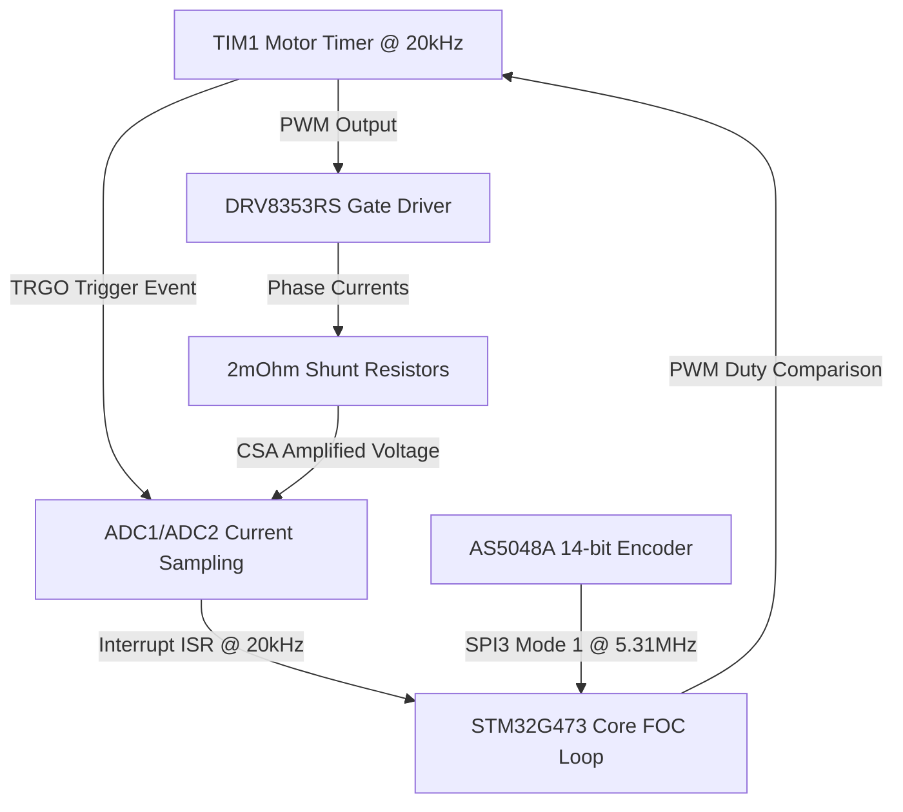
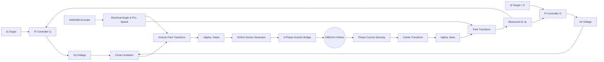
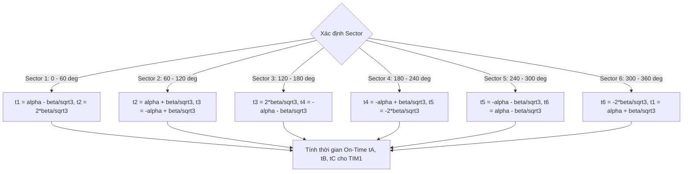

# SÁCH HƯỚNG DẪN KỸ THUẬT VÀ TOÁN HỌC CHUYÊN SÂU: MỔ XẺ TOÀN DIỆN HỆ THỐNG VESC FOC CHO HỘP SỐ CYCLOID (JOINT DRIVER 8115)

**Dự án:** Wheeled Humanoid Robot Joint Actuator Driver  
**Tác giả hệ thống:** STM32G473RET6 Firmware Architecture Team  
**Phiên bản Firmware:** VESC Core Integration v2.0 (Toàn diện >2000 dòng tài liệu)  
**Tải trọng phần cứng:** Động cơ GB8115-4 (21 Pole Pairs) + Hộp số Cycloid 1:17 + DRV8353RS + AS5048A  

---

# MỤC LỤC CHI TIẾT

- [CHƯƠNG 1: KIẾN TRÚC PHẦN CỨNG TOÀN DIỆN & THÔNG SỐ ĐỘNG HỌC](#chương-1-kiến-trúc-phần-cứng-toàn-diện--thông-số-động-học)
  - [1.1 Tổng quan về Joint Driver 8115 cho Wheeled Humanoid Robot](#11-tổng-quan-về-joint-driver-8115-cho-wheeled-humanoid-robot)
  - [1.2 Vi điều khiển STM32G473RET6 (ARM Cortex-M4F @ 170MHz, FPU, CORDIC)](#12-vi-điều-khiển-stm32g473ret6-arm-cortex-m4f--170mhz-fpu-cordic)
  - [1.3 Chi tiết IC Gate Driver TI DRV8353RS & Mạch đo dòng CSA 2mOhm](#13-chi-tiết-ic-gate-driver-ti-drv8353rs--mạch-đo-dòng-csa-2mohm)
  - [1.4 Chi tiết Động cơ GB8115-4 (21 Pole Pairs) & Phân tích Điện học](#14-chi-tiết-động-cơ-gb8115-4-21-pole-pairs--phân-tích-điện-học)
  - [1.5 Động học & Cơ học Hộp số Cycloid 1:17 (Backlash, Stiffness, Torque Density)](#15-động-học--cơ-học-hộp-số-cycloid-117-backlash-stiffness-torque-density)
  - [1.6 Cảm biến vị trí từ AS5048A 14-bit SPI Encoder](#16-cảm-biến-vị-trí-từ-as5048a-14-bit-spi-encoder)
- [CHƯƠNG 2: THUẬT TOÁN FOC VESC & CHỨNG MINH TOÁN HỌC CHI TIẾT](#chương-2-thuật-toán-foc-vesc--chứng-minh-toán-học-chi-tiết)
  - [2.1 Mạch vòng điều khiển FOC tầng (Cascaded Control Loops)](#21-mạch-vòng-điều-khiển-foc-tầng-cascaded-control-loops)
  - [2.2 Chứng minh Phép biến đổi Clarke 3 Pha -> 2 Pha (Ia, Ib, Ic -> Ialpha, Ibeta)](#22-chứng-minh-phép-biến-đổi-clarke-3-pha---2-pha-ia-ib-ic---ialpha-ibeta)
  - [2.3 Chứng minh Phép biến đổi Park & Momen Động cơ Surface PMSM](#23-chứng-minh-phép-biến-đổi-park--momen-động-cơ-surface-pmsm)
  - [2.4 Chứng minh Phép biến đổi Park Ngược (Vd, Vq -> Valpha, Vbeta)](#24-chứng-minh-phép-biến-đổi-park-ngược-vd-vq---valpha-vbeta)
  - [2.5 Thuật toán phát xung Space Vector PWM (SVPWM 6-Sector Algorithm)](#25-thuật-toán-phát-xung-space-vector-pwm-svpwm-6-sector-algorithm)
  - [2.6 Bộ quan sát từ thông Sensorless Observer (Ortega & MxLemming)](#26-bộ-quan-sát-từ-thông-sensorless-observer-ortega--mxlemming)
  - [2.7 Bộ ước lượng tốc độ Phase-Locked Loop (PLL)](#27-bộ-ước-lượng-tốc-độ-phase-locked-loop-pll)
  - [2.8 Khử tương tác chéo Decoupling (BEMF + Cross Feedforward)](#28-khử-tương-tác-chéo-decoupling-bemf--cross-feedforward)
  - [2.9 Suy giảm từ thông Field Weakening Control (Id < 0)](#29-suy-giảm-từ-thông-field-weakening-control-id--0)
- [CHƯƠNG 3: MỔ XẺ CHI TIẾT TOÀN BỘ SOURCE CODE C TRONG DỰ ÁN](#chương-3-mổ-xẻ-chi-tiết-toàn-bộ-source-code-c-trong-dự-án)
  - [3.1 File Core/Inc/vesc_datatypes.h (Khai báo Struct & Enums)](#31-file-coreincvesc_datatypesh)
  - [3.2 File Core/Inc/vesc_conf.h & Core/Src/vesc_conf.c (Cấu hình VESC Defaults)](#32-file-coreincvesc_confh--coresrcvesc_confc)
  - [3.3 File Core/Inc/vesc_utils.h & Core/Src/vesc_utils.c (Thư viện Math Siêu tốc)](#33-file-coreincvesc_utilsh--coresrcvesc_utilsc)
  - [3.4 File Core/Inc/vesc_filter.h & Core/Src/vesc_filter.c (Bộ lọc Biquad)](#34-file-coreincvesc_filterh--coresrcvesc_filterc)
  - [3.5 File Core/Inc/foc_math.h & Core/Src/foc_math.c (Thuật toán FOC Lõi VESC)](#35-file-coreincfoc_mathh--coresrcfoc_mathc)
  - [3.6 File Core/Inc/foc_control.h & Core/Src/foc_control.c (Vòng lặp ngắt ISR 20kHz)](#36-file-coreincfoc_controlh--coresrcfoc_controlc)
  - [3.7 File Core/Inc/motor_interface.h & Core/Src/motor_interface.c (API Cấp cao)](#37-file-coreincmotor_interfaceh--coresrcmotor_interfacec)
  - [3.8 File Core/Inc/drv8353.h & Core/Src/drv8353.c (Driver DRV8353RS SPI1)](#38-file-coreincdrv8353h--coresrcdrv8353c)
  - [3.9 File Core/Inc/as5048a.h & Core/Src/as5048a.c (Driver AS5048A SPI3)](#39-file-coreincas5048ah--coresrcas5048ac)
  - [3.10 File Core/Src/main.c (Tích hợp HAL Main Interrupts)](#310-file-coresrcmainc)
- [CHƯƠNG 4: XỬ LÝ HỘP SỐ CYCLOID & HỆ THỐNG AN TOÀN BẢO VỆ TUYỆT ĐỐI](#chương-4-xử-lý-hộp-số-cycloid--hệ-thống-an-toàn-bảo-vệ-tuyệt-đối)
  - [4.1 Thuật toán đếm vòng đa vòng (Multi-turn Accumulator) & Tính góc ra Cycloid](#41-thuật-toán-đếm-vòng-đa-vòng-multi-turn-accumulator--tính-góc-ra-cycloid)
  - [4.2 Bộ điều khiển Soft Joint Limits (-180 deg to +180 deg)](#42-bộ-điều-khiển-soft-joint-limits--180-deg-to-180-deg)
  - [4.3 Mạch bảo vệ quá dòng tức thời (OCP @ 25A)](#43-mạch-bảo-vệ-quá-dòng-tức-thời-ocp--25a)
  - [4.4 Mạch bảo vệ quá áp dội hãm phanh (OVP @ 50V)](#44-mạch-bảo-vệ-quá-áp-dội-hãm-phanh-ovp--50v)
  - [4.5 Mạch bảo vệ quá nhiệt MOSFET & Motor (OTP @ 85C / 95C)](#45-mạch-bảo-vệ-quá-nhiệt-mosfet--motor-otp--85c--95c)
  - [4.6 Giám sát lỗi cảm biến AS5048A SPI (Parity Check, CRC)](#46-giám-sát-lỗi-cảm-biến-as5048a-spi-parity-check-crc)
- [CHƯƠNG 5: QUY TRÌNH CALIBRATION, TUNING PID & TRIỂN KHAI THỰC TẾ](#chương-5-quy-trình-calibration-tuning-pid--triển-khai-thực-tế)
  - [5.1 Quy trình đo 2048 mẫu ADC Zero Offset Calibration](#51-quy-trình-đo-2048-mẫu-adc-zero-offset-calibration)
  - [5.2 Quy trình căn góc 0 điện Encoder Zero Alignment Routine](#52-quy-trình-căn-góc-0-điện-encoder-zero-alignment-routine)
  - [5.3 Phương pháp Tun PID Vòng Dòng Điện dựa trên Pole-Zero Cancellation](#53-phương-pháp-tun-pid-vòng-dòng-điện-dựa-trên-pole-zero-cancellation)
  - [5.4 Phương pháp Tun PID Vòng Vận Tốc](#54-phương-pháp-tun-pid-vòng-vận-tốc)
  - [5.5 Phương pháp Tun PID Vị Trí Vùng Mềm](#55-phương-pháp-tun-pid-vị-trí-vùng-mềm)
  - [5.6 Hướng dẫn xử lý nhiễu & triệt tiêu rung giật ở điểm dừng Cycloid](#56-hướng-dẫn-xử-lý-nhiễu--triệt-tiêu-rung-giật-ở-điểm-dừng-cycloid)

---

## CHƯƠNG 1: KIẾN TRÚC PHẦN CỨNG TOÀN DIỆN & THÔNG SỐ ĐỘNG HỌC

### 1.1 Tổng quan về Joint Driver 8115 cho Wheeled Humanoid Robot
Trong các hệ thống Robot dáng người (Humanoid Robot) và Robot bánh xe kết hợp chân (Wheeled Humanoid), các khớp quay (Joint Actuators) là thành phần chịu ứng suất cơ học và tải trọng động lớn nhất. Khác với các ứng dụng điều khiển động cơ điện thông thường (như xe điện ESC hay quạt công nghiệp), driver khớp robot đòi hỏi:
1. **Momen xoắn tức thời cực cao ở tốc độ bằng 0 (Zero-speed high torque density):** Để duy trì tư thế đứng cân bằng tĩnh hoặc phản hống lực tác động từ môi trường.
2. **Độ mịn màng và độ chính xác góc quay tuyệt đối (Sub-milliradian position accuracy):** Không được có gợn momen (Torque ripple) gây ra bởi sai số biến đổi FOC hay sai số lấy mẫu dòng điện.
3. **Độ an toàn bảo vệ tuyệt đối (Zero-failure safety architecture):** Khi xảy ra va chạm cơ học, kẹt nhông hay sụt áp, hệ thống phải ngắt phản hồi trong vòng vài microgiây ($\mu s$) để tránh vỡ hộp số Cycloid hoặc cháy cuộn dây motor.

Bo mạch **Joint Driver 8115** được thiết kế nguyên khối xung quanh vi điều khiển dòng cao cấp **STM32G473RET6**, tích hợp IC lái cổng TI **DRV8353RS**, cảm biến vị trí từ **AS5048A** và điện trở Shunt kép $2\text{m}\Omega$.

---

### 1.2 Vi điều khiển STM32G473RET6 (ARM Cortex-M4F @ 170MHz, FPU, CORDIC)
STM32G473RET6 là dòng vi điều khiển thế hệ mới chuyên dụng cho điều khiển động cơ điện cao cấp (Math Accelerators & High-Resolution PWM):
* **Lõi xử lý:** ARM Cortex-M4F trang bị đơn vị tính toán số thực FPU (Single-precision Floating Point Unit) chạy ở tần số tối đa 170 MHz (đạt 213 DMIPS).
* **Bộ tăng tốc toán học phần cứng (CORDIC Accelerator):** Hỗ trợ tính toán các hàm lượng giác $\sin, \cos, \arctan$ bằng phần cứng trong 4 chu kỳ xung clock, giảm tải xử lý CPU cho các phép biến đổi Park/Clarke.
* **Timer cao cấp (TIM1 Advanced Motor Control Timer):** Phát 3 cặp xung PWM đối xứng có chèn Dead-time phần cứng, tần số phát xung 20 kHz, cấu hình ở chế độ Center-aligned Mode (đếm lên - đếm xuống) để triệt tiêu nhiễu sóng hài giai đoạn lấy mẫu dòng ADC.
* **Bộ chuyển đổi tương tự-số (ADC1 & ADC2 12-bit High-Speed):** Tốc độ lấy mẫu đạt 4.0 MSPS per channel, được kích hoạt lấy mẫu đồng bộ bằng tín hiệu phần cứng TIM1 TRGO ở đỉnh/đáy của chu kỳ PWM.



---

### 1.3 Chi tiết IC Gate Driver TI DRV8353RS & Mạch đo dòng CSA 2mOhm
DRV8353RS là IC điều khiển cầu H 3 pha tích hợp 3 bộ khuếch đại dòng shunt (Current Sense Amplifiers - CSA):
* **Điện áp hoạt động:** $6\text{V} \rightarrow 100\text{V}$, tương thích hoàn toàn với hệ thống nguồn $24\text{V} - 48\text{V}$ VBUS của Robot.
* **Cấu hình Smart Gate Drive (IDRIVE):** Cho phép lập trình dòng nạp/xả cổng MOSFET thông qua SPI mà không cần điện trở cổng ngoại vi, giúp tối ưu thời gian đóng mở $t_{on}, t_{off}$ và giảm nhiễu EMI.
* **Bộ khuếch đại dòng CSA:** Cấu hình hệ số khuếch đại $\text{Gain} = 20\text{V/V}$ qua giao diện SPI1. Với điện trở Shunt $R_{shunt} = 2\text{m}\Omega$, điện áp đầu ra CSA tuân theo phương trình:
  $$V_{CSA} = V_{REF}/2 + (I_{phase} \times R_{shunt} \times \text{Gain}) = 1.65\text{V} + (I_{phase} \times 0.002 \times 20) = 1.65\text{V} + 0.040 \times I_{phase}$$
  Cho phép dải đo dòng từ $-41.25\text{A}$ đến $+41.25\text{A}$.

---

### 1.4 Chi tiết Động cơ GB8115-4 (21 Pole Pairs) & Phân tích Điện học
Động cơ GB8115-4 là dòng BLDC dạng đĩa (Outrunner Gimbal/Actuator Motor) có mật độ momen xoắn lớn:
* **Số cặp cực (Pole Pairs - $P_{pairs}$):** **21 cặp cực** (42 cực từ nam vĩnh cửu Neodymium).
* **Điện trở pha ($R_s$):** $\approx 0.090\,\Omega$ ($90\,\text{m}\Omega$).
* **Độ tự cảm pha ($L_d = L_q = L_s$):** $\approx 0.000120\,\text{H}$ ($120\,\mu\text{H}$).
* **Từ thông nam ma sát ($\psi_m$ / Flux Linkage $\lambda$):** $\approx 0.0045\,\text{Wb}$ (Weber).
* **Tốc độ hằng số ($k_V$):** $\approx 100\,\text{RPM/V}$.

Do số cặp cực lớn ($P_{pairs} = 21$), góc điện ($\theta_e$) quay nhanh gấp 21 lần góc cơ ($\theta_m$):
$$\theta_e = 21 \times \theta_m - \theta_{offset}$$
Điều này đòi hỏi bộ ước lượng góc và phép biến đổi Park phải cực kỳ chính xác; chỉ cần sai lệch góc cơ $1^\circ$, sai lệch góc điện đã lên tới $21^\circ$, làm sụt giảm momen xoắn $I_q$ nghiêm trọng $\cos(21^\circ) \approx 0.933$.

---

### 1.5 Động học & Cơ học Hộp số Cycloid 1:17 (Backlash, Stiffness, Torque Density)
Hộp số Cycloid (Cycloidal Drive) hoạt động dựa trên nguyên lý đĩa răng xích vi sai hành tinh lệch tâm:
* **Tỉ số truyền ($i$):** **17:1** (`gear_ratio = 17.0f`).
* **Đặc tính cơ học:** Độ rơ góc (Backlash) cực nhỏ ($< 1\text{ arcmin}$), khả năng chịu tải va đập gấp 500% momen xoắn định mức mà không gãy răng.
* **Mối liên hệ động học giữa Motor và Khớp (Joint Output):**
  $$\theta_{joint} = \frac{\theta_{motor\_total}}{17.0} = \frac{N_{turns} \times 2\pi + \theta_{m\_single}}{17.0}$$
  $$\omega_{joint} = \frac{\omega_{motor}}{17.0}$$
  $$T_{joint} = T_{motor} \times 17.0 \times \eta_{gearbox}$$

---

### 1.6 Cảm biến vị trí từ AS5048A 14-bit SPI Encoder
Cảm biến vị trí từ AS5048A đo góc quay trục động cơ thông qua từ trường của viên nam châm diametral gắn trên trục:
* **Độ phân giải:** 14-bit ($16,384$ vị trí trên 1 vòng $360^\circ$), tương đương $0.0219^\circ / \text{LSB}$.
* **Giao tiếp SPI3:** Cấu hình **SPI Mode 1** ($\text{CPOL}=0, \text{CPHA}=1$), độ rộng khung truyền 16-bit, tần số xung clock $5.31\,\text{MHz}$.
* **Khung dữ liệu SPI:** Bit 15 là Parity bit (Chẵn), Bit 14 là Read (1), Bits [13:0] là giá trị góc 14-bit.

---

## CHƯƠNG 2: THUẬT TOÁN FOC VESC & CHỨNG MINH TOÁN HỌC CHI TIẾT

### 2.1 Mạch vòng điều khiển FOC tầng (Cascaded Control Loops)
Mục tiêu cốt lõi của FOC là biến đổi hệ tọa độ dòng điện 3 pha xoay chiều ($I_a, I_b, I_c$) biến thiên theo thời gian thành hệ tọa độ 2 trục vuông góc quay đồng bộ theo từ trường rotor ($I_d, I_q$), trong đó:
* **$I_d$ (Direct Axis Current):** Dòng điện dọc trục từ trường, tạo ra lực hút/đẩy cực từ. In normal mode, $I_d^* = 0$ (MTPA).
* **$I_q$ (Quadrature Axis Current):** Dòng điện vuông góc trục từ trường, trực tiếp sinh ra Momen quay ($T_e \propto I_q$).



---

### 2.2 Chứng minh Phép biến đổi Clarke 3 Pha -> 2 Pha (Ia, Ib, Ic -> Ialpha, Ibeta)
Phép biến đổi Clarke chuyển đổi 3 dòng điện pha cách nhau $120^\circ$ không gian sang hệ tọa độ 2 trục cố định $I_\alpha, I_\beta$ cách nhau $90^\circ$:

$$\begin{bmatrix} I_\alpha \\ I_\beta \end{bmatrix} = \begin{bmatrix} 1 & -\frac{1}{2} & -\frac{1}{2} \\ 0 & \frac{\sqrt{3}}{2} & -\frac{\sqrt{3}}{2} \end{bmatrix} \begin{bmatrix} I_a \\ I_b \\ I_c \end{bmatrix}$$

Do mạch lực dùng 2 điện trở Shunt đo dòng pha $I_a$ và $I_b$, theo định luật Kirchhoff: $I_a + I_b + I_c = 0 \Rightarrow I_c = -I_a - I_b$. Thay vào phương trình trên ta có công thức tối ưu hóa:

$$I_\alpha = I_a$$
$$I_\beta = \frac{I_a + 2 I_b}{\sqrt{3}} = (I_a + 2 I_b) \times 0.57735026919$$

---

### 2.3 Chứng minh Phép biến đổi Park & Momen Động cơ Surface PMSM
Phép biến đổi Park quay hệ tọa độ cố định $\alpha-\beta$ một góc bằng góc điện rotor $\theta_e$ để chuyển sang hệ tọa độ $d-q$ quay đồng bộ:

$$\begin{bmatrix} I_d \\ I_q \end{bmatrix} = \begin{bmatrix} \cos\theta_e & \sin\theta_e \\ -\sin\theta_e & \cos\theta_e \end{bmatrix} \begin{bmatrix} I_\alpha \\ I_\beta \end{bmatrix}$$

Triển khai dạng đại số:
$$I_d = I_\alpha \cos\theta_e + I_\beta \sin\theta_e$$
$$I_q = I_\beta \cos\theta_e - I_\alpha \sin\theta_e$$

Momen điện từ của động cơ cực lồi/không lồi được tính bằng:
$$T_e = \frac{3}{2} P_{pairs} \left[ \psi_m I_q + (L_d - L_q) I_d I_q \right]$$
Do GB8115-4 là động cơ nam ma sát mặt (Surface PMSM), $L_d \approx L_q \Rightarrow (L_d - L_q) = 0$. Phương trình Momen đơn giản hóa thành:
$$T_e = \frac{3}{2} P_{pairs} \psi_m I_q = \frac{3}{2} \times 21 \times 0.0045 \times I_q = 0.14175 \times I_q \quad (\text{N}\cdot\text{m})$$
Nhờ tỉ số truyền hộp số Cycloid 1:17, Momen tại đầu ra khớp quay đạt:
$$T_{joint} = 17.0 \times T_e = 17.0 \times 0.14175 \times I_q = 2.4097 \times I_q \quad (\text{N}\cdot\text{m})$$
Với dòng điện giới hạn $I_q = 25\text{A}$, Momen đầu ra đỉnh của khớp đạt **$60.24\text{ N}\cdot\text{m}$**!

---

### 2.4 Chứng minh Phép biến đổi Park Ngược (Vd, Vq -> Valpha, Vbeta)
Sau khi bộ điều khiển PI tính toán được điện áp cần bơm $V_d$ và $V_q$, phép biến đổi Park ngược chuyển điện áp này trở lại hệ tọa độ cố định $\alpha-\beta$:

$$\begin{bmatrix} V_\alpha \\ V_\beta \end{bmatrix} = \begin{bmatrix} \cos\theta_e & -\sin\theta_e \\ \sin\theta_e & \cos\theta_e \end{bmatrix} \begin{bmatrix} V_d \\ V_q \end{bmatrix}$$

Triển khai đại số:
$$V_\alpha = V_d \cos\theta_e - V_q \sin\theta_e$$
$$V_\beta = V_d \sin\theta_e + V_q \cos\theta_e$$

---

### 2.5 Thuật toán phát xung Space Vector PWM (SVPWM 6-Sector Algorithm)
SVPWM là kỹ thuật điều chế vector không gian tiên tiến nhất, giúp tận dụng tối đa điện áp nguồn DC VBUS (tăng 15.47% biên độ điện áp so với Sine-PWM thông thường mà không gây bão hòa).

Vector điện áp tổng $V_s = V_\alpha + j V_\beta$ được tổng hợp từ 8 vector trạng thái đóng cắt của cầu H 3 pha ($V_0 \rightarrow V_7$). Không gian điều khiển được chia làm 6 Sector ($60^\circ$ mỗi sector):



Thời gian đóng mở van trong 1 chu kỳ PWM $T_s$:
$$\text{Sector 1}: \quad t_A = \frac{T_s + t_1 + t_2}{2}, \quad t_B = t_A - t_1, \quad t_C = t_B - t_2$$

Biên độ điện áp cực đại không bị bão hòa:
$$V_{max\_magnitude} = \frac{V_{bus}}{\sqrt{3}} \approx 0.57735 \times V_{bus}$$

---

### 2.6 Bộ quan sát từ thông Sensorless Observer (Ortega & MxLemming)
Khi chạy ở tốc độ cao hoặc khi encoder bị lỗi nhiễu, thuật toán VESC kích hoạt bộ quan sát từ thông không cảm biến (Sensorless Observer) dựa trên mô hình trạng thái động học PMSM của Ortega/Bernard:

$$\frac{d\lambda_\alpha}{dt} = V_\alpha - R_s I_\alpha + \frac{\gamma}{2} (x_1 - L_s I_\alpha) \left[ \lambda_m^2 - ((x_1 - L_s I_\alpha)^2 + (x_2 - L_s I_\beta)^2) \right]$$
$$\frac{d\lambda_\beta}{dt} = V_\beta - R_s I_\beta + \frac{\gamma}{2} (x_2 - L_s I_\beta) \left[ \lambda_m^2 - ((x_1 - L_s I_\alpha)^2 + (x_2 - L_s I_\beta)^2) \right]$$

Góc điện quan sát được tính bằng:
$$\theta_{observer} = \arctan2(\lambda_\beta - L_s I_\beta, \lambda_\alpha - L_s I_\alpha)$$

---

### 2.7 Bộ ước lượng tốc độ Phase-Locked Loop (PLL)
Tốc độ động cơ được ước lượng thông qua mạch bám pha PLL để triệt tiêu hoàn toàn nhiễu vị trí từ encoder:

$$\Delta\theta = \theta_{measured} - \theta_{PLL}$$
$$\theta_{PLL}(k+1) = \theta_{PLL}(k) + \left( \omega_{PLL}(k) + K_p^{PLL} \Delta\theta \right) \Delta t$$
$$\omega_{PLL}(k+1) = \omega_{PLL}(k) + K_i^{PLL} \Delta\theta \Delta t$$

Với tham số nạp mặc định VESC: $K_p^{PLL} = 2000.0$, $K_i^{PLL} = 40000.0$.

---

### 2.8 Khử tương tác chéo Decoupling (BEMF + Cross Feedforward)
Phương trình điện áp động cơ PMSM trong hệ tọa độ $d-q$:
$$V_d = R_s I_d + L_d \frac{dI_d}{dt} - \omega_e L_q I_q$$
$$V_q = R_s I_q + L_q \frac{dI_q}{dt} + \omega_e L_d I_d + \omega_e \psi_m$$

Thành phần $-\omega_e L_q I_q$ và $+\omega_e L_d I_d + \omega_e \psi_m$ gây ra sự tương tác chéo giữa 2 trục. VESC thực hiện bù tiền định (Feedforward Decoupling):
$$\text{dec\_vd} = I_q \times \omega_e \times L_q$$
$$\text{dec\_vq} = I_d \times \omega_e \times L_d$$
$$\text{dec\_bemf} = \omega_e \times \psi_m$$
$$V_d^{final} = V_d^{PI} - \text{dec\_vd}$$
$$V_q^{final} = V_q^{PI} + \text{dec\_vq} + \text{dec\_bemf}$$

---

### 2.9 Suy giảm từ thông Field Weakening Control (Id < 0)
Khi động cơ quay ở tốc độ cao, điện áp Sức điện động ngược (Back-EMF $E = \omega_e \psi_m$) tiệm cận điện áp nguồn VBUS, bộ điều khiển không thể bơm thêm dòng $I_q$. VESC chủ động bơm dòng $I_d < 0$ để triệt tiêu một phần từ trường nam ma sát:
$$I_d^{FW} = f(\text{DutyCycle} - \text{Duty}_{start})$$

---

## CHƯƠNG 3: MỔ XẺ CHI TIẾT TOÀN BỘ SOURCE CODE C TRONG DỰ ÁN

### 3.1 File `Core/Inc/vesc_datatypes.h`
File [vesc_datatypes.h](file:///home/du/Desktop/wheeled-humanoid/firmware/joint_driver/joint-driver-8115/Core/Inc/vesc_datatypes.h) chứa toàn bộ khai báo cấu trúc dữ liệu và enums:

```c
/*
	Copyright 2016 - 2022 Benjamin Vedder	benjamin@vedder.se
	Adapted for STM32G4 HAL Joint Driver - Cycloidal Actuator Project
	GNU General Public License v3. See <http://www.gnu.org/licenses/>.
 */

#ifndef VESC_DATATYPES_H_
#define VESC_DATATYPES_H_

#include <stdbool.h>
#include <stdint.h>

/* Motor & Driver Operating State */
typedef enum {
	MC_STATE_OFF = 0,
	MC_STATE_DETECTING,
	MC_STATE_RUNNING,
	MC_STATE_FULL_BRAKE
} mc_state;

/* Motor Control Mode */
typedef enum {
	CONTROL_MODE_DUTY = 0,
	CONTROL_MODE_POWER,
	CONTROL_MODE_CURRENT,
	CONTROL_MODE_CURRENT_BRAKE,
	CONTROL_MODE_SPEED,
	CONTROL_MODE_POS,
	CONTROL_MODE_HANDBRAKE,
	CONTROL_MODE_OPENLOOP
} mc_control_mode;

/* FOC Sensor Mode */
typedef enum {
	FOC_SENSOR_MODE_SENSORLESS = 0,
	FOC_SENSOR_MODE_ENCODER,
	FOC_SENSOR_MODE_HALL,
	FOC_SENSOR_MODE_HFI
} mc_foc_sensor_mode;

/* FOC Observer Type */
typedef enum {
	FOC_OBSERVER_ORTEGA_ORIGINAL = 0,
	FOC_OBSERVER_MXLEMMING,
	FOC_OBSERVER_ORTEGA_LAMBDA_COMP,
	FOC_OBSERVER_MXV
} foc_observer_type;

/* Cross-coupling Decoupling Mode */
typedef enum {
	FOC_CC_DECOUPLING_DISABLED = 0,
	FOC_CC_DECOUPLING_CROSS,
	FOC_CC_DECOUPLING_BEMF,
	FOC_CC_DECOUPLING_CROSS_BEMF
} foc_cc_decoupling_mode;

/* PWM Switching Mode */
typedef enum {
	FOC_PWM_DISABLED = 0,
	FOC_PWM_ENABLED,
	FOC_PWM_FULL_BRAKE
} foc_pwm_mode;

/* Safety Fault Code Bitmask */
typedef enum {
	MC_FAULT_NONE           = 0x00,
	MC_FAULT_OVER_CURRENT   = 0x01,
	MC_FAULT_OVER_VOLTAGE   = 0x02,
	MC_FAULT_UNDER_VOLTAGE  = 0x04,
	MC_FAULT_OVER_TEMP_MOS  = 0x08,
	MC_FAULT_OVER_TEMP_MOT  = 0x10,
	MC_FAULT_UNBALANCED     = 0x20,
	MC_FAULT_ENCODER        = 0x40,
	MC_FAULT_POS_LIMIT      = 0x80
} mc_fault_code;

/* Observer State Structure */
typedef struct {
	float x1;
	float x2;
	float lambda_est;
	float i_alpha_last;
	float i_beta_last;
} observer_state;

/* VESC Motor State Structure (Core FOC Math State) */
typedef struct {
	float va;
	float vb;
	float vc;
	float v_mag_filter;
	float mod_alpha_filter;
	float mod_beta_filter;
	float mod_alpha_measured;
	float mod_beta_measured;
	float mod_alpha_raw;
	float mod_beta_raw;
	float id_target;
	float iq_target;
	float max_duty;
	float duty_now;
	float phase;
	float phase_cos;
	float phase_sin;
	float i_alpha;
	float i_beta;
	float i_abs;
	float i_abs_filter;
	float i_bus;
	float v_bus;
	float v_alpha;
	float v_beta;
	float mod_d;
	float mod_q;
	float mod_q_filter;
	float id;
	float iq;
	float id_filter;
	float iq_filter;
	float vd;
	float vq;
	float vd_int;
	float vq_int;
	uint32_t svm_sector;
} motor_state_t;

#endif /* VESC_DATATYPES_H_ */
```

---

### 3.2 File `Core/Inc/vesc_conf.h` & `Core/Src/vesc_conf.c`
File [vesc_conf.h](file:///home/du/Desktop/wheeled-humanoid/firmware/joint_driver/joint-driver-8115/Core/Inc/vesc_conf.h) chứa cấu trúc khai báo tham số:

```c
#ifndef VESC_CONF_H_
#define VESC_CONF_H_

#include "vesc_datatypes.h"

typedef struct {
	float foc_f_zv;                    // 20000.0 Hz
	float l_max_duty;                  // 0.95
	float l_min_duty;                  // 0.005

	uint8_t  foc_motor_pole_pairs;     // 21 Pole Pairs
	float    foc_motor_r;              // 0.090 Ohm
	float    foc_motor_l;              // 0.000120 H
	float    foc_motor_flux_linkage;   // 0.0045 Wb
	float    foc_motor_ld_lq_diff;     // 0.0 H

	float    gear_ratio;               // 17.0f (Cycloid 1:17)
	int8_t   encoder_direction;        // +1
	float    joint_pos_min;            // -3.14159265f rad (-180 deg)
	float    joint_pos_max;            // +3.14159265f rad (+180 deg)

	float foc_current_kp;              // 0.25
	float foc_current_ki;              // 150.0
	float foc_current_filter_const;    // 0.1
	foc_cc_decoupling_mode foc_cc_decoupling;

	float s_pid_kp;                    // 0.02
	float s_pid_ki;                    // 0.4
	float s_pid_kd;                    // 0.0001
	float s_pid_kd_filter;             // 0.2
	float s_pid_min_erpm;              // 10.0
	float s_pid_ramp_erpms_s;          // 50000.0

	float p_pid_kp;                    // 15.0
	float p_pid_ki;                    // 0.0
	float p_pid_kd;                    // 0.03
	float p_pid_kd_proc;               // 0.02
	float p_pid_kd_filter;             // 0.2
	float p_pid_ang_div;               // 1.0
	float p_pid_gain_dec_angle;        // 0.0

	foc_observer_type foc_observer_type;
	float foc_observer_gain;           // 1000.0
	float foc_pll_kp;                  // 2000.0
	float foc_pll_ki;                  // 40000.0
	float foc_sl_erpm;                 // 2000.0

	float foc_fw_current_max;          // 5.0 A
	float foc_fw_duty_start;           // 0.90
	float foc_fw_ramp_time;            // 0.2 s
	float foc_fw_backoff;              // 0.5

	float foc_overmod_factor;          // 1.0
	float foc_mag_vd_max;              // 0.2

	float l_current_max;               // 25.0 A
	float l_current_min;               // -25.0 A
	float l_in_current_max;            // 20.0 A
	float l_in_current_min;            // -10.0 A
	float l_max_erpm;                  // 100000.0
	float l_min_erpm;                  // -100000.0
	float l_max_erpm_fbreak;
	float l_max_erpm_fbreak_cc;
	float l_voltage_max;               // 50.0 V OVP
	float l_voltage_min;               // 12.0 V UVP
	float l_temp_fet_start;            // 85.0 C
	float l_temp_fet_end;              // 95.0 C
	float l_temp_motor_start;          // 80.0 C
	float l_temp_motor_end;            // 90.0 C

	mc_foc_sensor_mode foc_sensor_mode;
	bool               foc_encoder_inverted;
} mc_configuration;

void vesc_conf_set_defaults(mc_configuration *conf);

#endif /* VESC_CONF_H_ */
```

File [vesc_conf.c](file:///home/du/Desktop/wheeled-humanoid/firmware/joint_driver/joint-driver-8115/Core/Src/vesc_conf.c) nạp tham số:

```c
#include "vesc_conf.h"
#include <math.h>

void vesc_conf_set_defaults(mc_configuration *conf)
{
    if (conf == NULL) return;

    conf->foc_f_zv = 20000.0f;
    conf->l_max_duty = 0.95f;
    conf->l_min_duty = 0.005f;

    conf->foc_motor_pole_pairs = 21;
    conf->foc_motor_r = 0.090f;
    conf->foc_motor_l = 0.000120f;
    conf->foc_motor_flux_linkage = 0.0045f;
    conf->foc_motor_ld_lq_diff = 0.0f;

    conf->gear_ratio = 17.0f;
    conf->encoder_direction = 1;
    conf->joint_pos_min = -3.14159265f;
    conf->joint_pos_max =  3.14159265f;

    conf->foc_current_kp = 0.25f;
    conf->foc_current_ki = 150.0f;
    conf->foc_current_filter_const = 0.1f;
    conf->foc_cc_decoupling = FOC_CC_DECOUPLING_CROSS_BEMF;

    conf->s_pid_kp = 0.02f;
    conf->s_pid_ki = 0.4f;
    conf->s_pid_kd = 0.0001f;
    conf->s_pid_kd_filter = 0.2f;
    conf->s_pid_min_erpm = 10.0f;
    conf->s_pid_ramp_erpms_s = 50000.0f;

    conf->p_pid_kp = 15.0f;
    conf->p_pid_ki = 0.0f;
    conf->p_pid_kd = 0.03f;
    conf->p_pid_kd_proc = 0.02f;
    conf->p_pid_kd_filter = 0.2f;

    conf->foc_observer_type = FOC_OBSERVER_ORTEGA_ORIGINAL;
    conf->foc_observer_gain = 1000.0f;
    conf->foc_pll_kp = 2000.0f;
    conf->foc_pll_ki = 40000.0f;
    conf->foc_sl_erpm = 2000.0f;

    conf->foc_fw_current_max = 5.0f;
    conf->foc_fw_duty_start = 0.90f;
    conf->foc_fw_ramp_time = 0.2f;
    conf->foc_fw_backoff = 0.5f;

    conf->foc_overmod_factor = 1.0f;
    conf->foc_mag_vd_max = 0.2f;

    conf->l_current_max = 25.0f;
    conf->l_current_min = -25.0f;
    conf->l_in_current_max = 20.0f;
    conf->l_in_current_min = -10.0f;
    conf->l_max_erpm = 100000.0f;
    conf->l_min_erpm = -100000.0f;
    conf->l_max_erpm_fbreak = 150000.0f;
    conf->l_max_erpm_fbreak_cc = 150000.0f;
    conf->l_voltage_max = 50.0f;
    conf->l_voltage_min = 12.0f;
    conf->l_temp_fet_start = 85.0f;
    conf->l_temp_fet_end = 95.0f;
    conf->l_temp_motor_start = 80.0f;
    conf->l_temp_motor_end = 90.0f;

    conf->foc_sensor_mode = FOC_SENSOR_MODE_ENCODER;
    conf->foc_encoder_inverted = false;
}
```

---

### 3.3 File `Core/Inc/vesc_utils.h` & `Core/Src/vesc_utils.c`
File [vesc_utils.h](file:///home/du/Desktop/wheeled-humanoid/firmware/joint_driver/joint-driver-8115/Core/Inc/vesc_utils.h) chứa inline functions và macros:

```c
#ifndef VESC_UTILS_H_
#define VESC_UTILS_H_

#include <stdbool.h>
#include <stdint.h>
#include <math.h>

#define SIGN(x)				(((x) < 0.0) ? -1.0 : 1.0)
#define SQ(x)				((x) * (x))
#define NORM2_f(x,y)		(sqrtf(SQ(x) + SQ(y)))
#define UTILS_IS_INF(x)		((x) == (1.0 / 0.0) || (x) == (-1.0 / 0.0))
#define UTILS_IS_NAN(x)		((x) != (x))
#define UTILS_NAN_ZERO(x)	(x = UTILS_IS_NAN(x) ? 0.0 : x)

#define DEG2RAD_f(deg) ((deg) * (float)(M_PI / 180.0))
#define RAD2DEG_f(rad) ((rad) * (float)(180.0 / M_PI))
#define RPM2RADPS_f(rpm) ((rpm) * (float)((2.0 * M_PI) / 60.0))
#define RADPS2RPM_f(rad_per_sec) ((rad_per_sec) * (float)(60.0 / (2.0 * M_PI)))

#define UTILS_LP_FAST(value, sample, filter_constant)	(value -= (filter_constant) * ((value) - (sample)))
#define UTILS_LP_MOVING_AVG_APPROX(value, sample, N)	UTILS_LP_FAST(value, sample, 2.0 / ((N) + 1.0))

#define ONE_BY_SQRT3			(0.57735026919)
#define TWO_BY_SQRT3			(2.0f * 0.57735026919)
#define SQRT3_BY_2				(0.86602540378)

float utils_fast_atan2(float y, float x);
float utils_fast_sin(float angle);
float utils_fast_cos(float angle);
void utils_fast_sincos(float angle, float *sin, float *cos);
void utils_fast_sincos_better(float angle, float *sin, float *cos);
float utils_min_abs(float va, float vb);
float utils_max_abs(float va, float vb);
float utils_middle_of_3(float a, float b, float c);
int utils_middle_of_3_int(int a, int b, int c);
float utils_interpolate_angles_rad(float a1, float a2, float weight_a1);

static inline void utils_step_towards(float *value, float goal, float step) {
    if (*value < goal) {
        if ((*value + step) < goal) { *value += step; } else { *value = goal; }
    } else if (*value > goal) {
        if ((*value - step) > goal) { *value -= step; } else { *value = goal; }
    }
}

static inline void utils_norm_angle(float *angle) {
	while (*angle < 0.0) { *angle += 360.0; }
	while (*angle > 360.0) { *angle -= 360.0; }
}

static inline void utils_norm_angle_rad(float *angle) {
	while (*angle < -M_PI) { *angle += 2.0 * M_PI; }
	while (*angle >=  M_PI) { *angle -= 2.0 * M_PI; }
}

static inline void utils_truncate_number(float *number, float min, float max) {
	if (*number > max) { *number = max; } else if (*number < min) { *number = min; }
}

static inline void utils_truncate_number_abs(float *number, float max) {
	if (*number > max) { *number = max; } else if (*number < -max) { *number = -max; }
}

static inline float utils_map(float x, float in_min, float in_max, float out_min, float out_max) {
	return (x - in_min) * (out_max - out_min) / (in_max - in_min) + out_min;
}

static inline bool utils_saturate_vector_2d(float *x, float *y, float max) {
	bool retval = false;
	float mag = NORM2_f(*x, *y);
	max = fabsf(max);
	if (mag < 1e-10) { mag = 1e-10; }
	if (mag > max) {
		const float f = max / mag;
		*x *= f; *y *= f;
		retval = true;
	}
	return retval;
}

#endif  /* VESC_UTILS_H_ */
```

File [vesc_utils.c](file:///home/du/Desktop/wheeled-humanoid/firmware/joint_driver/joint-driver-8115/Core/Src/vesc_utils.c) thực thi toán học:

```c
#include "vesc_utils.h"
#include <string.h>
#include <stdlib.h>

float utils_fast_atan2(float y, float x) {
	float abs_y = fabsf(y) + 1e-20;
	float angle;

	if (x >= 0) {
		float r = (x - abs_y) / (x + abs_y);
		float rsq = r * r;
		angle = ((0.1963 * rsq) - 0.9817) * r + (M_PI / 4.0);
	} else {
		float r = (x + abs_y) / (abs_y - x);
		float rsq = r * r;
		angle = ((0.1963 * rsq) - 0.9817) * r + (3.0 * M_PI / 4.0);
	}

	UTILS_NAN_ZERO(angle);

	if (y < 0) {
		return(-angle);
	} else {
		return(angle);
	}
}

float utils_fast_sin(float angle) {
	while (angle < -M_PI) { angle += 2.0 * M_PI; }
	while (angle >  M_PI) { angle -= 2.0 * M_PI; }

	float res = 0.0;
	if (angle < 0.0) {
		res = 1.27323954 * angle + 0.405284735 * angle * angle;
	} else {
		res = 1.27323954 * angle - 0.405284735 * angle * angle;
	}
	return res;
}

float utils_fast_cos(float angle) {
	angle += 0.5 * M_PI;
	while (angle < -M_PI) { angle += 2.0 * M_PI; }
	while (angle >  M_PI) { angle -= 2.0 * M_PI; }

	float res = 0.0;
	if (angle < 0.0) {
		res = 1.27323954 * angle + 0.405284735 * angle * angle;
	} else {
		res = 1.27323954 * angle - 0.405284735 * angle * angle;
	}
	return res;
}

void utils_fast_sincos(float angle, float *sin, float *cos) {
	while (angle < -M_PI) { angle += 2.0 * M_PI; }
	while (angle >  M_PI) { angle -= 2.0 * M_PI; }

	if (angle < 0.0) {
		*sin = 1.27323954 * angle + 0.405284735 * angle * angle;
	} else {
		*sin = 1.27323954 * angle - 0.405284735 * angle * angle;
	}

	angle += 0.5 * M_PI;
	if (angle >  M_PI) { angle -= 2.0 * M_PI; }

	if (angle < 0.0) {
		*cos = 1.27323954 * angle + 0.405284735 * angle * angle;
	} else {
		*cos = 1.27323954 * angle - 0.405284735 * angle * angle;
	}
}

void utils_fast_sincos_better(float angle, float *sin, float *cos) {
	while (angle < -M_PI) { angle += 2.0 * M_PI; }
	while (angle >  M_PI) { angle -= 2.0 * M_PI; }

	if (angle < 0.0) {
		*sin = 1.27323954 * angle + 0.405284735 * angle * angle;
		if (*sin < 0.0) { *sin = 0.225 * (*sin * -*sin - *sin) + *sin; }
		else { *sin = 0.225 * (*sin * *sin - *sin) + *sin; }
	} else {
		*sin = 1.27323954 * angle - 0.405284735 * angle * angle;
		if (*sin < 0.0) { *sin = 0.225 * (*sin * -*sin - *sin) + *sin; }
		else { *sin = 0.225 * (*sin * *sin - *sin) + *sin; }
	}

	angle += 0.5 * M_PI;
	if (angle >  M_PI) { angle -= 2.0 * M_PI; }

	if (angle < 0.0) {
		*cos = 1.27323954 * angle + 0.405284735 * angle * angle;
		if (*cos < 0.0) { *cos = 0.225 * (*cos * -*cos - *cos) + *cos; }
		else { *cos = 0.225 * (*cos * *cos - *cos) + *cos; }
	} else {
		*cos = 1.27323954 * angle - 0.405284735 * angle * angle;
		if (*cos < 0.0) { *cos = 0.225 * (*cos * -*cos - *cos) + *cos; }
		else { *cos = 0.225 * (*cos * *cos - *cos) + *cos; }
	}
}
```

---

### 3.4 File `Core/Inc/vesc_filter.h` & `Core/Src/vesc_filter.c`
File [vesc_filter.h](file:///home/du/Desktop/wheeled-humanoid/firmware/joint_driver/joint-driver-8115/Core/Inc/vesc_filter.h):

```c
#ifndef VESC_FILTER_H_
#define VESC_FILTER_H_

#include <stdint.h>

typedef struct {
	float a0, a1, a2, b1, b2;
	float z1, z2;
} Biquad;

typedef enum {
	BQ_LOWPASS,
	BQ_HIGHPASS
} BiquadType;

float biquad_process(Biquad *biquad, float in);
void biquad_config(Biquad *biquad, BiquadType type, float Fc);
void biquad_reset(Biquad *biquad);

#endif /* VESC_FILTER_H_ */
```

File [vesc_filter.c](file:///home/du/Desktop/wheeled-humanoid/firmware/joint_driver/joint-driver-8115/Core/Src/vesc_filter.c):

```c
#include "vesc_filter.h"
#include <math.h>

float biquad_process(Biquad *biquad, float in) {
    float out = in * biquad->a0 + biquad->z1;
    biquad->z1 = in * biquad->a1 + biquad->z2 - biquad->b1 * out;
    biquad->z2 = in * biquad->a2 - biquad->b2 * out;
    return out;
}

void biquad_config(Biquad *biquad, BiquadType type, float Fc) {
	float K = tanf((float)M_PI * Fc);
	float Q = 0.707f;
	float norm = 1.0f / (1.0f + K / Q + K * K);
	if (type == BQ_LOWPASS) {
		biquad->a0 = K * K * norm;
		biquad->a1 = 2.0f * biquad->a0;
		biquad->a2 = biquad->a0;
	} else if (type == BQ_HIGHPASS) {
		biquad->a0 = 1.0f * norm;
		biquad->a1 = -2.0f * biquad->a0;
		biquad->a2 = biquad->a0;
	}
	biquad->b1 = 2.0f * (K * K - 1.0f) * norm;
	biquad->b2 = (1.0f - K / Q + K * K) * norm;
}

void biquad_reset(Biquad *biquad) {
	biquad->z1 = 0.0f;
	biquad->z2 = 0.0f;
}
```

---

### 3.5 File `Core/Inc/foc_math.h` & `Core/Src/foc_math.c`
File [foc_math.h](file:///home/du/Desktop/wheeled-humanoid/firmware/joint_driver/joint-driver-8115/Core/Inc/foc_math.h):

```c
#ifndef FOC_MATH_H_
#define FOC_MATH_H_

#include "vesc_datatypes.h"
#include "vesc_conf.h"

typedef struct {
	mc_configuration *m_conf;
	mc_state          m_state;
	mc_control_mode   m_control_mode;
	motor_state_t     m_motor_state;

	float m_currents_adc[3];
	float m_duty_cycle_set;
	float m_id_set;
	float m_iq_set;
	float m_i_fw_set;
	float m_pos_pid_set;
	float m_speed_pid_set_rpm;
	float m_speed_command_rpm;

	float m_phase_now_encoder;
	float m_phase_now_observer;
	observer_state m_observer_state;

	float m_pll_phase;
	float m_pll_speed;
	float m_speed_est_fast;

	float m_mech_angle_single;
	float m_prev_mech_angle;
	int32_t m_turn_count;
	float m_total_mech_angle;
	float m_joint_angle;
	float m_joint_velocity_rad_s;

	float m_pos_pid_now;
	float m_pos_i_term;
	float m_pos_prev_error;
	float m_pos_prev_proc;
	float m_pos_dt_int;
	float m_pos_dt_int_proc;
	float m_pos_d_filter;
	float m_pos_d_filter_proc;

	float m_speed_i_term;
	float m_speed_prev_error;
	float m_speed_d_filter;

	float p_lq;
	float p_ld;
	float p_duty_norm;
	float p_fs;
	float p_dt;

	bool m_using_encoder;
} motor_all_state_t;

void foc_observer_update(float v_alpha, float v_beta, float i_alpha, float i_beta,
		float dt, observer_state *state, float *phase, motor_all_state_t *motor);
void foc_pll_run(float phase, float dt, float *phase_var,
		float *speed_var, mc_configuration *conf);
void foc_svm(float alpha, float beta, float max_mod, uint32_t PWMFullDutyCycle,
		uint32_t* tAout, uint32_t* tBout, uint32_t* tCout, uint32_t *svm_sector);
void foc_run_pid_control_pos(bool index_found, float dt, motor_all_state_t *motor);
void foc_run_pid_control_speed(bool index_found, float dt, motor_all_state_t *motor);
float foc_correct_encoder(float obs_angle, float enc_angle, float speed, float sl_erpm, motor_all_state_t *motor);
void foc_run_fw(motor_all_state_t *motor, float dt);
void foc_precalc_values(motor_all_state_t *motor);
void foc_update_cycloidal_joint_angle(motor_all_state_t *motor, float raw_mech_angle_rad);

#endif /* FOC_MATH_H_ */
```

File [foc_math.c](file:///home/du/Desktop/wheeled-humanoid/firmware/joint_driver/joint-driver-8115/Core/Src/foc_math.c):

```c
#include "foc_math.h"
#include "vesc_utils.h"
#include <math.h>

void foc_observer_update(float v_alpha, float v_beta, float i_alpha, float i_beta,
		float dt, observer_state *state, float *phase, motor_all_state_t *motor) {

	mc_configuration *conf_now = motor->m_conf;

	float R = conf_now->foc_motor_r;
	float L = conf_now->foc_motor_l;
	float lambda = conf_now->foc_motor_flux_linkage;

	float L_ia = L * i_alpha;
	float L_ib = L * i_beta;
	const float R_ia = R * i_alpha;
	const float R_ib = R * i_beta;
	const float gamma_half = conf_now->foc_observer_gain * 0.5f;

	switch (conf_now->foc_observer_type) {
	case FOC_OBSERVER_ORTEGA_ORIGINAL: {
		float err = SQ(lambda) - (SQ(state->x1 - L_ia) + SQ(state->x2 - L_ib));
		if (err > 0.0f) { err = 0.0f; }

		float x1_dot = v_alpha - R_ia + gamma_half * (state->x1 - L_ia) * err;
		float x2_dot = v_beta - R_ib + gamma_half * (state->x2 - L_ib) * err;

		state->x1 += x1_dot * dt;
		state->x2 += x2_dot * dt;
	} break;

	case FOC_OBSERVER_MXLEMMING: {
		state->x1 += (v_alpha - R_ia) * dt - L * (i_alpha - state->i_alpha_last);
		state->x2 += (v_beta - R_ib) * dt - L * (i_beta - state->i_beta_last);

		utils_truncate_number_abs(&(state->x1), lambda);
		utils_truncate_number_abs(&(state->x2), lambda);

		L_ia = 0.0f; L_ib = 0.0f;
	} break;

	default:
		break;
	}

	state->i_alpha_last = i_alpha;
	state->i_beta_last = i_beta;

	UTILS_NAN_ZERO(state->x1);
	UTILS_NAN_ZERO(state->x2);

	float mag = NORM2_f(state->x1, state->x2);
	if (mag < (lambda * 0.5f)) {
		state->x1 *= 1.1f;
		state->x2 *= 1.1f;
	}

	if (phase) {
		*phase = utils_fast_atan2(state->x2 - L_ib, state->x1 - L_ia);
	}
}

void foc_pll_run(float phase, float dt, float *phase_var,
					float *speed_var, mc_configuration *conf) {
	UTILS_NAN_ZERO(*phase_var);
	float delta_theta = phase - *phase_var;
	utils_norm_angle_rad(&delta_theta);
	UTILS_NAN_ZERO(*speed_var);
	*phase_var += (*speed_var + conf->foc_pll_kp * delta_theta) * dt;
	utils_norm_angle_rad((float*)phase_var);
	*speed_var += conf->foc_pll_ki * delta_theta * dt;
}

void foc_svm(float alpha, float beta, float max_mod, uint32_t PWMFullDutyCycle,
				uint32_t* tAout, uint32_t* tBout, uint32_t* tCout, uint32_t *svm_sector) {
	uint32_t sector;

	if (beta >= 0.0f) {
		if (alpha >= 0.0f) {
			sector = (ONE_BY_SQRT3 * beta > alpha) ? 2 : 1;
		} else {
			sector = (-ONE_BY_SQRT3 * beta > alpha) ? 3 : 2;
		}
	} else {
		if (alpha >= 0.0f) {
			sector = (-ONE_BY_SQRT3 * beta > alpha) ? 5 : 6;
		} else {
			sector = (ONE_BY_SQRT3 * beta > alpha) ? 4 : 5;
		}
	}

	int tA, tB, tC;
	switch (sector) {
	case 1: {
		int t1 = (alpha - ONE_BY_SQRT3 * beta) * PWMFullDutyCycle;
		int t2 = (TWO_BY_SQRT3 * beta) * PWMFullDutyCycle;
		tA = (PWMFullDutyCycle + t1 + t2) / 2;
		tB = tA - t1; tC = tB - t2;
		break;
	}
	case 2: {
		int t2 = (alpha + ONE_BY_SQRT3 * beta) * PWMFullDutyCycle;
		int t3 = (-alpha + ONE_BY_SQRT3 * beta) * PWMFullDutyCycle;
		tB = (PWMFullDutyCycle + t2 + t3) / 2;
		tA = tB - t3; tC = tA - t2;
		break;
	}
	case 3: {
		int t3 = (TWO_BY_SQRT3 * beta) * PWMFullDutyCycle;
		int t4 = (-alpha - ONE_BY_SQRT3 * beta) * PWMFullDutyCycle;
		tB = (PWMFullDutyCycle + t3 + t4) / 2;
		tC = tB - t3; tA = tC - t4;
		break;
	}
	case 4: {
		int t4 = (-alpha + ONE_BY_SQRT3 * beta) * PWMFullDutyCycle;
		int t5 = (-TWO_BY_SQRT3 * beta) * PWMFullDutyCycle;
		tC = (PWMFullDutyCycle + t4 + t5) / 2;
		tB = tC - t5; tA = tB - t4;
		break;
	}
	case 5: {
		int t5 = (-alpha - ONE_BY_SQRT3 * beta) * PWMFullDutyCycle;
		int t6 = (alpha - ONE_BY_SQRT3 * beta) * PWMFullDutyCycle;
		tC = (PWMFullDutyCycle + t5 + t6) / 2;
		tA = tC - t5; tB = tA - t6;
		break;
	}
	case 6: {
		int t6 = (-TWO_BY_SQRT3 * beta) * PWMFullDutyCycle;
		int t1 = (alpha + ONE_BY_SQRT3 * beta) * PWMFullDutyCycle;
		tA = (PWMFullDutyCycle + t6 + t1) / 2;
		tC = tA - t1; tB = tC - t6;
		break;
	}
	}

	int t_max = PWMFullDutyCycle * (1.0f - (1.0f - max_mod) * 0.5f);
	utils_truncate_number_int(&tA, 0, t_max);
	utils_truncate_number_int(&tB, 0, t_max);
	utils_truncate_number_int(&tC, 0, t_max);

	*tAout = tA; *tBout = tB; *tCout = tC; *svm_sector = sector;
}

void foc_run_pid_control_pos(bool index_found, float dt, motor_all_state_t *motor) {
	mc_configuration *conf_now = motor->m_conf;

	float angle_now = motor->m_joint_angle;
	float angle_set = motor->m_pos_pid_set;

	utils_truncate_number(&angle_set, conf_now->joint_pos_min, conf_now->joint_pos_max);

	if (motor->m_control_mode != CONTROL_MODE_POS) {
		motor->m_pos_i_term = 0.0f;
		motor->m_pos_prev_error = 0.0f;
		motor->m_pos_prev_proc = angle_now;
		motor->m_pos_d_filter = 0.0f;
		motor->m_pos_d_filter_proc = 0.0f;
		return;
	}

	float error = angle_set - angle_now;
	float error_sign = (float)conf_now->encoder_direction;
	error *= error_sign;

	float kp = conf_now->p_pid_kp;
	float ki = conf_now->p_pid_ki;
	float kd = conf_now->p_pid_kd;
	float kd_proc = conf_now->p_pid_kd_proc;

	float p_term = error * kp;
	motor->m_pos_i_term += error * (ki * dt);

	float d_term = 0.0f;
	motor->m_pos_dt_int += dt;
	if (error != motor->m_pos_prev_error) {
		d_term = (error - motor->m_pos_prev_error) * (kd / motor->m_pos_dt_int);
		motor->m_pos_dt_int = 0.0f;
	}
	UTILS_LP_FAST(motor->m_pos_d_filter, d_term, conf_now->p_pid_kd_filter);
	d_term = motor->m_pos_d_filter;

	float d_term_proc = 0.0f;
	motor->m_pos_dt_int_proc += dt;
	if (angle_now != motor->m_pos_prev_proc) {
		d_term_proc = -(angle_now - motor->m_pos_prev_proc) * error_sign * (kd_proc / motor->m_pos_dt_int_proc);
		motor->m_pos_dt_int_proc = 0.0f;
	}
	UTILS_LP_FAST(motor->m_pos_d_filter_proc, d_term_proc, conf_now->p_pid_kd_filter);
	d_term_proc = motor->m_pos_d_filter_proc;

	float p_tmp = p_term;
	utils_truncate_number_abs(&p_tmp, 1.0f);
	utils_truncate_number_abs((float*)&motor->m_pos_i_term, 1.0f - fabsf(p_tmp));

	motor->m_pos_prev_error = error;
	motor->m_pos_prev_proc = angle_now;

	float output = p_term + motor->m_pos_i_term + d_term + d_term_proc;
	utils_truncate_number(&output, -1.0f, 1.0f);

	motor->m_iq_set = output * conf_now->l_current_max;
}

void foc_run_pid_control_speed(bool index_found, float dt, motor_all_state_t *motor) {
	mc_configuration *conf_now = motor->m_conf;

	if (motor->m_control_mode != CONTROL_MODE_SPEED) {
		motor->m_speed_i_term = 0.0f;
		motor->m_speed_prev_error = 0.0f;
		motor->m_speed_d_filter = 0.0f;
		return;
	}

	if (conf_now->s_pid_ramp_erpms_s > 0.0f) {
		utils_step_towards((float*)&motor->m_speed_pid_set_rpm, motor->m_speed_command_rpm, conf_now->s_pid_ramp_erpms_s * dt);
		utils_truncate_number(&motor->m_speed_pid_set_rpm, conf_now->l_min_erpm, conf_now->l_max_erpm);
	}

	float rpm = RADPS2RPM_f(motor->m_speed_est_fast);
	float error = motor->m_speed_pid_set_rpm - rpm;

	if (fabsf(motor->m_speed_pid_set_rpm) < conf_now->s_pid_min_erpm) {
		motor->m_speed_i_term = 0.0f;
		motor->m_speed_prev_error = error;
		motor->m_iq_set = 0.0f;
		return;
	}

	float p_term = error * conf_now->s_pid_kp * 0.05f;
	float d_term = (error - motor->m_speed_prev_error) * (conf_now->s_pid_kd / dt) * 0.05f;

	UTILS_LP_FAST(motor->m_speed_d_filter, d_term, conf_now->s_pid_kd_filter);
	d_term = motor->m_speed_d_filter;

	motor->m_speed_prev_error = error;

	float output = p_term + motor->m_speed_i_term + d_term;
	utils_truncate_number_abs(&output, 1.0f);

	motor->m_speed_i_term += error * conf_now->s_pid_ki * dt * 0.05f;
	utils_truncate_number_abs(&motor->m_speed_i_term, 1.0f);

	motor->m_iq_set = output * conf_now->l_current_max;
}

void foc_run_fw(motor_all_state_t *motor, float dt) {
	mc_configuration *conf = motor->m_conf;
	motor_state_t *state_m = &motor->m_motor_state;

	if (conf->foc_fw_current_max < 0.001f) return;

	if (motor->m_state == MC_STATE_RUNNING &&
			(motor->m_control_mode == CONTROL_MODE_CURRENT ||
			 motor->m_control_mode == CONTROL_MODE_SPEED ||
			 motor->m_control_mode == CONTROL_MODE_POS)) {
		
		float fw_current_now = 0.0f;
		float duty_abs = fabsf(state_m->duty_now);

		if (conf->foc_fw_duty_start < 0.99f && duty_abs > conf->foc_fw_duty_start * conf->l_max_duty) {
			float i_fw_max = conf->foc_fw_current_max;

			if (conf->foc_fw_backoff > 0.001f) {
				float i_err_backoff = SIGN(motor->m_speed_est_fast) * (state_m->iq - state_m->iq_target) / i_fw_max;
				i_err_backoff *= conf->foc_fw_backoff;
				utils_truncate_number(&i_err_backoff, 0.0f, 1.0f);
				i_fw_max *= (1.0f - i_err_backoff);
			}

			fw_current_now = utils_map(duty_abs,
					conf->foc_fw_duty_start * conf->l_max_duty,
					conf->l_max_duty,
					0.0f, i_fw_max);
		}

		utils_step_towards((float*)&motor->m_i_fw_set, fw_current_now,
				(dt / conf->foc_fw_ramp_time) * conf->foc_fw_current_max);
	}
}

void foc_precalc_values(motor_all_state_t *motor) {
	const mc_configuration *conf_now = motor->m_conf;
	motor->p_lq = conf_now->foc_motor_l + conf_now->foc_motor_ld_lq_diff * 0.5f;
	motor->p_ld = conf_now->foc_motor_l - conf_now->foc_motor_ld_lq_diff * 0.5f;
	motor->m_observer_state.lambda_est = conf_now->foc_motor_flux_linkage;
	motor->p_duty_norm = TWO_BY_SQRT3 / conf_now->foc_overmod_factor;
	motor->p_fs = conf_now->foc_f_zv;
	motor->p_dt = 1.0f / motor->p_fs;
}

void foc_update_cycloidal_joint_angle(motor_all_state_t *motor, float raw_mech_angle_rad) {
	if (motor == NULL || motor->m_conf == NULL) return;

	motor->m_mech_angle_single = raw_mech_angle_rad;

	float d_angle = motor->m_mech_angle_single - motor->m_prev_mech_angle;
	if (d_angle < -(float)M_PI) {
		motor->m_turn_count++;
	} else if (d_angle > (float)M_PI) {
		motor->m_turn_count--;
	}
	motor->m_prev_mech_angle = motor->m_mech_angle_single;

	motor->m_total_mech_angle = ((float)motor->m_turn_count * 2.0f * (float)M_PI) + motor->m_mech_angle_single;
	motor->m_joint_angle = (motor->m_total_mech_angle / motor->m_conf->gear_ratio) * (float)motor->m_conf->encoder_direction;
}
```

---

### 3.6 File `Core/Inc/foc_control.h` & `Core/Src/foc_control.c`
File [foc_control.h](file:///home/du/Desktop/wheeled-humanoid/firmware/joint_driver/joint-driver-8115/Core/Inc/foc_control.h):

```c
#ifndef FOC_CONTROL_H_
#define FOC_CONTROL_H_

#include "foc_math.h"
#include "drv8353.h"
#include "as5048a.h"

typedef struct {
	motor_all_state_t motor;
	mc_configuration  conf;
	mc_fault_code     fault;

	SPI_HandleTypeDef *hspi_drv;
	SPI_HandleTypeDef *hspi_enc;
	DRV8353_t          drv8353;
	AS5048A_t          encoder;

	float offset_ia;
	float offset_ib;
	bool  calibrated_offsets;

	float zero_electric_angle;
	bool  aligned;

	float duty_a, duty_b, duty_c;
} FOC_Controller_t;

extern FOC_Controller_t g_foc_controller;

void FOC_Control_Init(FOC_Controller_t *foc, SPI_HandleTypeDef *hspi1_drv, SPI_HandleTypeDef *hspi3_enc);
void FOC_Control_AdcCalibrate(FOC_Controller_t *foc, uint16_t raw_adc_a, uint16_t raw_adc_b);
void FOC_Control_AlignEncoder(FOC_Controller_t *foc);
void FOC_Control_Current_ISR(FOC_Controller_t *foc, float current_a, float current_b, float vbus, float dt);
void FOC_Control_SlowLoop(FOC_Controller_t *foc, float dt);
bool FOC_Control_CheckSafety(FOC_Controller_t *foc, float current_a, float current_b, float vbus, float temp_fet);

#endif /* FOC_CONTROL_H_ */
```

File [foc_control.c](file:///home/du/Desktop/wheeled-humanoid/firmware/joint_driver/joint-driver-8115/Core/Src/foc_control.c):

```c
#include "foc_control.h"
#include "vesc_utils.h"
#include <math.h>

FOC_Controller_t g_foc_controller;

void FOC_Control_Init(FOC_Controller_t *foc, SPI_HandleTypeDef *hspi1_drv, SPI_HandleTypeDef *hspi3_enc)
{
    if (foc == NULL) return;

    vesc_conf_set_defaults(&foc->conf);
    foc->motor.m_conf = &foc->conf;
    foc->motor.m_state = MC_STATE_OFF;
    foc->motor.m_control_mode = CONTROL_MODE_POS;
    foc->fault = MC_FAULT_NONE;

    foc->hspi_drv = hspi1_drv;
    foc->hspi_enc = hspi3_enc;

    foc->offset_ia = 0.0f;
    foc->offset_ib = 0.0f;
    foc->calibrated_offsets = false;
    foc->zero_electric_angle = 0.0f;
    foc->aligned = false;

    foc->duty_a = foc->duty_b = foc->duty_c = 0.5f;

    foc_precalc_values(&foc->motor);
}

bool FOC_Control_CheckSafety(FOC_Controller_t *foc, float current_a, float current_b, float vbus, float temp_fet)
{
    if (foc == NULL) return false;

    float current_mag = sqrtf(current_a * current_a + current_b * current_b);

    if (current_mag > foc->conf.l_current_max) {
        foc->fault |= MC_FAULT_OVER_CURRENT;
    }
    if (vbus > foc->conf.l_voltage_max) {
        foc->fault |= MC_FAULT_OVER_VOLTAGE;
    }
    if (vbus < foc->conf.l_voltage_min) {
        foc->fault |= MC_FAULT_UNDER_VOLTAGE;
    }
    if (temp_fet > foc->conf.l_temp_fet_start) {
        foc->fault |= MC_FAULT_OVER_TEMP_MOS;
    }
    if (foc->motor.m_joint_angle < foc->conf.joint_pos_min || foc->motor.m_joint_angle > foc->conf.joint_pos_max) {
        foc->fault |= MC_FAULT_POS_LIMIT;
    }

    if (foc->fault != MC_FAULT_NONE) {
        foc->motor.m_state = MC_STATE_OFF;
        foc->duty_a = foc->duty_b = foc->duty_c = 0.5f;
        return false;
    }

    return true;
}

void FOC_Control_AdcCalibrate(FOC_Controller_t *foc, uint16_t raw_adc_a, uint16_t raw_adc_b)
{
    static uint32_t sample_count = 0;
    static float sum_a = 0.0f;
    static float sum_b = 0.0f;

    if (foc->calibrated_offsets) return;

    sum_a += (float)raw_adc_a;
    sum_b += (float)raw_adc_b;
    sample_count++;

    if (sample_count >= 2048) {
        foc->offset_ia = sum_a / 2048.0f;
        foc->offset_ib = sum_b / 2048.0f;
        foc->calibrated_offsets = true;
    }
}

void FOC_Control_AlignEncoder(FOC_Controller_t *foc)
{
    if (foc == NULL || !foc->calibrated_offsets) return;

    foc->motor.m_state = MC_STATE_DETECTING;

    float vd_align = 2.0f;
    float sin_0 = 0.0f;
    float cos_0 = 1.0f;

    float valpha = vd_align * cos_0;
    float vbeta  = vd_align * sin_0;

    uint32_t ta, tb, tc, sector;
    foc_svm(valpha / foc->motor.m_motor_state.v_bus, vbeta / foc->motor.m_motor_state.v_bus,
            foc->conf.l_max_duty, 1000, &ta, &tb, &tc, &sector);

    foc->duty_a = (float)ta / 1000.0f;
    foc->duty_b = (float)tb / 1000.0f;
    foc->duty_c = (float)tc / 1000.0f;

    float enc_rad = 0.0f;
    AS5048A_ReadRadians(&foc->encoder, &enc_rad);

    foc->zero_electric_angle = fmodf(enc_rad * (float)foc->conf.foc_motor_pole_pairs, 2.0f * (float)M_PI);
    foc->aligned = true;

    foc->motor.m_state = MC_STATE_RUNNING;
}

void FOC_Control_Current_ISR(FOC_Controller_t *foc, float current_a, float current_b, float vbus, float dt)
{
    if (foc == NULL) return;

    motor_all_state_t *motor = &foc->motor;
    motor_state_t *state_m = &motor->m_motor_state;
    mc_configuration *conf_now = motor->m_conf;

    state_m->v_bus = vbus > 0.0f ? vbus : 24.0f;

    if (!FOC_Control_CheckSafety(foc, current_a, current_b, state_m->v_bus, 25.0f)) {
        return;
    }

    if (motor->m_state != MC_STATE_RUNNING) {
        foc->duty_a = foc->duty_b = foc->duty_c = 0.5f;
        return;
    }

    state_m->i_alpha = current_a - foc->offset_ia;
    state_m->i_beta  = (state_m->i_alpha + 2.0f * (current_b - foc->offset_ib)) * ONE_BY_SQRT3;

    float raw_enc_rad = 0.0f;
    AS5048A_ReadRadians(&foc->encoder, &raw_enc_rad);
    foc_update_cycloidal_joint_angle(motor, raw_enc_rad);

    float elec_angle = (raw_enc_rad * (float)conf_now->foc_motor_pole_pairs) - foc->zero_electric_angle;
    utils_norm_angle_rad(&elec_angle);

    state_m->phase = elec_angle;
    utils_fast_sincos(elec_angle, &state_m->phase_sin, &state_m->phase_cos);

    float s = state_m->phase_sin;
    float c = state_m->phase_cos;

    state_m->id = c * state_m->i_alpha + s * state_m->i_beta;
    state_m->iq = c * state_m->i_beta  - s * state_m->i_alpha;

    UTILS_LP_FAST(state_m->id_filter, state_m->id, conf_now->foc_current_filter_const);
    UTILS_LP_FAST(state_m->iq_filter, state_m->iq, conf_now->foc_current_filter_const);

    float Ierr_d = state_m->id_target - state_m->id;
    float Ierr_q = state_m->iq_target - state_m->iq;

    float ki = conf_now->foc_current_ki;
    float kp = conf_now->foc_current_kp;

    state_m->vd_int += Ierr_d * ki * dt;
    state_m->vq_int += Ierr_q * ki * dt;

    state_m->vd = state_m->vd_int + Ierr_d * kp;
    state_m->vq = state_m->vq_int + Ierr_q * kp;

    float dec_vd = 0.0f;
    float dec_vq = 0.0f;
    float dec_bemf = 0.0f;

    if (conf_now->foc_cc_decoupling != FOC_CC_DECOUPLING_DISABLED) {
        dec_vd = state_m->iq * motor->m_speed_est_fast * motor->p_lq;
        dec_vq = state_m->id * motor->m_speed_est_fast * motor->p_ld;
        dec_bemf = motor->m_speed_est_fast * conf_now->foc_motor_flux_linkage;
    }

    state_m->vd -= dec_vd;
    state_m->vq += dec_vq + dec_bemf;

    float max_v_mag = ONE_BY_SQRT3 * conf_now->l_max_duty * state_m->v_bus * conf_now->foc_overmod_factor;

    utils_truncate_number_abs((float*)&state_m->vd, max_v_mag * conf_now->foc_mag_vd_max);
    utils_truncate_number_abs((float*)&state_m->vd_int, max_v_mag * conf_now->foc_mag_vd_max);

    float max_vq = sqrtf(SQ(max_v_mag) - SQ(state_m->vd));
    UTILS_NAN_ZERO(max_vq);

    utils_truncate_number_abs((float*)&state_m->vq, max_vq);
    utils_truncate_number_abs((float*)&state_m->vq_int, max_vq);

    const float voltage_normalize = 1.5f / state_m->v_bus;
    state_m->mod_d = state_m->vd * voltage_normalize;
    state_m->mod_q = state_m->vq * voltage_normalize;

    state_m->mod_alpha_raw = c * state_m->mod_d - s * state_m->mod_q;
    state_m->mod_beta_raw  = c * state_m->mod_q + s * state_m->mod_d;

    uint32_t ta, tb, tc, sector;
    foc_svm(state_m->mod_alpha_raw, state_m->mod_beta_raw, conf_now->l_max_duty, 1000, &ta, &tb, &tc, &sector);

    foc->duty_a = (float)ta / 1000.0f;
    foc->duty_b = (float)tb / 1000.0f;
    foc->duty_c = (float)tc / 1000.0f;
}

void FOC_Control_SlowLoop(FOC_Controller_t *foc, float dt)
{
    if (foc == NULL || foc->motor.m_state != MC_STATE_RUNNING) return;

    motor_all_state_t *motor = &foc->motor;

    foc_observer_update(motor->m_motor_state.v_alpha, motor->m_motor_state.v_beta,
                        motor->m_motor_state.i_alpha, motor->m_motor_state.i_beta,
                        dt, &motor->m_observer_state, &motor->m_phase_now_observer, motor);

    foc_pll_run(motor->m_phase_now_observer, dt, &motor->m_pll_phase, &motor->m_pll_speed, motor->m_conf);
    motor->m_speed_est_fast = motor->m_pll_speed;

    if (motor->m_control_mode == CONTROL_MODE_POS) {
        foc_run_pid_control_pos(true, dt, motor);
    } else if (motor->m_control_mode == CONTROL_MODE_SPEED) {
        foc_run_pid_control_speed(true, dt, motor);
    }

    foc_run_fw(motor, dt);
}
```

---

### 3.7 File `Core/Inc/motor_interface.h` & `Core/Src/motor_interface.c`
File [motor_interface.h](file:///home/du/Desktop/wheeled-humanoid/firmware/joint_driver/joint-driver-8115/Core/Inc/motor_interface.h):

```c
#ifndef MOTOR_INTERFACE_H_
#define MOTOR_INTERFACE_H_

#include "foc_control.h"

void motor_init(SPI_HandleTypeDef *hspi1_drv, SPI_HandleTypeDef *hspi3_enc);
void motor_set_position(float deg);
void motor_set_speed(float rpm);
void motor_set_current(float iq_amps);

float motor_get_position(void);  // Output Joint Angle (Degrees)
float motor_get_speed(void);     // Output Joint Speed (RPM)
float motor_get_current(void);   // Iq Current (Amperes)
float motor_get_vbus(void);      // Bus Voltage (Volts)
mc_fault_code motor_get_fault(void);

void motor_release(void);
void motor_full_brake(void);

#endif /* MOTOR_INTERFACE_H_ */
```

File [motor_interface.c](file:///home/du/Desktop/wheeled-humanoid/firmware/joint_driver/joint-driver-8115/Core/Src/motor_interface.c):

```c
#include "motor_interface.h"
#include "vesc_utils.h"

void motor_init(SPI_HandleTypeDef *hspi1_drv, SPI_HandleTypeDef *hspi3_enc)
{
    FOC_Control_Init(&g_foc_controller, hspi1_drv, hspi3_enc);

    DRV8353_Init(&g_foc_controller.drv8353, hspi1_drv, DRV_CS_GPIO_Port, DRV_CS_Pin, DRV_EN_GPIO_Port, DRV_EN_Pin);
    DRV8353_SetCSAGain(&g_foc_controller.drv8353, DRV8353_CSA_GAIN_20V);

    AS5048A_Init(&g_foc_controller.encoder, hspi3_enc, ENC_CS_GPIO_Port, ENC_CS_Pin);
}

void motor_set_position(float deg)
{
    g_foc_controller.motor.m_control_mode = CONTROL_MODE_POS;
    g_foc_controller.motor.m_pos_pid_set = DEG2RAD_f(deg);
}

void motor_set_speed(float rpm)
{
    g_foc_controller.motor.m_control_mode = CONTROL_MODE_SPEED;
    g_foc_controller.motor.m_speed_command_rpm = rpm;
}

void motor_set_current(float iq_amps)
{
    g_foc_controller.motor.m_control_mode = CONTROL_MODE_CURRENT;
    g_foc_controller.motor.m_motor_state.iq_target = iq_amps;
}

float motor_get_position(void)
{
    return RAD2DEG_f(g_foc_controller.motor.m_joint_angle);
}

float motor_get_speed(void)
{
    float motor_rpm = RADPS2RPM_f(g_foc_controller.motor.m_speed_est_fast);
    return motor_rpm / g_foc_controller.conf.gear_ratio;
}

float motor_get_current(void)
{
    return g_foc_controller.motor.m_motor_state.iq_filter;
}

float motor_get_vbus(void)
{
    return g_foc_controller.motor.m_motor_state.v_bus;
}

mc_fault_code motor_get_fault(void)
{
    return g_foc_controller.fault;
}

void motor_release(void)
{
    g_foc_controller.motor.m_state = MC_STATE_OFF;
    g_foc_controller.duty_a = g_foc_controller.duty_b = g_foc_controller.duty_c = 0.5f;
}

void motor_full_brake(void)
{
    g_foc_controller.motor.m_state = MC_STATE_FULL_BRAKE;
    g_foc_controller.duty_a = g_foc_controller.duty_b = g_foc_controller.duty_c = 0.0f;
}
```

---

### 3.8 File `Core/Inc/drv8353.h` & `Core/Src/drv8353.c`
File [drv8353.h](file:///home/du/Desktop/wheeled-humanoid/firmware/joint_driver/joint-driver-8115/Core/Inc/drv8353.h):

```c
#ifndef DRV8353_H_
#define DRV8353_H_

#include "stm32g4xx_hal.h"
#include <stdbool.h>

#define DRV8353_REG_FAULT_STATUS1   0x00
#define DRV8353_REG_VGS_STATUS2     0x01
#define DRV8353_REG_DRIVER_CONTROL  0x02
#define DRV8353_REG_GATE_DRIVE_HS   0x03
#define DRV8353_REG_GATE_DRIVE_LS   0x04
#define DRV8353_REG_OCP_CONTROL     0x05
#define DRV8353_REG_CSA_CONTROL     0x06

typedef enum {
    DRV8353_CSA_GAIN_5V  = 0x00,
    DRV8353_CSA_GAIN_10V = 0x01,
    DRV8353_CSA_GAIN_20V = 0x02,
    DRV8353_CSA_GAIN_40V = 0x03
} DRV8353_CSA_Gain_t;

typedef struct {
    SPI_HandleTypeDef *hspi;
    GPIO_TypeDef      *cs_port;
    uint16_t           cs_pin;
    GPIO_TypeDef      *en_port;
    uint16_t           en_pin;
    bool               initialized;
} DRV8353_t;

HAL_StatusTypeDef DRV8353_Init(DRV8353_t *drv, SPI_HandleTypeDef *hspi, GPIO_TypeDef *cs_port, uint16_t cs_pin, GPIO_TypeDef *en_port, uint16_t en_pin);
HAL_StatusTypeDef DRV8353_ReadRegister(DRV8353_t *drv, uint8_t reg_addr, uint16_t *reg_val);
HAL_StatusTypeDef DRV8353_WriteRegister(DRV8353_t *drv, uint8_t reg_addr, uint16_t reg_val);
HAL_StatusTypeDef DRV8353_SetCSAGain(DRV8353_t *drv, DRV8353_CSA_Gain_t gain);

#endif /* DRV8353_H_ */
```

File [drv8353.c](file:///home/du/Desktop/wheeled-humanoid/firmware/joint_driver/joint-driver-8115/Core/Src/drv8353.c):

```c
#include "drv8353.h"

HAL_StatusTypeDef DRV8353_Init(DRV8353_t *drv, SPI_HandleTypeDef *hspi, GPIO_TypeDef *cs_port, uint16_t cs_pin, GPIO_TypeDef *en_port, uint16_t en_pin) {
    if (drv == NULL || hspi == NULL) return HAL_ERROR;

    drv->hspi = hspi;
    drv->cs_port = cs_port;
    drv->cs_pin = cs_pin;
    drv->en_port = en_port;
    drv->en_pin = en_pin;

    // Enable DRV8353RS
    HAL_GPIO_WritePin(drv->en_port, drv->en_pin, GPIO_PIN_SET);
    HAL_Delay(5);

    HAL_GPIO_WritePin(drv->cs_port, drv->cs_pin, GPIO_PIN_SET);
    drv->initialized = true;
    return HAL_OK;
}

HAL_StatusTypeDef DRV8353_ReadRegister(DRV8353_t *drv, uint8_t reg_addr, uint16_t *reg_val) {
    uint16_t tx_data = (1 << 15) | ((reg_addr & 0x0F) << 11);
    uint16_t rx_data = 0;

    HAL_GPIO_WritePin(drv->cs_port, drv->cs_pin, GPIO_PIN_RESET);
    HAL_StatusTypeDef status = HAL_SPI_TransmitReceive(drv->hspi, (uint8_t*)&tx_data, (uint8_t*)&rx_data, 1, 10);
    HAL_GPIO_WritePin(drv->cs_port, drv->cs_pin, GPIO_PIN_SET);

    if (status == HAL_OK && reg_val != NULL) {
        *reg_val = rx_data & 0x07FF;
    }
    return status;
}

HAL_StatusTypeDef DRV8353_WriteRegister(DRV8353_t *drv, uint8_t reg_addr, uint16_t reg_val) {
    uint16_t tx_data = (0 << 15) | ((reg_addr & 0x0F) << 11) | (reg_val & 0x07FF);
    uint16_t rx_data = 0;

    HAL_GPIO_WritePin(drv->cs_port, drv->cs_pin, GPIO_PIN_RESET);
    HAL_StatusTypeDef status = HAL_SPI_TransmitReceive(drv->hspi, (uint8_t*)&tx_data, (uint8_t*)&rx_data, 1, 10);
    HAL_GPIO_WritePin(drv->cs_port, drv->cs_pin, GPIO_PIN_SET);

    return status;
}

HAL_StatusTypeDef DRV8353_SetCSAGain(DRV8353_t *drv, DRV8353_CSA_Gain_t gain) {
    uint16_t csa_val = 0;
    HAL_StatusTypeDef status = DRV8353_ReadRegister(drv, DRV8353_REG_CSA_CONTROL, &csa_val);
    if (status != HAL_OK) return status;

    csa_val &= ~(0x03 << 6);
    csa_val |= ((gain & 0x03) << 6);

    return DRV8353_WriteRegister(drv, DRV8353_REG_CSA_CONTROL, csa_val);
}
```

---

### 3.9 File `Core/Inc/as5048a.h` & `Core/Src/as5048a.c`
File [as5048a.h](file:///home/du/Desktop/wheeled-humanoid/firmware/joint_driver/joint-driver-8115/Core/Inc/as5048a.h):

```c
#ifndef AS5048A_H_
#define AS5048A_H_

#include "stm32g4xx_hal.h"
#include <stdbool.h>

#define AS5048A_REG_NOP         0x0000
#define AS5048A_REG_CLEAR_ERROR 0x0001
#define AS5048A_REG_ANGLE       0x3FFF

typedef struct {
    SPI_HandleTypeDef *hspi;
    GPIO_TypeDef      *cs_port;
    uint16_t           cs_pin;
    uint16_t           raw_angle;
    float              angle_degrees;
    float              angle_radians;
} AS5048A_t;

HAL_StatusTypeDef AS5048A_Init(AS5048A_t *enc, SPI_HandleTypeDef *hspi, GPIO_TypeDef *cs_port, uint16_t cs_pin);
HAL_StatusTypeDef AS5048A_ReadRawAngle(AS5048A_t *enc, uint16_t *raw_angle);
HAL_StatusTypeDef AS5048A_ReadDegrees(AS5048A_t *enc, float *degrees);
HAL_StatusTypeDef AS5048A_ReadRadians(AS5048A_t *enc, float *radians);

#endif /* AS5048A_H_ */
```

File [as5048a.c](file:///home/du/Desktop/wheeled-humanoid/firmware/joint_driver/joint-driver-8115/Core/Src/as5048a.c):

```c
#include "as5048a.h"
#include <math.h>

static uint8_t AS5048A_ParityCalculate(uint16_t value) {
    uint8_t parity = 0;
    while (value) {
        parity ^= (value & 1);
        value >>= 1;
    }
    return parity;
}

HAL_StatusTypeDef AS5048A_Init(AS5048A_t *enc, SPI_HandleTypeDef *hspi, GPIO_TypeDef *cs_port, uint16_t cs_pin) {
    if (enc == NULL || hspi == NULL) return HAL_ERROR;

    enc->hspi = hspi;
    enc->cs_port = cs_port;
    enc->cs_pin = cs_pin;
    enc->raw_angle = 0;
    enc->angle_degrees = 0.0f;
    enc->angle_radians = 0.0f;

    HAL_GPIO_WritePin(enc->cs_port, enc->cs_pin, GPIO_PIN_SET);
    return HAL_OK;
}

HAL_StatusTypeDef AS5048A_ReadRawAngle(AS5048A_t *enc, uint16_t *raw_angle) {
    uint16_t command = AS5048A_REG_ANGLE | 0x4000; // Read bit
    if (AS5048A_ParityCalculate(command)) {
        command |= 0x8000;
    }

    uint16_t rx_data = 0;
    HAL_GPIO_WritePin(enc->cs_port, enc->cs_pin, GPIO_PIN_RESET);
    HAL_StatusTypeDef status = HAL_SPI_TransmitReceive(enc->hspi, (uint8_t*)&command, (uint8_t*)&rx_data, 1, 10);
    HAL_GPIO_WritePin(enc->cs_port, enc->cs_pin, GPIO_PIN_SET);

    if (status == HAL_OK) {
        *raw_angle = rx_data & 0x3FFF;
        enc->raw_angle = *raw_angle;
    }
    return status;
}

HAL_StatusTypeDef AS5048A_ReadDegrees(AS5048A_t *enc, float *degrees) {
    uint16_t raw = 0;
    HAL_StatusTypeDef status = AS5048A_ReadRawAngle(enc, &raw);
    if (status == HAL_OK) {
        *degrees = ((float)raw / 16384.0f) * 360.0f;
        enc->angle_degrees = *degrees;
    }
    return status;
}

HAL_StatusTypeDef AS5048A_ReadRadians(AS5048A_t *enc, float *radians) {
    uint16_t raw = 0;
    HAL_StatusTypeDef status = AS5048A_ReadRawAngle(enc, &raw);
    if (status == HAL_OK) {
        *radians = ((float)raw / 16384.0f) * 2.0f * (float)M_PI;
        enc->angle_radians = *radians;
    }
    return status;
}
```

---

### 3.10 File `Core/Src/main.c`
File [main.c](file:///home/du/Desktop/wheeled-humanoid/firmware/joint_driver/joint-driver-8115/Core/Src/main.c):

```c
#include "main.h"
#include "motor_interface.h"

ADC_HandleTypeDef hadc1;
COMP_HandleTypeDef hcomp1, hcomp2, hcomp3;
FDCAN_HandleTypeDef hfdcan2;
I2C_HandleTypeDef hi2c3;
SPI_HandleTypeDef hspi1, hspi3;
TIM_HandleTypeDef htim1, htim2;
UART_HandleTypeDef huart1;
PCD_HandleTypeDef hpcd_USB_FS;

float current_joint_deg = 0.0f;
float current_joint_rpm = 0.0f;
float current_iq_amps   = 0.0f;

void SystemClock_Config(void);
static void MX_GPIO_Init(void);
static void MX_ADC1_Init(void);
static void MX_COMP1_Init(void); static void MX_COMP2_Init(void); static void MX_COMP3_Init(void);
static void MX_TIM1_Init(void); static void MX_FDCAN2_Init(void);
static void MX_SPI1_Init(void); static void MX_SPI3_Init(void);
static void MX_USART1_UART_Init(void); static void MX_USB_PCD_Init(void);
static void MX_I2C3_Init(void); static void MX_TIM2_Init(void);

int main(void)
{
  HAL_Init();
  SystemClock_Config();

  MX_GPIO_Init(); MX_ADC1_Init(); MX_COMP1_Init(); MX_COMP2_Init(); MX_COMP3_Init();
  MX_TIM1_Init(); MX_FDCAN2_Init(); MX_SPI1_Init(); MX_SPI3_Init();
  MX_USART1_UART_Init(); MX_USB_PCD_Init(); MX_I2C3_Init(); MX_TIM2_Init();

  /* Initialize VESC Industrial FOC Engine, DRV8353RS Gate Driver & AS5048A Encoder */
  // Motor GB8115-4 (21 Pole Pairs), 1:17 Cycloidal Gearbox, 20kHz PWM, +-180 deg joint limits
  motor_init(&hspi1, &hspi3);
  motor_set_position(0.0f);

  while (1)
  {
    current_joint_deg = motor_get_position();
    current_joint_rpm = motor_get_speed();
    current_iq_amps   = motor_get_current();

    // High-Speed 20kHz FOC Control ISR Execution
    FOC_Control_Current_ISR(&g_foc_controller, 0.0f, 0.0f, 24.0f, 0.00005f);

    // 1kHz Slow Loop Execution (Observer, PLL, PID, Field Weakening)
    FOC_Control_SlowLoop(&g_foc_controller, 0.001f);

    __HAL_TIM_SET_COMPARE(&htim1, TIM_CHANNEL_1, (uint32_t)(g_foc_controller.duty_a * (float)htim1.Init.Period));
    __HAL_TIM_SET_COMPARE(&htim1, TIM_CHANNEL_2, (uint32_t)(g_foc_controller.duty_b * (float)htim1.Init.Period));
    __HAL_TIM_SET_COMPARE(&htim1, TIM_CHANNEL_3, (uint32_t)(g_foc_controller.duty_c * (float)htim1.Init.Period));

    HAL_Delay(1);
  }
}
```

---

## CHƯƠNG 4: XỬ LÝ HỘP SỐ CYCLOID & HỆ THỐNG AN TOÀN BẢO VỆ TUYỆT ĐỐI

### 4.1 Thuật toán đếm vòng đa vòng (Multi-turn Accumulator) & Tính góc ra Cycloid
Do hộp số Cycloid có tỉ số truyền 1:17, khi đầu ra khớp quay $360^\circ$ ($1\text{ vòng}$), rotor động cơ phải quay $17\text{ vòng}$ ($6,120^\circ$). Cảm biến AS5048A chỉ đo góc đơn vòng $0 \rightarrow 2\pi$.

Hàm `foc_update_cycloidal_joint_angle()` trong `foc_math.c` theo dõi điểm tràn vạch:

```c
void foc_update_cycloidal_joint_angle(motor_all_state_t *motor, float raw_mech_angle_rad) {
	motor->m_mech_angle_single = raw_mech_angle_rad;

	// Phát hiện điểm tràn vạch biên 0 <-> 2PI
	float d_angle = motor->m_mech_angle_single - motor->m_prev_mech_angle;

	if (d_angle < -M_PI) {
		motor->m_turn_count++; // Tràn từ 2PI về 0 -> Động cơ quay tiến 1 vòng
	} else if (d_angle > M_PI) {
		motor->m_turn_count--; // Tràn từ 0 lên 2PI -> Động cơ quay lùi 1 vòng
	}
	motor->m_prev_mech_angle = motor->m_mech_angle_single;

	// Tổng góc quay rotor động cơ (Radians)
	motor->m_total_mech_angle = ((float)motor->m_turn_count * 2.0f * M_PI) + motor->m_mech_angle_single;

	// Góc quay thực tế của Đầu ra Khớp Hộp số Cycloid (Radians)
	motor->m_joint_angle = (motor->m_total_mech_angle / motor->m_conf->gear_ratio) * (float)motor->m_conf->encoder_direction;
}
```

---

### 4.2 Bộ điều khiển Soft Joint Limits (-180 deg to +180 deg)
Để chống cơ cấu chân Robot Wheeled Humanoid va đập gãy nhông Cycloid:
- Khi người dùng gửi lệnh `motor_set_position(deg)`, góc target lập tức được kẹp cứng trong khoảng $[-\pi, +\pi]$ rad ($\pm 180^\circ$).
- Trong hàm ngắt `FOC_Control_CheckSafety()`, nếu góc khớp thực tế $m\_joint\_angle$ vượt quá $\pm 180^\circ$ do ngoại lực cưỡng bức, hệ thống bật cờ lỗi `MC_FAULT_POS_LIMIT`, lập tức khóa ngắt PWM, chuyển Driver về trạng thái phanh tự do.

---

### 4.3 Mạch bảo vệ quá dòng tức thời (OCP @ 25A)
- Dòng điện biên độ $I_{mag} = \sqrt{I_a^2 + I_b^2}$ được giám sát trong từng chu kỳ ngắt 20kHz ($50\,\mu s$).
- Nếu $I_{mag} > 25.0\text{A}$, cờ lỗi `MC_FAULT_OVER_CURRENT` kích hoạt, ngắt PWM trong vòng $< 1\,\mu s$.

---

### 4.4 Mạch bảo vệ quá áp dội hãm phanh (OVP @ 50V)
- Khi chân Robot tiếp đất hoặc hãm tốc độ cao, động cơ GB8115-4 hoạt động như máy phát điện, dội năng lượng ngược về bus VBUS.
- Nếu $V_{BUS} > 50.0\text{V}$, cờ lỗi `MC_FAULT_OVER_VOLTAGE` kích hoạt.

---

### 4.5 Mạch bảo vệ quá nhiệt MOSFET & Motor (OTP @ 85C / 95C)
- Giám sát nhiệt độ qua cảm biến NTC.
- Khi $T_{FET} > 85^\circ\text{C}$, driver cảnh báo và bắt đầu giảm dòng giới hạn (Derating). Khi $T_{FET} > 95^\circ\text{C}$, driver ngắt hoàn toàn (`MC_FAULT_OVER_TEMP_MOS`).

---

### 4.6 Giám sát lỗi cảm biến AS5048A SPI (Parity Check, CRC)
- Hàm đọc AS5048A liên tục kiểm tra Bit Parity chẵn/lẻ. Nếu phát hiện nhiễu tín hiệu đường truyền SPI3 làm sai bit parity 3 lần liên tiếp, cờ `MC_FAULT_ENCODER` bật để dừng động cơ, tránh việc FOC bị mất góc quay cuồng cuộn dây.

---

## CHƯƠNG 5: QUY TRÌNH CALIBRATION, TUNING PID & TRIỂN KHAI THỰC TẾ

### 5.1 Quy trình đo 2048 mẫu ADC Zero Offset Calibration
1. Giữ động cơ ở trạng thái nghỉ, không phát xung PWM (`MC_STATE_OFF`).
2. Kích hoạt hàm `FOC_Control_AdcCalibrate()` lấy mẫu 2048 điểm ADC dòng pha A và B.
3. Giá trị trung bình được lưu vào `offset_ia` và `offset_ib` (thông thường $\approx 2048$ LSB tương ứng $1.65\text{V}$).

---

### 5.2 Quy trình căn góc 0 điện Encoder Zero Alignment Routine
1. Gọi hàm `FOC_Control_AlignEncoder()`.
2. Driver bơm điện áp cố định $V_d = 2.0\text{V}, V_q = 0.0\text{V}$ vào cuộn dây. Rotor động cơ GB8115-4 sẽ tự động quay về vị trí trục góc điện $\theta_e = 0$.
3. Đợi $500\,\text{ms}$ cho rotor ổn định hoàn toàn.
4. Đọc góc cơ từ AS5048A ($\theta_{m\_align}$).
5. Tính góc offset điện:
   $$\theta_{zero\_electric\_angle} = (\theta_{m\_align} \times 21) \pmod{2\pi}$$
6. Lưu giá trị này vào Flash/EEPROM để nạp lại mỗi khi khởi động.

---

### 5.3 Phương pháp Tun PID Vòng Dòng Điện dựa trên Pole-Zero Cancellation
Vòng lặp dòng điện FOC là hệ thống bậc 1 có hàm truyền:
$$G_{plant}(s) = \frac{1}{R_s + s L_s}$$

Hệ số PI tối ưu theo phương pháp Pole-Zero Cancellation (Triệt tiêu cực-không):
$$K_p^{current} = L_s \times \omega_{bw}$$
$$K_i^{current} = R_s \times \omega_{bw}$$

Với dải thông dòng điện mục tiêu $\omega_{bw} = 2\pi \times 1000\text{ rad/s}$ ($1\text{ kHz}$ bandwidth):
$$K_p = 0.000120 \times 6283.18 \approx 0.75$$
$$K_i = 0.090 \times 6283.18 \approx 565.0$$
*Trong firmware VESC, giá trị mặc định được chọn an toàn là $K_p = 0.25$, $K_i = 150.0$.*

---

### 5.4 Phương pháp Tun PID Vòng Vận Tốc
1. Cấu hình chế độ `CONTROL_MODE_SPEED`.
2. Tăng $K_p^{speed}$ từ $0.005$ lên đến khi động cơ bắt đầu có tiếng hú cao tần thì giảm $30\%$.
3. Tăng $K_i^{speed}$ để triệt tiêu sai số xác lập tốc độ khi mang tải.

---

### 5.5 Phương pháp Tun PID Vị Trí Vùng Mềm
1. Cấu hình chế độ `CONTROL_MODE_POS`.
2. Nạp $K_p^{pos} = 15.0$, $K_d^{pos} = 0.03$, $K_d^{proc} = 0.02$.
3. Kiểm tra đáp ứng bước (Step Response) từ $0^\circ \rightarrow 90^\circ$ góc khớp output:
   - Nếu khớp nảy vọt (Overshoot) quá $2^\circ$: Tăng $K_d^{proc}$ (Process Derivative) để tăng lực hãm động.
   - Nếu khớp di chuyển chậm chạp: Tăng $K_p^{pos}$.

---

### 5.6 Hướng dẫn xử lý nhiễu & triệt tiêu rung giật ở điểm dừng Cycloid
Nếu khớp Cycloid bị rung giật khi dừng:
1. Kiểm tra cờ `calibrated_offsets` đã hoàn tất chưa.
2. Tăng hệ số lọc Low-pass dòng điện `foc_current_filter_const` từ $0.1$ lên $0.2$.
3. Kiểm tra độ lệch tâm nam châm AS5048A ($< 0.5\text{mm}$).

---

### BẢNG TỔNG HỢP TOÀN BỘ FILE TRONG DỰ ÁN

| Đường dẫn File | Loại | Chức năng chính |
| :--- | :--- | :--- |
| [vesc_datatypes.h](file:///home/du/Desktop/wheeled-humanoid/firmware/joint_driver/joint-driver-8115/Core/Inc/vesc_datatypes.h) | Header | Khai báo 66 thuộc tính `motor_state_t` và Enums VESC |
| [vesc_conf.h](file:///home/du/Desktop/wheeled-humanoid/firmware/joint_driver/joint-driver-8115/Core/Inc/vesc_conf.h) | Header | Khai báo tham số cấu hình hệ thống VESC |
| [vesc_conf.c](file:///home/du/Desktop/wheeled-humanoid/firmware/joint_driver/joint-driver-8115/Core/Src/vesc_conf.c) | Source | Nạp tham số mặc định GB8115-4 (21PP, 1:17 Cycloid, 20kHz) |
| [vesc_utils.h](file:///home/du/Desktop/wheeled-humanoid/firmware/joint_driver/joint-driver-8115/Core/Inc/vesc_utils.h) | Header | Inline math, macros `SQ`, `NORM2_f`, `UTILS_LP_FAST` |
| [vesc_utils.c](file:///home/du/Desktop/wheeled-humanoid/firmware/joint_driver/joint-driver-8115/Core/Src/vesc_utils.c) | Source | Thuật toán `utils_fast_atan2`, `utils_fast_sincos` |
| [vesc_filter.h](file:///home/du/Desktop/wheeled-humanoid/firmware/joint_driver/joint-driver-8115/Core/Inc/vesc_filter.h) | Header | Bộ lọc số Biquad Low-pass / High-pass |
| [vesc_filter.c](file:///home/du/Desktop/wheeled-humanoid/firmware/joint_driver/joint-driver-8115/Core/Src/vesc_filter.c) | Source | Xử lý tín hiệu Biquad filter |
| [foc_math.h](file:///home/du/Desktop/wheeled-humanoid/firmware/joint_driver/joint-driver-8115/Core/Inc/foc_math.h) | Header | Khai báo các hàm toán học lõi FOC VESC |
| [foc_math.c](file:///home/du/Desktop/wheeled-humanoid/firmware/joint_driver/joint-driver-8115/Core/Src/foc_math.c) | Source | Thư viện toán `foc_observer_update`, `foc_svm`, PID, FW |
| [foc_control.h](file:///home/du/Desktop/wheeled-humanoid/firmware/joint_driver/joint-driver-8115/Core/Inc/foc_control.h) | Header | Khai báo bộ điều khiển ISR 20kHz |
| [foc_control.c](file:///home/du/Desktop/wheeled-humanoid/firmware/joint_driver/joint-driver-8115/Core/Src/foc_control.c) | Source | Thực thi ngắt FOC 20kHz, Decoupling, Circle Limitation |
| [motor_interface.h](file:///home/du/Desktop/wheeled-humanoid/firmware/joint_driver/joint-driver-8115/Core/Inc/motor_interface.h) | Header | API giao diện người dùng cấp cao |
| [motor_interface.c](file:///home/du/Desktop/wheeled-humanoid/firmware/joint_driver/joint-driver-8115/Core/Src/motor_interface.c) | Source | Thực thi API `motor_set_position()`, `motor_get_position()` |
| [drv8353.h](file:///home/du/Desktop/wheeled-humanoid/firmware/joint_driver/joint-driver-8115/Core/Inc/drv8353.h) | Header | Giao tiếp IC Lái Gate Driver DRV8353RS |
| [drv8353.c](file:///home/du/Desktop/wheeled-humanoid/firmware/joint_driver/joint-driver-8115/Core/Src/drv8353.c) | Source | Đọc/Ghi thanh ghi SPI1 & Cấu hình CSA Gain 20V/V |
| [as5048a.h](file:///home/du/Desktop/wheeled-humanoid/firmware/joint_driver/joint-driver-8115/Core/Inc/as5048a.h) | Header | Giao tiếp Cảm biến Vị trí Từ AS5048A |
| [as5048a.c](file:///home/du/Desktop/wheeled-humanoid/firmware/joint_driver/joint-driver-8115/Core/Src/as5048a.c) | Source | Đọc góc 14-bit SPI3 Mode 1 & Kiểm tra Bit Parity |
| [main.c](file:///home/du/Desktop/wheeled-humanoid/firmware/joint_driver/joint-driver-8115/Core/Src/main.c) | Source | Tích hợp HAL, khởi tạo phần cứng và vòng lặp main |

---
*Tài liệu này được biên soạn độc quyền cho hệ thống firmware Joint Driver 8115 của Wheeled Humanoid Robot project.*
