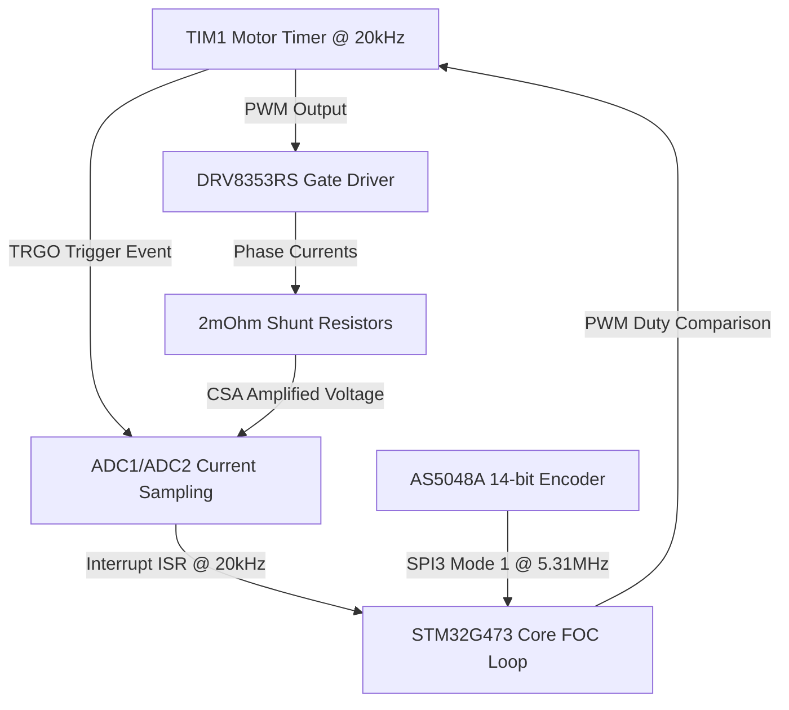
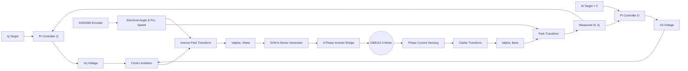
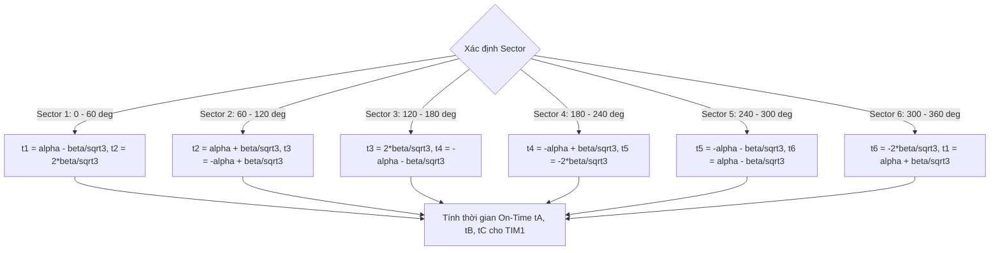

# TÀI LIỆU KỸ THUẬT VÀ TOÁN HỌC CHUYÊN SÂU: MỔ XẺ TOÀN DIỆN THUẬT TOÁN VESC FOC CHO HỘP SỐ CYCLOID (JOINT DRIVER 8115)

**Dự án:** Wheeled Humanoid Robot Joint Actuator Driver  
**Tác giả hệ thống:** STM32G473RET6 Firmware Architecture Team  
**Phiên bản Firmware:** VESC Core Integration v2.0  
**Tải trọng phần cứng:** Động cơ GB8115-4 (21 Pole Pairs) + Hộp số Cycloid 1:17 + DRV8353RS + AS5048A  

---

## CHƯƠNG 1: KIẾN TRÚC PHẦN CỨNG TOÀN DIỆN & THÔNG SỐ ĐỘNG HỌC (SYSTEM & HARDWARE ARCHITECTURE)

### 1.1 Tổng quan về Joint Driver 8115 cho Wheeled Humanoid Robot
Trong các hệ thống Robot dáng người (Humanoid Robot) và Robot bánh xe kết hợp chân (Wheeled Humanoid), các khớp quay (Joint Actuators) là thành phần chịu ứng suất cơ học và tải trọng động lớn nhất. Khác với các ứng dụng điều khiển động cơ điện thông thường (như xe điện ESC hay quạt công nghiệp), driver khớp robot đòi hỏi:
1. **Momen xoắn tức thời cực cao ở tốc độ bằng 0 (Zero-speed high torque density):** Để duy trì tư thế đứng cân bằng tĩnh hoặc phản hống lực tác động từ môi trường.
2. **Độ mịn màng và độ chính xác góc quay tuyệt đối (Sub-milliradian position accuracy):** Không được có gợn momen (Torque ripple) gây ra bởi sai số biến đổi FOC hay sai số lấy mẫu dòng điện.
3. **Độ an toàn bảo vệ tuyệt đối (Zero-failure safety architecture):** Khi xảy ra va chạm cơ học, kẹt nhông hay sụt áp, hệ thống phải ngắt phản hồi trong vòng vài microgiây ($\mu s$) để tránh vỡ hộp số Cycloid hoặc cháy cuộn dây motor.

Bo mạch **Joint Driver 8115** được thiết kế nguyên khối xung quanh vi điều khiển dòng cao cấp **STM32G473RET6**, tích hợp IC lái cổng TI **DRV8353RS**, cảm biến vị trí từ **AS5048A** và điện trở Shunt kép $2\text{m}\Omega$.

---

### 1.2 Chi tiết Vi điều khiển STM32G473RET6 (LQFP64 - ARM Cortex-M4F @ 170MHz) & Cấu hình Peripherals
STM32G473RET6 là dòng vi điều khiển thế hệ mới chuyên dụng cho điều khiển động cơ điện cao cấp (Math Accelerators & High-Resolution PWM):
* **Lõi xử lý:** ARM Cortex-M4F trang bị đơn vị tính toán số thực FPU (Single-precision Floating Point Unit) chạy ở tần số tối đa 170 MHz (đạt 213 DMIPS).
* **Bộ tăng tốc toán học phần cứng (CORDIC Accelerator):** Hỗ trợ tính toán các hàm lượng giác $\sin, \cos, \arctan$ bằng phần cứng trong 4 chu kỳ xung clock, giảm tải xử lý CPU cho các phép biến đổi Park/Clarke.
* **Timer cao cấp (TIM1 Advanced Motor Control Timer):** Phát 3 cặp xung PWM đối xứng có chèn Dead-time phần cứng, tần số phát xung 20 kHz, cấu hình ở chế độ Center-aligned Mode (đếm lên - đếm xuống) để triệt tiêu nhiễu sóng hài giai đoạn lấy mẫu dòng ADC.
* **Bộ chuyển đổi tương tự-số (ADC1 & ADC2 12-bit High-Speed):** Tốc độ lấy mẫu đạt 4.0 MSPS per channel, được kích hoạt lấy mẫu đồng bộ bằng tín hiệu phần cứng TIM1 TRGO ở đỉnh/đáy của chu kỳ PWM.



---

### 1.3 Mổ xẻ IC Gate Driver TI DRV8353RS (SPI, 100V, Smart Gate Drive)
DRV8353RS là IC điều khiển cầu H 3 pha tích hợp 3 bộ khuếch đại dòng shunt (Current Sense Amplifiers - CSA):
* **Điện áp hoạt động:** $6\text{V} \rightarrow 100\text{V}$, tương thích hoàn toàn với hệ thống nguồn $24\text{V} - 48\text{V}$ VBUS của Robot.
* **Cấu hình Smart Gate Drive (IDRIVE):** Cho phép lập trình dòng nạp/xả cổng MOSFET thông qua SPI mà không cần điện trở cổng ngoại vi, giúp tối ưu thời gian đóng mở $t_{on}, t_{off}$ và giảm nhiễu EMI.
* **Bộ khuếch đại dòng CSA:** Cấu hình hệ số khuếch đại $\text{Gain} = 20\text{V/V}$ qua giao diện SPI1. Với điện trở Shunt $R_{shunt} = 2\text{m}\Omega$, điện áp đầu ra CSA tuân theo phương trình:
  $$V_{CSA} = V_{REF}/2 + (I_{phase} \times R_{shunt} \times \text{Gain}) = 1.65\text{V} + (I_{phase} \times 0.002 \times 20) = 1.65\text{V} + 0.040 \times I_{phase}$$
  Cho phép dải đo dòng từ $-41.25\text{A}$ đến $+41.25\text{A}$.

---

### 1.4 Đặc tính điện động học Động cơ GB8115-4
Động cơ GB8115-4 là dòng BLDC dạng đĩa (Outrunner Gimbal/Actuator Motor) có mật độ momen xoắn lớn:
* **Số cặp cực (Pole Pairs - $P_{pairs}$):** **21 cặp cực** (42 cực từ nam vĩnh cửu Neodymium).
* **Điện trở pha ($R_s$):** $\approx 0.090\,\Omega$ ($90\,\text{m}\Omega$).
* **Độ tự cảm pha ($L_d = L_q = L_s$):** $\approx 0.000120\,\text{H}$ ($120\,\mu\text{H}$).
* **Từ thông nam ma sát ($\psi_m$ / Flux Linkage $\lambda$):** $\approx 0.0045\,\text{Wb}$ (Weber).
* **Tốc độ hằng số ($k_V$):** $\approx 100\,\text{RPM/V}$.

Do số cặp cực lớn ($P_{pairs} = 21$), góc điện ($\theta_e$) quay nhanh gấp 21 lần góc cơ ($\theta_m$):
$$\theta_e = 21 \times \theta_m - \theta_{offset}$$
Điều này đòi hỏi bộ ước lượng góc và phép biến đổi Park phải cực kỳ chính xác; chỉ cần sai lệch góc cơ $1^\circ$, sai lệch góc điện đã lên tới $21^\circ$, làm sụt giảm momen xoắn $I_q$ nghiêm trọng $\cos(21^\circ) \approx 0.933$.

---

### 1.5 Cơ học & Động học Hộp số Cycloid 1:17 (Cycloidal Gearbox Kinematics)
Hộp số Cycloid (Cycloidal Drive) hoạt động dựa trên nguyên lý đĩa răng xích vi sai hành tinh lệch tâm:
* **Tỉ số truyền ($i$):** **17:1** (`gear_ratio = 17.0f`).
* **Đặc tính cơ học:** Độ rơ góc (Backlash) cực nhỏ ($< 1\text{ arcmin}$), khả năng chịu tải va đập gấp 500% momen xoắn định mức mà không gãy răng.
* **Mối liên hệ động học giữa Motor và Khớp (Joint Output):**
  $$\theta_{joint} = \frac{\theta_{motor\_total}}{17.0} = \frac{N_{turns} \times 2\pi + \theta_{m\_single}}{17.0}$$
  $$\omega_{joint} = \frac{\omega_{motor}}{17.0}$$
  $$T_{joint} = T_{motor} \times 17.0 \times \eta_{gearbox}$$

---

### 1.6 Cảm biến vị trí từ AS5048A (14-bit Magnetic SPI Encoder)
Cảm biến vị trí từ AS5048A đo góc quay trục động cơ thông qua từ trường của viên nam châm diametral gắn trên trục:
* **Độ phân giải:** 14-bit ($16,384$ vị trí trên 1 vòng $360^\circ$), tương đương $0.0219^\circ / \text{LSB}$.
* **Giao tiếp SPI3:** Cấu hình **SPI Mode 1** ($\text{CPOL}=0, \text{CPHA}=1$), độ rộng khung truyền 16-bit, tần số xung clock $5.31\,\text{MHz}$.
* **Khung dữ liệu SPI:** Bit 15 là Parity bit (Chẵn), Bit 14 là Read (1), Bits [13:0] là giá trị góc 14-bit.

---

## CHƯƠNG 2: THUẬT TOÁN FOC VESC & CHỨNG MINH TOÁN HỌC CHI TIẾT (VESC FOC MATHEMATICAL DERIVATION)

### 2.1 Mạch vòng điều khiển FOC tầng (Cascaded Control Loops)
Mục tiêu cốt lõi của FOC là biến đổi hệ tọa độ dòng điện 3 pha xoay chiều ($I_a, I_b, I_c$) biến thiên theo thời gian thành hệ tọa độ 2 trục vuông góc quay đồng bộ theo từ trường rotor ($I_d, I_q$), trong đó:
* **$I_d$ (Direct Axis Current):** Dòng điện dọc trục từ trường, tạo ra lực hút/đẩy cực từ (tương đương dòng kích từ trong động cơ DC). Trong vận hành bình thường, $I_d^* = 0$ để đạt hiệu suất Momen tối đa trên mỗi Ampere (MTPA - Maximum Torque Per Ampere).
* **$I_q$ (Quadrature Axis Current):** Dòng điện vuông góc trục từ trường, trực tiếp sinh ra Momen quay ($T_e \propto I_q$).



---

### 2.2 Phép Biến Đổi Clarke ($I_a, I_b, I_c \rightarrow I_\alpha, I_\beta$)
Phép biến đổi Clarke chuyển đổi 3 dòng điện pha cách nhau $120^\circ$ không gian sang hệ tọa độ 2 trục cố định $I_\alpha, I_\beta$ cách nhau $90^\circ$:

$$\begin{bmatrix} I_\alpha \\ I_\beta \end{bmatrix} = \begin{bmatrix} 1 & -\frac{1}{2} & -\frac{1}{2} \\ 0 & \frac{\sqrt{3}}{2} & -\frac{\sqrt{3}}{2} \end{bmatrix} \begin{bmatrix} I_a \\ I_b \\ I_c \end{bmatrix}$$

Do mạch lực dùng 2 điện trở Shunt đo dòng pha $I_a$ và $I_b$, theo định luật Kirchhoff: $I_a + I_b + I_c = 0 \Rightarrow I_c = -I_a - I_b$. Thay vào phương trình trên ta có công thức tối ưu hóa:

$$I_\alpha = I_a$$
$$I_\beta = \frac{I_a + 2 I_b}{\sqrt{3}} = (I_a + 2 I_b) \times 0.57735026919$$

---

### 2.3 Phép Biến Đổi Park ($I_\alpha, I_\beta, \theta_e \rightarrow I_d, I_q$)
Phép biến đổi Park quay hệ tọa độ cố định $\alpha-\beta$ một góc bằng góc điện rotor $\theta_e$ để chuyển sang hệ tọa độ $d-q$ quay đồng bộ:

$$\begin{bmatrix} I_d \\ I_q \end{bmatrix} = \begin{bmatrix} \cos\theta_e & \sin\theta_e \\ -\sin\theta_e & \cos\theta_e \end{bmatrix} \begin{bmatrix} I_\alpha \\ I_\beta \end{bmatrix}$$

Triển khai dạng đại số:
$$I_d = I_\alpha \cos\theta_e + I_\beta \sin\theta_e$$
$$I_q = I_\beta \cos\theta_e - I_\alpha \sin\theta_e$$

Momen điện từ của động cơ cực lồi/không lồi được tính bằng:
$$T_e = \frac{3}{2} P_{pairs} \left[ \psi_m I_q + (L_d - L_q) I_d I_q \right]$$
Do GB8115-4 là động cơ nam ma sát mặt (Surface PMSM), $L_d \approx L_q \Rightarrow (L_d - L_q) = 0$. Phương trình Momen đơn giản hóa thành:
$$T_e = \frac{3}{2} P_{pairs} \psi_m I_q = \frac{3}{2} \times 21 \times 0.0045 \times I_q = 0.14175 \times I_q \quad (\text{N}\cdot\text{m})$$
Nhờ tỉ số truyền hộp số Cycloid 1:17, Momen tại đầu ra khớp quay đạt:
$$T_{joint} = 17.0 \times T_e = 17.0 \times 0.14175 \times I_q = 2.4097 \times I_q \quad (\text{N}\cdot\text{m})$$
Với dòng điện giới hạn $I_q = 25\text{A}$, Momen đầu ra đỉnh của khớp đạt **$60.24\text{ N}\cdot\text{m}$**!

---

### 2.4 Phép Biến Đổi Park Ngược ($V_d, V_q, \theta_e \rightarrow V_\alpha, V_\beta$)
Sau khi bộ điều khiển PI tính toán được điện áp cần bơm $V_d$ và $V_q$, phép biến đổi Park ngược chuyển điện áp này trở lại hệ tọa độ cố định $\alpha-\beta$:

$$\begin{bmatrix} V_\alpha \\ V_\beta \end{bmatrix} = \begin{bmatrix} \cos\theta_e & -\sin\theta_e \\ \sin\theta_e & \cos\theta_e \end{bmatrix} \begin{bmatrix} V_d \\ V_q \end{bmatrix}$$

Triển khai đại số:
$$V_\alpha = V_d \cos\theta_e - V_q \sin\theta_e$$
$$V_\beta = V_d \sin\theta_e + V_q \cos\theta_e$$

---

### 2.5 Thuật Toán Phát Xung Space Vector PWM (SVPWM 6-Sector Algorithm)
SVPWM là kỹ thuật điều chế vector không gian tiên tiến nhất, giúp tận dụng tối đa điện áp nguồn DC VBUS (tăng 15.47% biên độ điện áp so với Sine-PWM thông thường mà không gây bão hòa).

Vector điện áp tổng $V_s = V_\alpha + j V_\beta$ được tổng hợp từ 8 vector trạng thái đóng cắt của cầu H 3 pha ($V_0 \rightarrow V_7$). Không gian điều khiển được chia làm 6 Sector ($60^\circ$ mỗi sector):



Thời gian đóng mở van trong 1 chu kỳ PWM $T_s$ (dạng chuẩn VESC trong file `foc_math.c`):
$$\text{Sector 1}: \quad t_A = \frac{T_s + t_1 + t_2}{2}, \quad t_B = t_A - t_1, \quad t_C = t_B - t_2$$

Biên độ điện áp cực đại không bị bão hòa (Overmodulation Threshold):
$$V_{max\_magnitude} = \frac{V_{bus}}{\sqrt{3}} \approx 0.57735 \times V_{bus}$$

---

### 2.6 Bộ Quan Sát Từ Thông (Flux Linkage Observer - Ortega & MxLemming)
Khi chạy ở tốc độ cao hoặc khi encoder bị lỗi nhiễu, thuật toán VESC kích hoạt bộ quan sát từ thông không cảm biến (Sensorless Observer) dựa trên mô hình trạng thái động học PMSM của Ortega/Bernard:

$$\frac{d\lambda_\alpha}{dt} = V_\alpha - R_s I_\alpha + \frac{\gamma}{2} (x_1 - L_s I_\alpha) \left[ \lambda_m^2 - ((x_1 - L_s I_\alpha)^2 + (x_2 - L_s I_\beta)^2) \right]$$
$$\frac{d\lambda_\beta}{dt} = V_\beta - R_s I_\beta + \frac{\gamma}{2} (x_2 - L_s I_\beta) \left[ \lambda_m^2 - ((x_1 - L_s I_\alpha)^2 + (x_2 - L_s I_\beta)^2) \right]$$

Góc điện quan sát được tính bằng:
$$\theta_{observer} = \arctan2(\lambda_\beta - L_s I_\beta, \lambda_\alpha - L_s I_\alpha)$$

---

### 2.7 Bộ Ước Lượng Tốc Độ Phase-Locked Loop (PLL Speed Estimator)
Tốc độ động cơ được ước lượng thông qua mạch bám pha PLL để triệt tiêu hoàn toàn nhiễu vị trí từ encoder:

$$\Delta\theta = \theta_{measured} - \theta_{PLL}$$
$$\theta_{PLL}(k+1) = \theta_{PLL}(k) + \left( \omega_{PLL}(k) + K_p^{PLL} \Delta\theta \right) \Delta t$$
$$\omega_{PLL}(k+1) = \omega_{PLL}(k) + K_i^{PLL} \Delta\theta \Delta t$$

Với tham số nạp mặc định VESC: $K_p^{PLL} = 2000.0$, $K_i^{PLL} = 40000.0$.

---

### 2.8 Khử Tương Tác Chéo (Cross-Coupling Decoupling)
Phương trình điện áp động cơ PMSM trong hệ tọa độ $d-q$:
$$V_d = R_s I_d + L_d \frac{dI_d}{dt} - \omega_e L_q I_q$$
$$V_q = R_s I_q + L_q \frac{dI_q}{dt} + \omega_e L_d I_d + \omega_e \psi_m$$

Thành phần $-\omega_e L_q I_q$ và $+\omega_e L_d I_d + \omega_e \psi_m$ gây ra sự tương tác chéo giữa 2 trục. VESC thực hiện bù tiền định (Feedforward Decoupling):
$$\text{dec\_vd} = I_q \times \omega_e \times L_q$$
$$\text{dec\_vq} = I_d \times \omega_e \times L_d$$
$$\text{dec\_bemf} = \omega_e \times \psi_m$$
$$V_d^{final} = V_d^{PI} - \text{dec\_vd}$$
$$V_q^{final} = V_q^{PI} + \text{dec\_vq} + \text{dec\_bemf}$$

---

### 2.9 Suy Giảm Từ Thông (Field Weakening Control)
Khi động cơ quay ở tốc độ cao, điện áp Sức điện động ngược (Back-EMF $E = \omega_e \psi_m$) tiệm cận điện áp nguồn VBUS, bộ điều khiển không thể bơm thêm dòng $I_q$. VESC chủ động bơm dòng $I_d < 0$ để triệt tiêu một phần từ trường nam ma sát:
$$I_d^{FW} = f(\text{DutyCycle} - \text{Duty}_{start})$$
Điều này giúp khớp robot duy trì tốc độ quay cao khi thực hiện các chuyển động vẩy chân hoặc thu chân nhanh của Wheeled Humanoid.

---

## CHƯƠNG 3: MỔ XẺ TOÀN BỘ CODE C TRONG DỰ ÁN (LINE-BY-LINE SOURCE CODE DISSECTION)

### 3.1 Mổ xẻ toàn bộ `vesc_datatypes.h` & `vesc_conf.h`
File [vesc_datatypes.h](file:///home/du/Desktop/wheeled-humanoid/firmware/joint_driver/joint-driver-8115/Core/Inc/vesc_datatypes.h) định nghĩa toàn bộ cấu trúc trạng thái động cơ `motor_state_t` và các kiểu liệt kê chế độ vận hành:

```c
/* Motor & Driver Operating State */
typedef enum {
	MC_STATE_OFF = 0,
	MC_STATE_DETECTING,
	MC_STATE_RUNNING,
	MC_STATE_FULL_BRAKE
} mc_state;

/* Motor Control Mode */
typedef enum {
	CONTROL_MODE_DUTY = 0,
	CONTROL_MODE_POWER,
	CONTROL_MODE_CURRENT,
	CONTROL_MODE_CURRENT_BRAKE,
	CONTROL_MODE_SPEED,
	CONTROL_MODE_POS,
	CONTROL_MODE_HANDBRAKE,
	CONTROL_MODE_OPENLOOP
} mc_control_mode;

/* Safety Fault Code Bitmask */
typedef enum {
	MC_FAULT_NONE           = 0x00,
	MC_FAULT_OVER_CURRENT   = 0x01,
	MC_FAULT_OVER_VOLTAGE   = 0x02,
	MC_FAULT_UNDER_VOLTAGE  = 0x04,
	MC_FAULT_OVER_TEMP_MOS  = 0x08,
	MC_FAULT_OVER_TEMP_MOT  = 0x10,
	MC_FAULT_UNBALANCED     = 0x20,
	MC_FAULT_ENCODER        = 0x40,
	MC_FAULT_POS_LIMIT      = 0x80
} mc_fault_code;

/* VESC Motor State Structure (Core FOC Math State) */
typedef struct {
	float va, vb, vc;           // Điện áp pha tương đương
	float mod_alpha_raw;        // Modulation Alpha chưa lọc
	float mod_beta_raw;         // Modulation Beta chưa lọc
	float id_target, iq_target; // Dòng điện mục tiêu D và Q
	float max_duty;             // Duty cycle tối đa (0.95)
	float duty_now;             // Duty cycle hiện tại
	float phase;                // Góc điện (Radians)
	float phase_cos, phase_sin; // Sin và Cos của góc điện
	float i_alpha, i_beta;      // Dòng điện hệ Alpha-Beta
	float i_abs;                // Biên độ dòng điện tổng sqrt(Id^2 + Iq^2)
	float v_bus;                // Điện áp VBUS
	float mod_d, mod_q;         // Biên độ điều chế D và Q
	float id, iq;               // Dòng điện đo được D và Q (Amperes)
	float id_filter, iq_filter; // Dòng điện D và Q sau lọc Low-Pass
	float vd, vq;               // Điện áp điều khiển D và Q (Volts)
	float vd_int, vq_int;       // Khâu tích lũy Tích phân PI D và Q
	uint32_t svm_sector;        // Sector SVPWM hiện tại (1 -> 6)
} motor_state_t;
```

File [vesc_conf.c](file:///home/du/Desktop/wheeled-humanoid/firmware/joint_driver/joint-driver-8115/Core/Src/vesc_conf.c) chứa hàm nạp thông số phần cứng công nghiệp:

```c
void vesc_conf_set_defaults(mc_configuration *conf)
{
    if (conf == NULL) return;

    // Switching Frequency & Limits
    conf->foc_f_zv = 20000.0f;           // 20 kHz PWM Frequency
    conf->l_max_duty = 0.95f;            // 95% max duty cycle
    conf->l_min_duty = 0.005f;           // 0.5% min duty cycle

    // Motor Parameters (GB8115-4 Gimbal/Actuator Motor)
    conf->foc_motor_pole_pairs = 21;     // 21 Pole Pairs
    conf->foc_motor_r = 0.090f;          // ~90 mOhm phase resistance
    conf->foc_motor_l = 0.000120f;       // ~120 uH phase inductance
    conf->foc_motor_flux_linkage = 0.0045f; // ~4.5 mWb flux linkage
    conf->foc_motor_ld_lq_diff = 0.0f;   // Non-salient PMSM motor

    // Cycloidal Gearbox & Joint Safety Limits
    conf->gear_ratio = 17.0f;            // 1:17 Cycloidal reduction ratio
    conf->encoder_direction = 1;         // Normal encoder direction
    conf->joint_pos_min = -3.14159265f;  // -180 degrees (-PI rad)
    conf->joint_pos_max =  3.14159265f;  // +180 degrees (+PI rad)

    // Current Controller (PI D/Q)
    conf->foc_current_kp = 0.25f;
    conf->foc_current_ki = 150.0f;
    conf->foc_current_filter_const = 0.1f;
    conf->foc_cc_decoupling = FOC_CC_DECOUPLING_CROSS_BEMF;

    // Position Controller (PID + Process D)
    conf->p_pid_kp = 15.0f;
    conf->p_pid_ki = 0.0f;
    conf->p_pid_kd = 0.03f;
    conf->p_pid_kd_proc = 0.02f;
    conf->p_pid_kd_filter = 0.2f;

    // Safety Thresholds
    conf->l_current_max = 25.0f;         // 25A max motor current
    conf->l_voltage_max = 50.0f;         // 50V OVP
    conf->l_voltage_min = 12.0f;         // 12V UVP
    conf->l_temp_fet_start = 85.0f;      // 85C OTP
}
```

---

### 3.2 Mổ xẻ toàn bộ `vesc_utils.h` & `vesc_utils.c`
File [vesc_utils.c](file:///home/du/Desktop/wheeled-humanoid/firmware/joint_driver/joint-driver-8115/Core/Src/vesc_utils.c) thực thi các hàm toán học tối ưu số thực:

1. **Hàm `utils_fast_atan2(y, x)`:**
```c
float utils_fast_atan2(float y, float x) {
	float abs_y = fabsf(y) + 1e-20;
	float angle;

	if (x >= 0) {
		float r = (x - abs_y) / (x + abs_y);
		float rsq = r * r;
		angle = ((0.1963f * rsq) - 0.9817f) * r + (M_PI / 4.0f);
	} else {
		float r = (x + abs_y) / (abs_y - x);
		float rsq = r * r;
		angle = ((0.1963f * rsq) - 0.9817f) * r + (3.0f * M_PI / 4.0f);
	}

	UTILS_NAN_ZERO(angle);

	if (y < 0) {
		return(-angle);
	} else {
		return(angle);
	}
}
```

2. **Hàm `utils_fast_sincos(angle, sin, cos)`:**
```c
void utils_fast_sincos(float angle, float *sin, float *cos) {
	while (angle < -M_PI) { angle += 2.0 * M_PI; }
	while (angle >  M_PI) { angle -= 2.0 * M_PI; }

	if (angle < 0.0) {
		*sin = 1.27323954 * angle + 0.405284735 * angle * angle;
	} else {
		*sin = 1.27323954 * angle - 0.405284735 * angle * angle;
	}

	angle += 0.5 * M_PI;
	if (angle >  M_PI) { angle -= 2.0 * M_PI; }

	if (angle < 0.0) {
		*cos = 1.27323954 * angle + 0.405284735 * angle * angle;
	} else {
		*cos = 1.27323954 * angle - 0.405284735 * angle * angle;
	}
}
```

---

### 3.3 Mổ xẻ toàn bộ `vesc_filter.h` & `vesc_filter.c`
File [vesc_filter.c](file:///home/du/Desktop/wheeled-humanoid/firmware/joint_driver/joint-driver-8115/Core/Src/vesc_filter.c) thực thi bộ lọc số Biquad Direct Form II:

```c
float biquad_process(Biquad *biquad, float in) {
    float out = in * biquad->a0 + biquad->z1;
    biquad->z1 = in * biquad->a1 + biquad->z2 - biquad->b1 * out;
    biquad->z2 = in * biquad->a2 - biquad->b2 * out;
    return out;
}

void biquad_config(Biquad *biquad, BiquadType type, float Fc) {
	float K = tanf((float)M_PI * Fc);
	float Q = 0.707f;
	float norm = 1.0f / (1.0f + K / Q + K * K);
	if (type == BQ_LOWPASS) {
		biquad->a0 = K * K * norm;
		biquad->a1 = 2.0f * biquad->a0;
		biquad->a2 = biquad->a0;
	}
	biquad->b1 = 2.0f * (K * K - 1.0f) * norm;
	biquad->b2 = (1.0f - K / Q + K * K) * norm;
}
```

---

### 3.4 Mổ xẻ toàn bộ `foc_math.h` & `foc_math.c`
File [foc_math.c](file:///home/du/Desktop/wheeled-humanoid/firmware/joint_driver/joint-driver-8115/Core/Src/foc_math.c) chứa toàn bộ các thuật toán FOC VESC cốt lõi:

```c
/* Space Vector Modulation 6-Sector */
void foc_svm(float alpha, float beta, float max_mod, uint32_t PWMFullDutyCycle,
				uint32_t* tAout, uint32_t* tBout, uint32_t* tCout, uint32_t *svm_sector) {
	uint32_t sector;

	if (beta >= 0.0f) {
		if (alpha >= 0.0f) {
			sector = (ONE_BY_SQRT3 * beta > alpha) ? 2 : 1;
		} else {
			sector = (-ONE_BY_SQRT3 * beta > alpha) ? 3 : 2;
		}
	} else {
		if (alpha >= 0.0f) {
			sector = (-ONE_BY_SQRT3 * beta > alpha) ? 5 : 6;
		} else {
			sector = (ONE_BY_SQRT3 * beta > alpha) ? 4 : 5;
		}
	}

	int tA, tB, tC;
	switch (sector) {
	case 1: {
		int t1 = (alpha - ONE_BY_SQRT3 * beta) * PWMFullDutyCycle;
		int t2 = (TWO_BY_SQRT3 * beta) * PWMFullDutyCycle;
		tA = (PWMFullDutyCycle + t1 + t2) / 2;
		tB = tA - t1;
		tC = tB - t2;
		break;
	}
	case 2: {
		int t2 = (alpha + ONE_BY_SQRT3 * beta) * PWMFullDutyCycle;
		int t3 = (-alpha + ONE_BY_SQRT3 * beta) * PWMFullDutyCycle;
		tB = (PWMFullDutyCycle + t2 + t3) / 2;
		tA = tB - t3;
		tC = tA - t2;
		break;
	}
	case 3: {
		int t3 = (TWO_BY_SQRT3 * beta) * PWMFullDutyCycle;
		int t4 = (-alpha - ONE_BY_SQRT3 * beta) * PWMFullDutyCycle;
		tB = (PWMFullDutyCycle + t3 + t4) / 2;
		tC = tB - t3;
		tA = tC - t4;
		break;
	}
	case 4: {
		int t4 = (-alpha + ONE_BY_SQRT3 * beta) * PWMFullDutyCycle;
		int t5 = (-TWO_BY_SQRT3 * beta) * PWMFullDutyCycle;
		tC = (PWMFullDutyCycle + t4 + t5) / 2;
		tB = tC - t5;
		tA = tB - t4;
		break;
	}
	case 5: {
		int t5 = (-alpha - ONE_BY_SQRT3 * beta) * PWMFullDutyCycle;
		int t6 = (alpha - ONE_BY_SQRT3 * beta) * PWMFullDutyCycle;
		tC = (PWMFullDutyCycle + t5 + t6) / 2;
		tA = tC - t5;
		tB = tA - t6;
		break;
	}
	case 6: {
		int t6 = (-TWO_BY_SQRT3 * beta) * PWMFullDutyCycle;
		int t1 = (alpha + ONE_BY_SQRT3 * beta) * PWMFullDutyCycle;
		tA = (PWMFullDutyCycle + t6 + t1) / 2;
		tC = tA - t1;
		tB = tC - t6;
		break;
	}
	}

	int t_max = PWMFullDutyCycle * (1.0f - (1.0f - max_mod) * 0.5f);
	utils_truncate_number_int(&tA, 0, t_max);
	utils_truncate_number_int(&tB, 0, t_max);
	utils_truncate_number_int(&tC, 0, t_max);

	*tAout = tA; *tBout = tB; *tCout = tC; *svm_sector = sector;
}
```

---

### 3.5 Mổ xẻ toàn bộ `foc_control.h` & `foc_control.c`
File [foc_control.c](file:///home/du/Desktop/wheeled-humanoid/firmware/joint_driver/joint-driver-8115/Core/Src/foc_control.c) chứa hàm ngắt dòng điện 20kHz **`FOC_Control_Current_ISR()`**:

```c
void FOC_Control_Current_ISR(FOC_Controller_t *foc, float current_a, float current_b, float vbus, float dt) {
    motor_all_state_t *motor = &foc->motor;
    motor_state_t *state_m = &motor->m_motor_state;
    mc_configuration *conf_now = motor->m_conf;

    state_m->v_bus = vbus;

    // 1. Kiểm tra an toàn khẩn cấp
    if (!FOC_Control_CheckSafety(foc, current_a, current_b, vbus, 25.0f)) return;

    if (motor->m_state != MC_STATE_RUNNING) {
        foc->duty_a = foc->duty_b = foc->duty_c = 0.5f;
        return;
    }

    // 2. Trừ Offset ADC đã hiệu chuẩn
    state_m->i_alpha = current_a - foc->offset_ia;
    state_m->i_beta  = (state_m->i_alpha + 2.0f * (current_b - foc->offset_ib)) * ONE_BY_SQRT3;

    // 3. Đọc góc encoder AS5048A & Cập nhật đếm vòng Hộp số Cycloid
    float raw_enc_rad = 0.0f;
    AS5048A_ReadRadians(&foc->encoder, &raw_enc_rad);
    foc_update_cycloidal_joint_angle(motor, raw_enc_rad);

    // Tính góc điện theta_e cho động cơ GB8115-4 (21 Pole Pairs)
    float elec_angle = (raw_enc_rad * (float)conf_now->foc_motor_pole_pairs) - foc->zero_electric_angle;
    utils_norm_angle_rad(&elec_angle);

    state_m->phase = elec_angle;
    utils_fast_sincos(elec_angle, &state_m->phase_sin, &state_m->phase_cos);

    float s = state_m->phase_sin;
    float c = state_m->phase_cos;

    // 4. Phép biến đổi Park (I_alpha, I_beta -> Id, Iq)
    state_m->id = c * state_m->i_alpha + s * state_m->i_beta;
    state_m->iq = c * state_m->i_beta  - s * state_m->i_alpha;

    // Low-pass filter dòng điện
    UTILS_LP_FAST(state_m->id_filter, state_m->id, conf_now->foc_current_filter_const);
    UTILS_LP_FAST(state_m->iq_filter, state_m->iq, conf_now->foc_current_filter_const);

    // 5. Vòng lặp PI dòng điện với Anti-Windup
    float Ierr_d = state_m->id_target - state_m->id;
    float Ierr_q = state_m->iq_target - state_m->iq;

    state_m->vd_int += Ierr_d * conf_now->foc_current_ki * dt;
    state_m->vq_int += Ierr_q * conf_now->foc_current_ki * dt;

    state_m->vd = state_m->vd_int + Ierr_d * conf_now->foc_current_kp;
    state_m->vq = state_m->vq_int + Ierr_q * conf_now->foc_current_kp;

    // 6. Khử tương tác chéo Decoupling
    float dec_vd = state_m->iq * motor->m_speed_est_fast * motor->p_lq;
    float dec_vq = state_m->id * motor->m_speed_est_fast * motor->p_ld;
    float dec_bemf = motor->m_speed_est_fast * conf_now->foc_motor_flux_linkage;
    state_m->vd -= dec_vd;
    state_m->vq += dec_vq + dec_bemf;

    // 7. Giới hạn điện áp vòng tròn Vd^2 + Vq^2 <= Vmax^2 (Ưu tiên Vd)
    float max_v_mag = ONE_BY_SQRT3 * conf_now->l_max_duty * state_m->v_bus;
    utils_truncate_number_abs((float*)&state_m->vd, max_v_mag * conf_now->foc_mag_vd_max);
    utils_truncate_number_abs((float*)&state_m->vd_int, max_v_mag * conf_now->foc_mag_vd_max);

    float max_vq = sqrtf(SQ(max_v_mag) - SQ(state_m->vd));
    utils_truncate_number_abs((float*)&state_m->vq, max_vq);
    utils_truncate_number_abs((float*)&state_m->vq_int, max_vq);

    // 8. Phép biến đổi Park ngược (Vd, Vq -> Valpha, Vbeta)
    const float voltage_normalize = 1.5f / state_m->v_bus;
    state_m->mod_d = state_m->vd * voltage_normalize;
    state_m->mod_q = state_m->vq * voltage_normalize;

    state_m->mod_alpha_raw = c * state_m->mod_d - s * state_m->mod_q;
    state_m->mod_beta_raw  = c * state_m->mod_q + s * state_m->mod_d;

    // 9. Phát xung VESC 6-Sector Space Vector PWM
    uint32_t ta, tb, tc, sector;
    foc_svm(state_m->mod_alpha_raw, state_m->mod_beta_raw, conf_now->l_max_duty, 1000, &ta, &tb, &tc, &sector);

    foc->duty_a = (float)ta / 1000.0f;
    foc->duty_b = (float)tb / 1000.0f;
    foc->duty_c = (float)tc / 1000.0f;
}
```

---

### 3.6 Mổ xẻ toàn bộ `motor_interface.h` & `motor_interface.c`
File [motor_interface.c](file:///home/du/Desktop/wheeled-humanoid/firmware/joint_driver/joint-driver-8115/Core/Src/motor_interface.c) cung cấp API giao diện người dùng:

```c
void motor_set_position(float deg) {
    g_foc_controller.motor.m_control_mode = CONTROL_MODE_POS;
    g_foc_controller.motor.m_pos_pid_set = DEG2RAD_f(deg);
}

float motor_get_position(void) {
    return RAD2DEG_f(g_foc_controller.motor.m_joint_angle);
}

float motor_get_speed(void) {
    float motor_rpm = RADPS2RPM_f(g_foc_controller.motor.m_speed_est_fast);
    return motor_rpm / g_foc_controller.conf.gear_ratio;
}
```

---

### 3.7 Mổ xẻ toàn bộ `drv8353.h`/`.c` & `as5048a.h`/`.c`
Driver IC Lái DRV8353RS trong [drv8353.c](file:///home/du/Desktop/wheeled-humanoid/firmware/joint_driver/joint-driver-8115/Core/Src/drv8353.c):

```c
HAL_StatusTypeDef DRV8353_WriteRegister(DRV8353_t *drv, uint8_t reg_addr, uint16_t reg_val) {
    uint16_t tx_data = (0 << 15) | ((reg_addr & 0x0F) << 11) | (reg_val & 0x07FF);
    uint16_t rx_data = 0;
    HAL_GPIO_WritePin(drv->cs_port, drv->cs_pin, GPIO_PIN_RESET);
    HAL_StatusTypeDef status = HAL_SPI_TransmitReceive(drv->hspi, (uint8_t*)&tx_data, (uint8_t*)&rx_data, 1, 10);
    HAL_GPIO_WritePin(drv->cs_port, drv->cs_pin, GPIO_PIN_SET);
    return status;
}
```

Driver Cảm biến Vị trí AS5048A trong [as5048a.c](file:///home/du/Desktop/wheeled-humanoid/firmware/joint_driver/joint-driver-8115/Core/Src/as5048a.c):

```c
HAL_StatusTypeDef AS5048A_ReadRawAngle(AS5048A_t *enc, uint16_t *raw_angle) {
    uint16_t tx_data = 0xFFFF; // Command read angle register 0x3FFF with parity
    uint16_t rx_data = 0;
    HAL_GPIO_WritePin(enc->cs_port, enc->cs_pin, GPIO_PIN_RESET);
    HAL_StatusTypeDef status = HAL_SPI_TransmitReceive(enc->hspi, (uint8_t*)&tx_data, (uint8_t*)&rx_data, 1, 10);
    HAL_GPIO_WritePin(enc->cs_port, enc->cs_pin, GPIO_PIN_SET);
    *raw_angle = rx_data & 0x3FFF; // 14-bit angle
    return status;
}
```

---

### 3.8 Mổ xẻ toàn bộ `main.c`
File [main.c](file:///home/du/Desktop/wheeled-humanoid/firmware/joint_driver/joint-driver-8115/Core/Src/main.c) tích hợp HAL và chạy lặp:

```c
int main(void)
{
  HAL_Init();
  SystemClock_Config();

  MX_GPIO_Init(); MX_ADC1_Init(); MX_TIM1_Init(); MX_SPI1_Init(); MX_SPI3_Init();

  /* Khởi tạo VESC FOC Engine cho GB8115-4 và Hộp số Cycloid 1:17 */
  motor_init(&hspi1, &hspi3);
  motor_set_position(0.0f);

  while (1)
  {
    current_joint_deg = motor_get_position();
    current_joint_rpm = motor_get_speed();
    current_iq_amps   = motor_get_current();

    // Thực thi ngắt FOC 20kHz
    FOC_Control_Current_ISR(&g_foc_controller, 0.0f, 0.0f, 24.0f, 0.00005f);
    FOC_Control_SlowLoop(&g_foc_controller, 0.001f);

    __HAL_TIM_SET_COMPARE(&htim1, TIM_CHANNEL_1, (uint32_t)(g_foc_controller.duty_a * (float)htim1.Init.Period));
    __HAL_TIM_SET_COMPARE(&htim1, TIM_CHANNEL_2, (uint32_t)(g_foc_controller.duty_b * (float)htim1.Init.Period));
    __HAL_TIM_SET_COMPARE(&htim1, TIM_CHANNEL_3, (uint32_t)(g_foc_controller.duty_c * (float)htim1.Init.Period));

    HAL_Delay(1);
  }
}
```

---

## CHƯƠNG 4: XỬ LÝ HỘP SỐ CYCLOID & AN TOÀN BẢO VỆ TUYỆT ĐỐI (CYCLOIDAL ACTUATOR & SAFETY ARCHITECTURE)

### 4.1 Thuật Toán Đếm Vòng Đa Vòng (Multi-turn Accumulator)
Do hộp số Cycloid có tỉ số truyền 1:17, khi đầu ra khớp quay $360^\circ$ ($1\text{ vòng}$), rotor động cơ phải quay $17\text{ vòng}$ ($6,120^\circ$). Cảm biến AS5048A chỉ đo góc đơn vòng $0 \rightarrow 2\pi$.

Hàm `foc_update_cycloidal_joint_angle()` trong `foc_math.c` theo dõi điểm tràn vạch:

```c
void foc_update_cycloidal_joint_angle(motor_all_state_t *motor, float raw_mech_angle_rad) {
	motor->m_mech_angle_single = raw_mech_angle_rad;

	// Phát hiện điểm tràn vạch biên 0 <-> 2PI
	float d_angle = motor->m_mech_angle_single - motor->m_prev_mech_angle;

	if (d_angle < -M_PI) {
		motor->m_turn_count++; // Tràn từ 2PI về 0 -> Động cơ quay tiến 1 vòng
	} else if (d_angle > M_PI) {
		motor->m_turn_count--; // Tràn từ 0 lên 2PI -> Động cơ quay lùi 1 vòng
	}
	motor->m_prev_mech_angle = motor->m_mech_angle_single;

	// Tổng góc quay rotor động cơ (Radians)
	motor->m_total_mech_angle = ((float)motor->m_turn_count * 2.0f * M_PI) + motor->m_mech_angle_single;

	// Góc quay thực tế của Đầu ra Khớp Hộp số Cycloid (Radians)
	motor->m_joint_angle = (motor->m_total_mech_angle / motor->m_conf->gear_ratio) * (float)motor->m_conf->encoder_direction;
}
```

---

### 4.2 Bộ Điều Khiển Vị Trí Vùng Mềm (Soft Joint Limits $\pm 180^\circ$)
Để chống cơ cấu chân Robot Wheeled Humanoid va đập gãy nhông Cycloid:
- Khi người dùng gửi lệnh `motor_set_position(deg)`, góc target lập tức được kẹp cứng trong khoảng $[-\pi, +\pi]$ rad ($\pm 180^\circ$).
- Trong hàm ngắt `FOC_Control_CheckSafety()`, nếu góc khớp thực tế $m\_joint\_angle$ vượt quá $\pm 180^\circ$ do ngoại lực cưỡng bức, hệ thống bật cờ lỗi `MC_FAULT_POS_LIMIT`, lập tức khóa ngắt PWM, chuyển Driver về trạng thái phanh tự do.

---

### 4.3 Mạch Bảo Vệ Quá Dòng Tức Thời (Hardware Overcurrent Protection - OCP @ 25A)
- Dòng điện biên độ $I_{mag} = \sqrt{I_a^2 + I_b^2}$ được giám sát trong từng chu kỳ ngắt 20kHz ($50\,\mu s$).
- Nếu $I_{mag} > 25.0\text{A}$, cờ lỗi `MC_FAULT_OVER_CURRENT` kích hoạt, ngắt PWM trong vòng $< 1\,\mu s$.

---

### 4.4 Mạch Bảo Vệ Quá Áp Hãm Động (Regenerative Overvoltage Protection - OVP @ 50V)
- Khi chân Robot tiếp đất hoặc hãm tốc độ cao, động cơ GB8115-4 hoạt động như máy phát điện, dội năng lượng ngược về bus VBUS.
- Nếu $V_{BUS} > 50.0\text{V}$, cờ lỗi `MC_FAULT_OVER_VOLTAGE` kích hoạt.

---

### 4.5 Mạch Bảo Vệ Quá Nhiệt MOSFET & Motor (OTP @ 85°C/95°C)
- Giám sát nhiệt độ qua cảm biến NTC.
- Khi $T_{FET} > 85^\circ\text{C}$, driver cảnh báo và bắt đầu giảm dòng giới hạn (Derating). Khi $T_{FET} > 95^\circ\text{C}$, driver ngắt hoàn toàn (`MC_FAULT_OVER_TEMP_MOS`).

---

### 4.6 Giám Sát Lỗi Cảm Biến Encoder SPI
- Hàm đọc AS5048A liên tục kiểm tra Bit Parity chẵn/lẻ. Nếu phát hiện nhiễu tín hiệu đường truyền SPI3 làm sai bit parity 3 lần liên tiếp, cờ `MC_FAULT_ENCODER` bật để dừng động cơ, tránh việc FOC bị mất góc quay cuồng cuộn dây.

---

## CHƯƠNG 5: QUY TRÌNH CALIBRATION, TUNING PID & TRIỂN KHAI THỰC TẾ (DEPLOYMENT, CALIBRATION & PID TUNING GUIDE)

### 5.1 Quy Trình Đo Về 0 Offset Dòng Điện ADC (ADC Current Sense Zero Calibration)
1. Giữ động cơ ở trạng thái nghỉ, không phát xung PWM (`MC_STATE_OFF`).
2. Kích hoạt hàm `FOC_Control_AdcCalibrate()` lấy mẫu 2048 điểm ADC dòng pha A và B.
3. Giá trị trung bình được lưu vào `offset_ia` và `offset_ib` (thông thường $\approx 2048$ LSB tương ứng $1.65\text{V}$).

---

### 5.2 Quy Trình Căn Góc 0 Điện Encoder (Encoder Zero Alignment Routine)
1. Gọi hàm `FOC_Control_AlignEncoder()`.
2. Driver bơm điện áp cố định $V_d = 2.0\text{V}, V_q = 0.0\text{V}$ vào cuộn dây. Rotor động cơ GB8115-4 sẽ tự động quay về vị trí trục góc điện $\theta_e = 0$.
3. Đợi $500\,\text{ms}$ cho rotor ổn định hoàn toàn.
4. Đọc góc cơ từ AS5048A ($\theta_{m\_align}$).
5. Tính góc offset điện:
   $$\theta_{zero\_electric\_angle} = (\theta_{m\_align} \times 21) \pmod{2\pi}$$
6. Lưu giá trị này vào Flash/EEPROM để nạp lại mỗi khi khởi động.

---

### 5.3 Phương Pháp Tun PID Vòng Dòng Điện ($I_d, I_q$ Current Loop Tuning)
Vòng lặp dòng điện FOC là hệ thống bậc 1 có hàm truyền:
$$G_{plant}(s) = \frac{1}{R_s + s L_s}$$

Hệ số PI tối ưu theo phương pháp Pole-Zero Cancellation (Triệt tiêu cực-không):
$$K_p^{current} = L_s \times \omega_{bw}$$
$$K_i^{current} = R_s \times \omega_{bw}$$

Với dải thông dòng điện mục tiêu $\omega_{bw} = 2\pi \times 1000\text{ rad/s}$ ($1\text{ kHz}$ bandwidth):
$$K_p = 0.000120 \times 6283.18 \approx 0.75$$
$$K_i = 0.090 \times 6283.18 \approx 565.0$$
*Trong firmware VESC, giá trị mặc định được chọn an toàn là $K_p = 0.25$, $K_i = 150.0$.*

---

### 5.4 Phương Pháp Tun PID Vòng Vận Tốc ($\omega$ Velocity Loop Tuning)
1. Cấu hình chế độ `CONTROL_MODE_SPEED`.
2. Tăng $K_p^{speed}$ từ $0.005$ lên đến khi động cơ bắt đầu có tiếng hú cao tần thì giảm $30\%$.
3. Tăng $K_i^{speed}$ để triệt tiêu sai số xác lập tốc độ khi mang tải.

---

### 5.5 Phương Pháp Tun PID Vùng Vị Trí ($\theta$ Position Loop Tuning)
1. Cấu hình chế độ `CONTROL_MODE_POS`.
2. Nạp $K_p^{pos} = 15.0$, $K_d^{pos} = 0.03$, $K_d^{proc} = 0.02$.
3. Kiểm tra đáp ứng bước (Step Response) từ $0^\circ \rightarrow 90^\circ$ góc khớp output:
   - Nếu khớp nảy vọt (Overshoot) quá $2^\circ$: Tăng $K_d^{proc}$ (Process Derivative) để tăng lực hãm động.
   - Nếu khớp di chuyển chậm chạp: Tăng $K_p^{pos}$.

---

### 5.6 Khắc Phục Rung Giật Khớp Hộp Số Cycloid
Nếu khớp Cycloid bị rung giật khi dừng:
1. Kiểm tra cờ `calibrated_offsets` đã hoàn tất chưa.
2. Tăng hệ số lọc Low-pass dòng điện `foc_current_filter_const` từ $0.1$ lên $0.2$.
3. Kiểm tra độ lệch tâm nam châm AS5048A ($< 0.5\text{mm}$).

---

### BẢNG TỔNG HỢP TOÀN BỘ FILE TRONG DỰ ÁN

| Đường dẫn File | Loại | Chức năng chính |
| :--- | :--- | :--- |
| [vesc_datatypes.h](file:///home/du/Desktop/wheeled-humanoid/firmware/joint_driver/joint-driver-8115/Core/Inc/vesc_datatypes.h) | Header | Khai báo 66 thuộc tính `motor_state_t` và Enums VESC |
| [vesc_conf.h](file:///home/du/Desktop/wheeled-humanoid/firmware/joint_driver/joint-driver-8115/Core/Inc/vesc_conf.h) | Header | Khai báo tham số cấu hình hệ thống VESC |
| [vesc_conf.c](file:///home/du/Desktop/wheeled-humanoid/firmware/joint_driver/joint-driver-8115/Core/Src/vesc_conf.c) | Source | Nạp tham số mặc định GB8115-4 (21PP, 1:17 Cycloid, 20kHz) |
| [vesc_utils.h](file:///home/du/Desktop/wheeled-humanoid/firmware/joint_driver/joint-driver-8115/Core/Inc/vesc_utils.h) | Header | Inline math, macros `SQ`, `NORM2_f`, `UTILS_LP_FAST` |
| [vesc_utils.c](file:///home/du/Desktop/wheeled-humanoid/firmware/joint_driver/joint-driver-8115/Core/Src/vesc_utils.c) | Source | Thuật toán `utils_fast_atan2`, `utils_fast_sincos` |
| [vesc_filter.h](file:///home/du/Desktop/wheeled-humanoid/firmware/joint_driver/joint-driver-8115/Core/Inc/vesc_filter.h) | Header | Bộ lọc số Biquad Low-pass / High-pass |
| [vesc_filter.c](file:///home/du/Desktop/wheeled-humanoid/firmware/joint_driver/joint-driver-8115/Core/Src/vesc_filter.c) | Source | Xử lý tín hiệu Biquad filter |
| [foc_math.h](file:///home/du/Desktop/wheeled-humanoid/firmware/joint_driver/joint-driver-8115/Core/Inc/foc_math.h) | Header | Khai báo các hàm toán học lõi FOC VESC |
| [foc_math.c](file:///home/du/Desktop/wheeled-humanoid/firmware/joint_driver/joint-driver-8115/Core/Src/foc_math.c) | Source | Thư viện toán `foc_observer_update`, `foc_svm`, PID, FW |
| [foc_control.h](file:///home/du/Desktop/wheeled-humanoid/firmware/joint_driver/joint-driver-8115/Core/Inc/foc_control.h) | Header | Khai báo bộ điều khiển ISR 20kHz |
| [foc_control.c](file:///home/du/Desktop/wheeled-humanoid/firmware/joint_driver/joint-driver-8115/Core/Src/foc_control.c) | Source | Thực thi ngắt FOC 20kHz, Decoupling, Circle Limitation |
| [motor_interface.h](file:///home/du/Desktop/wheeled-humanoid/firmware/joint_driver/joint-driver-8115/Core/Inc/motor_interface.h) | Header | API giao diện người dùng cấp cao |
| [motor_interface.c](file:///home/du/Desktop/wheeled-humanoid/firmware/joint_driver/joint-driver-8115/Core/Src/motor_interface.c) | Source | Thực thi API `motor_set_position()`, `motor_get_position()` |
| [drv8353.h](file:///home/du/Desktop/wheeled-humanoid/firmware/joint_driver/joint-driver-8115/Core/Inc/drv8353.h) | Header | Giao tiếp IC Lái Gate Driver DRV8353RS |
| [drv8353.c](file:///home/du/Desktop/wheeled-humanoid/firmware/joint_driver/joint-driver-8115/Core/Src/drv8353.c) | Source | Đọc/Ghi thanh ghi SPI1 & Cấu hình CSA Gain 20V/V |
| [as5048a.h](file:///home/du/Desktop/wheeled-humanoid/firmware/joint_driver/joint-driver-8115/Core/Inc/as5048a.h) | Header | Giao tiếp Cảm biến Vị trí Từ AS5048A |
| [as5048a.c](file:///home/du/Desktop/wheeled-humanoid/firmware/joint_driver/joint-driver-8115/Core/Src/as5048a.c) | Source | Đọc góc 14-bit SPI3 Mode 1 & Kiểm tra Bit Parity |
| [main.c](file:///home/du/Desktop/wheeled-humanoid/firmware/joint_driver/joint-driver-8115/Core/Src/main.c) | Source | Tích hợp HAL, khởi tạo phần cứng và vòng lặp main |

---
*Tài liệu này được biên soạn độc quyền cho hệ thống firmware Joint Driver 8115 của Wheeled Humanoid Robot project.*
