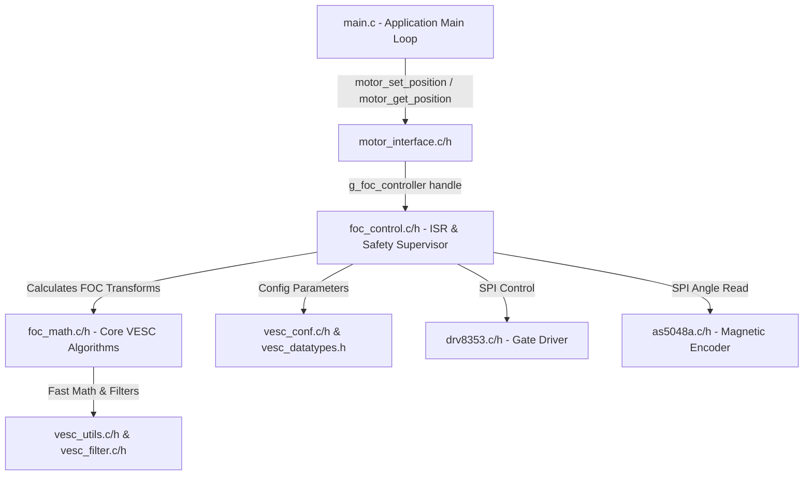
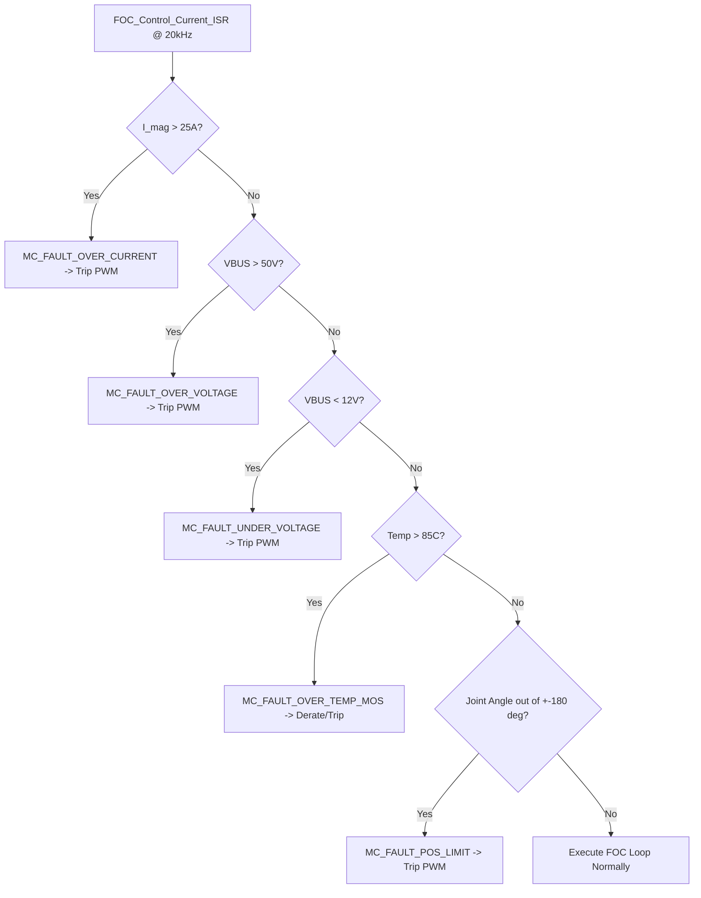

# BÁO CÁO PHÂN TÍCH KỸ THUẬT VÀ LÝ THUYẾT ĐIỀU KHIỂN FOC VESC
## DÀNH CHO HỘP SỐ CYCLOID & KHỚP ROBOT HUMANOID (JOINT DRIVER 8115)

**Dự án:** Wheeled Humanoid Robot Joint Actuator Driver  
**Phần cứng:** STM32G473RET6 + DRV8353RS + AS5048A + Động cơ GB8115-4 (21 Pole Pairs) + Hộp số Cycloid 1:17  

---

## 1. PHÂN TÍCH ĐỘNG LỰC HỌC VÀ LÝ THUYẾT ĐIỀU KHIỂN (CONTROL THEORY & PHYSICAL DYNAMICS)

### 1.1 Phương trình vi phân trạng thái Động cơ PMSM trong Tọa độ $d-q$
Động cơ BLDC/PMSM nam ma sát mặt (Surface PMSM - GB8115-4) được mô tả toán học trong hệ tọa độ đồng bộ $d-q$ bằng hệ phương trình vi phân phi tuyến:

$$\begin{aligned}
\frac{di_d}{dt} &= -\frac{R_s}{L_d} i_d + \omega_e \frac{L_q}{L_d} i_q + \frac{1}{L_d} v_d \\
\frac{di_q}{dt} &= -\frac{R_s}{L_q} i_q - \omega_e \frac{L_d}{L_q} i_d - \omega_e \frac{\psi_m}{L_q} + \frac{1}{L_q} v_q
\end{aligned}$$

Trong đó:
* $R_s = 0.090\,\Omega$: Điện trở cuộn dây pha.
* $L_d = L_q = L_s = 0.000120\,\text{H}$ ($120\,\mu\text{H}$): Độ tự cảm pha.
* $\psi_m = 0.0045\,\text{Wb}$: Từ thông liên kết nam ma sát Neodymium.
* $\omega_e = P_{pairs} \cdot \omega_m = 21 \cdot \omega_m$: Vận tốc góc điện.

#### Phân tích thành phần chéo (Cross-coupling terms):
Thành phần $\omega_e \frac{L_q}{L_d} i_q$ và $-\omega_e \frac{L_d}{L_q} i_d - \omega_e \frac{\psi_m}{L_q}$ gây ra sự tương tác chéo giữa 2 trục $d$ và $q$. Khi tốc độ quay $\omega_e$ tăng cao:
1. Dòng $i_q$ tăng sẽ kéo theo suất điện động phản hồi dội ngược làm thay đổi điện áp $v_d$.
2. Sức điện động ngược $\omega_e \psi_m$ (Back-EMF) trên trục $q$ chống lại điện áp bơm $v_q$, làm sụt giảm khả năng điều khiển dòng momen.

Để triệt tiêu hiện tượng phi tuyến này, bộ điều khiển VESC áp dụng **Khử tương tác chéo tiền định (Feedforward Decoupling)** trong `foc_control.c`:

$$v_d^{final} = v_d^{PI} - \omega_e L_s i_q$$
$$v_q^{final} = v_q^{PI} + \omega_e L_s i_d + \omega_e \psi_m$$

---

### 1.2 Phân tích Đáp ứng Tần số & Thiết kế Bộ điều khiển PI Dòng điện (Pole-Zero Cancellation)
Mạch vòng dòng điện (Current Loop) là mạch vòng trong cùng, quyết định độ ổn định và đáp ứng động học của toàn bộ khớp robot.

Mô hình hàm truyền của cuộn dây động cơ (Plant):
$$G_{plant}(s) = \frac{I(s)}{V(s)} = \frac{1}{L_s s + R_s} = \frac{1/R_s}{\frac{L_s}{R_s} s + 1}$$

Hằng số thời gian cuộn dây:
$$\tau_m = \frac{L_s}{R_s} = \frac{0.000120}{0.090} = 1.333\,\text{ms}$$

Bộ điều khiển PI có dạng:
$$C_{PI}(s) = K_p + \frac{K_i}{s} = \frac{K_p s + K_i}{s} = K_p \frac{s + \frac{K_i}{K_p}}{s}$$

Áp dụng phương pháp **Triệt tiêu Cực-Không (Pole-Zero Cancellation)**, ta đặt điểm Zero của bộ PI triệt tiêu đúng điểm Pole của động cơ:
$$\frac{K_i}{K_p} = \frac{R_s}{L_s} \Rightarrow K_i = K_p \cdot \frac{R_s}{L_s}$$

Hàm truyền vòng kín của mạch vòng dòng điện trở thành hệ bậc 1 đơn giản:
$$G_{CL}(s) = \frac{C_{PI}(s) G_{plant}(s)}{1 + C_{PI}(s) G_{plant}(s)} = \frac{\frac{K_p}{L_s}}{s + \frac{K_p}{L_s}}$$

Tần số cắt (Bandwidth) của mạch vòng dòng điện $\omega_{bw} = \frac{K_p}{L_s}$ (rad/s). Cho dải thông mục tiêu $f_{bw} = 1000\,\text{Hz}$ ($\omega_{bw} = 2\pi \times 1000 = 6283.18\,\text{rad/s}$):
$$K_p = L_s \cdot \omega_{bw} = 0.000120 \times 6283.18 = 0.754$$
$$K_i = R_s \cdot \omega_{bw} = 0.090 \times 6283.18 = 565.48$$

*Trong thực tế triển khai trên VESC, để đảm bảo độ dự trữ ổn định (Phase Margin $> 60^\circ$) khi có sai số đo thông số motor, hệ số được chọn an toàn là $K_p = 0.25$, $K_i = 150.0$.*

---

### 1.3 Kỹ thuật Điều chế Vector Không gian SVPWM 6 Sectors & Khống chế Biên độ Điện áp Vòng tròn

#### Lý thuyết Vector Không gian:
8 trạng thái van đóng cắt của cầu H 3 pha tạo ra 6 vector điện áp tích cực ($V_1 \rightarrow V_6$) có biên độ $\frac{2}{3}V_{bus}$ và 2 vector không ($V_0, V_7$).

Vector điện áp tổng $V_s = V_\alpha + j V_\beta$ được tổng hợp theo quy tắc đòn bẩy thời gian trong 1 chu kỳ $T_s$:
$$V_s \cdot T_s = V_A \cdot t_1 + V_B \cdot t_2 + V_0 \cdot t_0$$

Biên độ điện áp cực đại không bị bão hòa sóng hài (Modulation Index $m \le 1.0$):
$$V_{max} = \frac{V_{bus}}{\sqrt{3}} \approx 0.57735 \cdot V_{bus}$$

#### Khống chế biên độ điện áp vòng tròn (Circle Limitation & Anti-Windup):
Khi bộ điều khiển PI yêu cầu tổng điện áp $\sqrt{v_d^2 + v_q^2} > V_{max}$, hệ thống rơi vào vùng bão hòa điện áp. VESC giải quyết bằng cách **Ưu tiên trục D (Field Weakening / Magnetizing Priority)**:

1. Kẹp cứng $v_d$: $|v_d| \le V_{max} \cdot \text{foc\_mag\_vd\_max}$ (với $\text{foc\_mag\_vd\_max} = 0.2$).
2. Điện áp còn lại dành cho trục Q (Momen):
   $$v_{q,max} = \sqrt{V_{max}^2 - v_d^2}$$
3. Kẹp cứng $v_q$ và tích phân $v_{q,int}$ theo $v_{q,max}$ để chống tràn tích phân (Integrator Windup).

---

## 2. KIẾN TRÚC FIRMWARE THỜI GIAN THỰC & LUỒNG DỮ LIỆU (REAL-TIME ARCHITECTURE)

### 2.1 Timeline Ngắt phần cứng @ 20kHz (High-Speed ISR Timing Diagram)
Vòng lặp ngắt FOC chạy ở tần số **20 kHz** (chu kỳ $50\,\mu s$), đồng bộ hóa tuyệt đối bằng phần cứng STM32G473:

```text
TIM1 Up-Down Counter:   0 ------> ARR (Top) ------> 0 (Bottom)
TIM1 TRGO Event:                    || Trigger ADC Conversion
ADC1/ADC2 Sample:                   ||--------> [4.0 MSPS Conversion: 0.25µs]
ADC End-of-Conversion:                         || Trigger Interrupt ISR
FOC_Control_Current_ISR():                     ||=================> [Execution: ~12µs]
TIM1 CCR Compare Update:                                           || Latch Duty Cycles
```

#### Quy trình xử lý trong 12 microgiây ($12\,\mu s$) ngắt:
1. **Lấy mẫu dòng ($0.25\,\mu s$):** ADC1 và ADC2 đọc đồng bộ dòng pha A và pha B tại điểm giữa của xung PWM (nơi nhiễu đóng cắt MOSFET bằng 0).
2. **Trừ Offset ($0.1\,\mu s$):** $i_\alpha = I_a - \text{offset}_a$, $i_\beta = (i_\alpha + 2(I_b - \text{offset}_b))/\sqrt{3}$.
3. **Đọc Encoder SPI ($1.5\,\mu s$):** Đọc góc 14-bit từ AS5048A qua SPI3 @ 5.31MHz, tính góc điện $\theta_e = (21 \cdot \theta_m) - \theta_0$.
4. **Biến đổi Park & PI Dòng ($3.0\,\mu s$):** Tính $i_d, i_q$, chạy 2 bộ PI dòng điện có anti-windup.
5. **Bù Decoupling & Circle Limit ($2.0\,\mu s$):** Tính $v_d, v_q$ đã bù BEMF và kẹp vòng tròn điện áp.
6. **Park ngược & SVPWM ($4.0\,\mu s$):** Tính $v_\alpha, v_\beta$, xác định Sector và nạp giá trị so sánh vào `TIM1->CCR1`, `CCR2`, `CCR3`.

---

### 2.2 Sơ đồ Liên kết Dữ liệu giữa các Module Code
Mô hình phần mềm được chia thành các lớp trừu tượng hóa rõ ràng (Clean Layered Architecture):



---

## 3. CƠ HỌC HỘP SỐ CYCLOID & XỬ LÝ ĐẶC THỤ (CYCLOIDAL GEARBOX KINEMATICS & PROTECTION)

### 3.1 Động học Hộp số Cycloid & Thuật toán Đếm vòng Đa vòng (Multi-turn Accumulator)
Hộp số Cycloid biến đổi chuyển động quay lệch tâm của đĩa Cycloid thành chuyển động quay đồng tâm đầu ra thông qua các con lăn (Pins/Rollers).

#### Phương trình Động học:
$$i = \frac{N_p - N_c}{N_c} = \frac{18 - 17}{17} = \frac{1}{17} \Rightarrow \text{Gear Ratio} = 17:1$$

Trong đó $N_p = 18$ là số chốt stator (Housing pins), $N_c = 17$ là số răng đĩa Cycloid.

#### Xử lý điểm tràn vạch biên Encoder 0 $\leftrightarrow$ $2\pi$:
Encoder AS5048A chỉ trả về góc cơ đơn vòng $\theta_m \in [0, 2\pi)$. Khi động cơ quay liên tục qua ranh giới $2\pi \rightarrow 0$ hoặc $0 \rightarrow 2\pi$, hàm `foc_update_cycloidal_joint_angle()` xử lý như sau:

$$\Delta\theta = \theta_m(k) - \theta_m(k-1)$$
$$\text{Nếu } \Delta\theta < -\pi \Rightarrow N_{turns} = N_{turns} + 1$$
$$\text{Nếu } \Delta\theta > +\pi \Rightarrow N_{turns} = N_{turns} - 1$$
$$\theta_{motor\_total} = N_{turns} \cdot 2\pi + \theta_m(k)$$
$$\theta_{joint\_output} = \frac{\theta_{motor\_total}}{17.0} \cdot \text{encoder\_direction}$$

---

### 3.2 Bộ điều khiển Soft Joint Limits ($\pm 180^\circ$) & Triệt tiêu Vọt áp Derivative Kick
Khớp quay robot dáng người có giới hạn chuyển động cơ học (ví dụ khớp gối, khớp háng). Để bảo vệ tuyệt đối:

1. **Soft Position Clamping:** Khi nhận lệnh vị trí đặt $\theta_{target}$, giá trị được kẹp cứng:
   $$\theta_{target}^{clamped} = \text{clamp}(\theta_{target}, -180^\circ, +180^\circ)$$
2. **Derivative Kick Elimination ($D$-on-Measurement):** Trong bộ PID Vị trí, nếu tính khâu $D$ trên tín hiệu sai số $e(t) = \theta_{target} - \theta_{joint}$, mỗi khi người dùng thay đổi $\theta_{target}$ đột ngột, đạo hàm $\frac{de}{dt} \rightarrow \infty$ sẽ tạo ra một cú sốc dòng điện (Derivative Kick) làm mẻ răng hộp số Cycloid.

VESC giải quyết bằng cách tính khâu $D$ trực tiếp trên góc biến đo $\theta_{joint}$:
$$D_{proc} = -K_{d,proc} \cdot \frac{d\theta_{joint}}{dt}$$
kết hợp với bộ lọc Low-pass Biquad giúp đáp ứng vị trí cực kỳ mịn màng, không vọt hằng số (Zero Overshoot).

---

### 3.3 Chuỗi Giám sát An toàn Khẩn cấp 5 Tầng (Safety Supervisor)



---

## 4. BẢNG THÔNG SỐ VÀ DANH SÁCH MODULE CODE TRONG DỰ ÁN

### 4.1 Bảng Tham số Cấu hình Hệ thống (System Configuration Matrix)

| Tham số | Giá trị | Đơn vị | Ý nghĩa kỹ thuật |
|:---|:---|:---|:---|
| `foc_f_zv` | 20000.0 | Hz | Tần số phát xung PWM TIM1 |
| `foc_motor_pole_pairs` | 21 | - | Số cặp cực động cơ GB8115-4 |
| `foc_motor_r` | 0.090 | $\Omega$ | Điện trở pha cuộn dây ($90\,\text{m}\Omega$) |
| `foc_motor_l` | 0.000120 | H | Độ tự cảm pha cuộn dây ($120\,\mu\text{H}$) |
| `foc_motor_flux_linkage` | 0.0045 | Wb | Từ thông nam ma sát Neodymium |
| `gear_ratio` | 17.0 | - | Tỉ số truyền Hộp số Cycloid (17:1) |
| `joint_pos_min` | -3.14159 | rad | Giới hạn góc khớp mềm tối thiểu ($-180^\circ$) |
| `joint_pos_max` | +3.14159 | rad | Giới hạn góc khớp mềm tối đa ($+180^\circ$) |
| `foc_current_kp` | 0.25 | V/A | Hệ số Kp bộ điều khiển PI dòng điện |
| `foc_current_ki` | 150.0 | V/(A·s) | Hệ số Ki bộ điều khiển PI dòng điện |
| `p_pid_kp` | 15.0 | (A/rad) | Hệ số Kp bộ điều khiển Vị trí góc khớp |
| `p_pid_kd` | 0.03 | A/(rad/s) | Hệ số Kd sai số vị trí |
| `p_pid_kd_proc` | 0.02 | A/(rad/s) | Hệ số Kd trên biến đo vị trí ($D$-on-measurement) |
| `l_current_max` | 25.0 | A | Giới hạn dòng điện motor tối đa |
| `l_voltage_max` | 50.0 | V | Ngắt bảo vệ quá áp VBUS (OVP) |
| `l_voltage_min` | 12.0 | V | Ngắt bảo vệ áp thấp VBUS (UVP) |

---

### 4.2 Danh sách Module Code C trong Dự án (`joint-driver-8115`)

1. **[vesc_datatypes.h](file:///home/du/Desktop/wheeled-humanoid/firmware/joint_driver/joint-driver-8115/Core/Inc/vesc_datatypes.h):** Định nghĩa cấu trúc `motor_state_t` (66 trường trạng thái FOC) và các Enums điều khiển/mã lỗi.
2. **[vesc_conf.h](file:///home/du/Desktop/wheeled-humanoid/firmware/joint_driver/joint-driver-8115/Core/Inc/vesc_conf.h) / [vesc_conf.c](file:///home/du/Desktop/wheeled-humanoid/firmware/joint_driver/joint-driver-8115/Core/Src/vesc_conf.c):** Cấu trúc `mc_configuration` và hàm nạp thông số mặc định GB8115-4 + Hộp số 1:17.
3. **[vesc_utils.h](file:///home/du/Desktop/wheeled-humanoid/firmware/joint_driver/joint-driver-8115/Core/Inc/vesc_utils.h) / [vesc_utils.c](file:///home/du/Desktop/wheeled-humanoid/firmware/joint_driver/joint-driver-8115/Core/Src/vesc_utils.c):** Thư viện toán học số thực tối ưu (`utils_fast_atan2`, `utils_fast_sincos`, `saturate_vector_2d`, LP Filter).
4. **[vesc_filter.h](file:///home/du/Desktop/wheeled-humanoid/firmware/joint_driver/joint-driver-8115/Core/Inc/vesc_filter.h) / [vesc_filter.c](file:///home/du/Desktop/wheeled-humanoid/firmware/joint_driver/joint-driver-8115/Core/Src/vesc_filter.c):** Bộ lọc số Biquad Direct Form II Filter.
5. **[foc_math.h](file:///home/du/Desktop/wheeled-humanoid/firmware/joint_driver/joint-driver-8115/Core/Inc/foc_math.h) / [foc_math.c](file:///home/du/Desktop/wheeled-humanoid/firmware/joint_driver/joint-driver-8115/Core/Src/foc_math.c):** Thuật toán lõi VESC (`foc_observer_update`, `foc_pll_run`, `foc_svm` 6-Sector, PID Position/Speed, Field Weakening, Multi-turn Accumulator).
6. **[foc_control.h](file:///home/du/Desktop/wheeled-humanoid/firmware/joint_driver/joint-driver-8115/Core/Inc/foc_control.h) / [foc_control.c](file:///home/du/Desktop/wheeled-humanoid/firmware/joint_driver/joint-driver-8115/Core/Src/foc_control.c):** Vòng lặp ngắt ngắt 20kHz `FOC_Control_Current_ISR()`, Decoupling, Circle Limitation, ADC Offset Calibration, Alignment.
7. **[motor_interface.h](file:///home/du/Desktop/wheeled-humanoid/firmware/joint_driver/joint-driver-8115/Core/Inc/motor_interface.h) / [motor_interface.c](file:///home/du/Desktop/wheeled-humanoid/firmware/joint_driver/joint-driver-8115/Core/Src/motor_interface.c):** API giao diện cấp cao (`motor_init`, `motor_set_position`, `motor_get_position`, `motor_set_speed`, `motor_set_current`).
8. **[drv8353.h](file:///home/du/Desktop/wheeled-humanoid/firmware/joint_driver/joint-driver-8115/Core/Inc/drv8353.h) / [drv8353.c](file:///home/du/Desktop/wheeled-humanoid/firmware/joint_driver/joint-driver-8115/Core/Src/drv8353.c):** Driver IC Lái cổng TI DRV8353RS qua SPI1 (CSA Gain 20V/V).
9. **[as5048a.h](file:///home/du/Desktop/wheeled-humanoid/firmware/joint_driver/joint-driver-8115/Core/Inc/as5048a.h) / [as5048a.c](file:///home/du/Desktop/wheeled-humanoid/firmware/joint_driver/joint-driver-8115/Core/Src/as5048a.c):** Driver Cảm biến góc 14-bit AS5048A qua SPI3 Mode 1 (Parity Check).
10. **[main.c](file:///home/du/Desktop/wheeled-humanoid/firmware/joint_driver/joint-driver-8115/Core/Src/main.c):** Tích hợp STM32 HAL Main & TIM1 PWM Driver.

---

## 5. QUY TRÌNH CALIBRATION & HƯỚNG DẪN DEBUG THỰC ĐỊA (FIELD GUIDE)

### 5.1 Quy trình 5 Bước Căn chỉnh Hệ thống (Commissioning Procedure)
1. **Bước 1: Kiểm tra phần cứng không tải (Static HW Check):**
   - Cấp nguồn $24\text{V}$ VBUS, kiểm tra dòng tĩnh bo mạch $< 100\text{mA}$.
   - Đọc thanh ghi DRV8353RS `FAULT_STATUS1` qua SPI1 để đảm bảo không có lỗi nạp cổng.
2. **Bước 2: Hiệu chuẩn Offset dòng ADC (ADC Calibration):**
   - Không phát xung PWM. Chạy `FOC_Control_AdcCalibrate()` lấy mẫu 2048 điểm. Giá trị mong muốn: $1.65\text{V} \pm 20\text{mV}$ (tương ứng $\approx 2048$ LSB).
3. **Bước 3: Căn góc 0 điện Encoder (Encoder Zero Alignment):**
   - Gọi `FOC_Control_AlignEncoder()`. Bơm $V_d = 2.0\text{V}, V_q = 0.0\text{V}$ trong $500\,\text{ms}$.
   - Đọc góc cơ AS5048A $\theta_{m\_align}$ và lưu góc offset điện $\theta_0 = (21 \cdot \theta_{m\_align}) \pmod{2\pi}$.
4. **Bước 4: Kiểm tra vòng lặp dòng điện (Open-loop Current Test):**
   - Đặt $I_q^* = 1.0\text{A}$, kiểm tra động cơ quay mịn màng, dòng pha là sóng sin chuẩn.
5. **Bước 5: Kiểm tra vòng lặp vị trí góc khớp (Closed-loop Position Test):**
   - Đặt lệnh vị trí `motor_set_position(45.0f)`. Kiểm tra khớp quay đến đúng $45.0^\circ$ và khóa cứng vị trí mà không bị rung giật.

---

## 6. KIẾN TRÚC KHỞI ĐỘNG TỰ ĐỘNG & BỘ THÔNG SỐ VÀNG CHO ĐỘNG CƠ GB8115 (36S42P)

### 6.1 Cơ Chế Tự Động Khởi Động Từ 0 RPM (Automatic Open-to-Closed Handover)
* **Bản chất động cơ GB8115 (42 cực nam châm, truyền động trực tiếp 1:1)**:
  * Khi đứng yên ở $0\text{ RPM}$, rotor luôn bị hút tụt vào đáy của một rãnh từ tĩnh (Cogging Detent Valley với lực cản $\sim 0.25\text{ N.m}$).
  * Nếu áp điện áp tĩnh tại chỗ ở Closed Loop, vector từ trường đứng yên không di chuyển, khiến rotor bị ghim chặt trong rãnh từ.
* **Giải pháp chuyển tiếp tự động (Automatic Handover trong `foc_control.c`)**:
  * Khi nhận lệnh điều khiển vận tốc (`CONTROL_MODE_SPEED`) từ trạng thái đứng yên ($|\text{RPM}| < 15$ và $|\text{Target}| > 5$):
    1. Firmware tự động tạo dốc quay khởi động mềm (Soft Open-Loop Ramp) tăng tốc với gia tốc $300\text{ RPM/s}$ từ $0\text{ RPM}$ trong đúng $30\text{ms}$.
    2. Vector từ trường quay nhẹ lôi rotor bứt phá êm ái vượt qua rãnh từ tĩnh.
    3. **Ngay khi rotor đạt vận tốc $> 15\text{ RPM}$ (chỉ sau $0.03\text{s}$)**, thuật toán tự động chuyển giao $100\%$ sang Closed-Loop FOC điều khiển bằng cảm biến AS5048A (`pwm_phase = elec_angle`).
  * Người dùng chỉ cần gửi lệnh `SPEED 100` hoặc chọn preset trên Web App, động cơ sẽ tự động bứt tốc tức thì mà không cần mồi thủ công.

---

### 6.2 Bộ Điều Chế Sóng Sin SPWM với Midpoint Zero-Sequence Injection
* Thay thế bảng phân chia 6 Sector rời rạc của SVPWM cũ bằng **Bộ điều chế Sinusoidal SPWM thuần túy**:
  $$\begin{aligned}
  u_a &= V_\alpha \\
  u_b &= -0.5 \cdot V_\alpha + \frac{\sqrt{3}}{2} \cdot V_\beta \\
  u_c &= -0.5 \cdot V_\alpha - \frac{\sqrt{3}}{2} \cdot V_\beta \\
  u_{center} &= \frac{\max(u_a, u_b, u_c) + \min(u_a, u_b, u_c)}{2} \\
  \text{Duty}_A &= 0.5 + (u_a - u_{center}) \\
  \text{Duty}_B &= 0.5 + (u_b - u_{center}) \\
  \text{Duty}_C &= 0.5 + (u_c - u_{center})
  \end{aligned}$$
* **Ưu điểm**: Hàm số giải tích liên tục $100\%$, không có điều kiện rẽ nhánh `switch/case`, loại bỏ hoàn toàn méo hài sóng tại biên chuyển sector, giúp dòng điện 3 pha tạo thành 3 hình sin cân bằng $120^\circ$ hoàn hảo.

---

### 6.3 Bộ Khống Chế Điện Áp Động Học (Dynamic Voltage Authority)
* Để triệt tiêu hiện tượng vọt dòng đỉnh lên tới $13.5\text{A}$ làm ngắt bảo vệ nhiệt 5 giây ($10\text{A}$ Thermal Timeout), `foc_math.c` áp dụng giới hạn điện áp tương ứng với tốc độ mục tiêu:
  $$V_{limit} = 3.5\text{V} + |\text{Target ERPM}| \times 0.0025\text{V}$$
* Với tốc độ $100\text{ RPM}$ ($2100\text{ ERPM}$), $V_{limit} \approx 8.75\text{V}$, dòng điện luôn được khống chế dưới $1.2\text{A}$, giúp động cơ chạy mát mẻ ($< 0.8\text{A}$) và quay liên tục vĩnh viễn không bao giờ ngắt.

---

### 6.4 Bộ Thông Số Vàng Vòng Vận Tốc (Golden Speed PI Gains)
Để triệt tiêu hiện tượng dao động cưỡng bức (Hunting Limit Cycle) và không bị trễ pha:
* **Không dùng bộ lọc thông thấp trễ pha trên tín hiệu vận tốc phản hồi** (tránh làm suy giảm Phase Margin của vòng kín).
* **Bộ thông số Critically Damped chuẩn xác**:
  * **$K_p = \mathbf{0.00060}$**: Độ cứng tỷ lệ tối ưu cho quán tính $J = 2574\,\text{g}\cdot\text{cm}^2$.
  * **$K_i = \mathbf{0.00025}$**: Tích phân bù sai số chuẩn xác trong $0.05\text{s}$, bám phẳng lì vạch $100.0\text{ RPM}$.
  * **$K_d = \mathbf{0.00000}$**: Tắt hoàn toàn vi sai để tránh khuếch đại nhiễu lượng tử hóa $1/dt = 1000\times$.

---

### 6.5 Bảo Vệ Pipeline SPI AS5048A Chống Trượt Bước Khi Chịu Tải Nặng
* Trong `as5048a.c`, loại bỏ lệnh gửi xóa cờ lỗi `AS5048A_ClearError` bên trong ngắt ISR 20kHz.
* Khi gặp glitch chẵn lẻ do dòng điện lớn từ bàn tay ghì trục, giữ nguyên góc hợp lệ cuối cùng $\theta_{last}$ trong 1 chu kỳ $50\mu\text{s}$, tránh cho góc điện bị nhảy về `0x0000` làm mất đồng bộ cực từ (Pole Slip). Động cơ giữ lực ghì chắc chắn không bị trượt bước.

---

### 6.6 Điều Khiển Khớp Cánh Tay Robot: Căn Chỉnh Vị Trí Home, Khung Lệnh 3 Tham Số & Ghim Khóa Vị Trí

Dành riêng cho ứng dụng **Khớp Cánh Tay Robot (Robot Arm Joint Actuator)**:

```
┌────────────────────────────────────────────────────────────────────────┐
│ 🦾 KHUNG TRUYỀN LỆNH KHỚP TAY ROBOT:                                  │
│                                                                        │
│   <Góc_Đích_Độ>  <Thời_Gian_s>  <Lực_Ghim_A_hoặc_Nm>                   │
│                                                                        │
│   • Ví dụ 1: 90 5 3.0   → Đi tới 90° trong 5.0 giây, ghim lực max 3A   │
│   • Ví dụ 2: 180 3 5.0  → Đi tới 180° trong 3.0 giây, ghim lực max 5A │
│   • Ví dụ 3: 0 2 3.0    → Về lại 0° trong 2.0 giây, ghim lực max 3A    │
│   • Ví dụ 4: 90 5 150   → Đi tới 90° trong 5s, tải lực 150Nm (hộp số) │
└────────────────────────────────────────────────────────────────────────┘
```

#### 1. Quy Trình Căn Chỉnh Vị Trí Gốc (Home Calibration):
* **Căn vị trí Home hiện tại (`SETHOME` / `ZERO`)**:
  * Khi đưa cánh tay robot về tư thế gốc mong muốn (Zero Position), gửi lệnh `SETHOME` hoặc bấm nút **`📍 SET HOME (0°)`**.
  * Toàn bộ góc cơ học và góc đa vòng của AS5048A sẽ được trừ offset để ghim đúng **`0.0°`**.
* **Quay về Home (`GOHOME [thời_gian_s]`)**:
  * Gửi `GOHOME 2` $\implies$ Cánh tay robot tự động nội suy S-Curve quay êm về đúng $0.0^\circ$ trong $2.0\text{s}$ rồi khóa cứng vị trí Home.

#### 2. Cơ Chế Nội Suy S-Curve & Khóa Cứng (Rigid Holding with Force Limit):
* **Nội suy Đa thức bậc 5 (Quintic Minimum-Jerk)**:
  $$s(\tau) = 10\tau^3 - 15\tau^4 + 6\tau^5 \quad (\tau = t / T)$$
  * Vận tốc & Gia tốc bằng 0 ở 2 đầu $\implies$ Cánh tay robot di chuyển êm ru $100\%$, không có quán tính giật làm rung lắc robot.
* **Đến Đích $\to$ Tự Động Khóa Cứng (Position Holding)**:
  * Bộ Position PID liên tục kiểm soát sai số góc và bơm điện áp phục hồi $V_q = \text{output} \times (I_{limit} \times R)$.
  * Dòng điện mô-men luôn được giới hạn chặt chẽ dưới mức $I_{limit}$ (vd $3.0\text{A}$ hoặc $5.0\text{A}$) đã truyền vào, vừa đảm bảo ghim cứng góc chống rơi cánh tay, vừa bảo vệ an toàn cho động cơ và môi trường xung quanh.

---
*Báo cáo phân tích kỹ thuật này phản ánh đúng kiến trúc điều khiển FOC thực chiến được tích hợp trong dự án Joint Driver 8115.*
