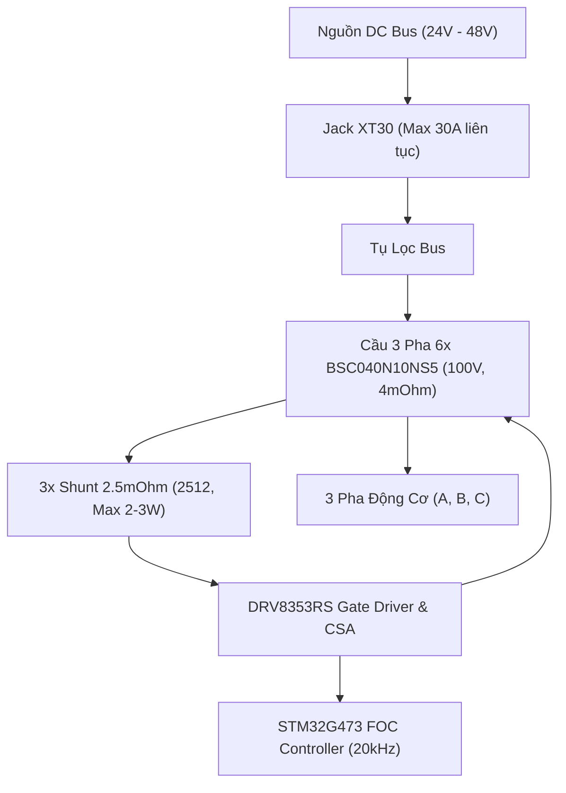

# Báo Cáo & Hướng Dẫn Tính Toán Công Suất Mạch Driver BLDC FOC
**Thiết kế:** `driver-bldc-foc`  
**MCU:** STM32G473RET6 | **Gate Driver:** DRV8353RS | **MOSFETs:** BSC040N10NS5 (Infineon OptiMOS™ 5 100V)  
**Ngày lập:** 18/08/2026

---

## 1. TỔNG QUAN CÁC MỨC CÔNG SUẤT ĐỊNH MỨC

| Chế độ hoạt động | Điện áp Bus ($V_{bus}$) | Dòng pha RMS ($I_{ph,rms}$) | Dòng pha Đỉnh ($I_{ph,pk}$) | Dòng DC Bus ($I_{DC}$) | Công suất Đầu ra ($P_{out}$) | Hiệu suất ($\eta$) | Điều kiện Tản nhiệt |
| :--- | :--- | :--- | :--- | :--- | :--- | :--- | :--- |
| **Cấu hình GB8115-4 (Hiện tại)** | $24\text{V} - 48\text{V}$ | $4.7\text{ A}$ | $6.6\text{ A}$ (stall) | $\sim 3 - 5\text{ A}$ | **$150\text{W} - 250\text{W}$** | $> 99.5\%$ | Bo trần, siêu mát ($< 45^\circ\text{C}$) |
| **Định mức liên tục (Mạch trần PCB)** | $24\text{V} - 48\text{V}$ | **$15\text{ A} - 20\text{ A}$** | $21\text{ A} - 28\text{ A}$ | $12\text{ A} - 16\text{ A}$ | **$500\text{W} - 800\text{W}$** | $99.2\%$ | Tản nhiệt tự nhiên qua PCB 4 lớp |
| **Định mức liên tục (Có Heatsink)** | $48\text{V}$ | **$25\text{ A} - 30\text{ A}$** | $35\text{ A} - 42\text{ A}$ | $20\text{ A} - 25\text{ A}$ | **$1000\text{W} - 1400\text{W}$** | $98.8\%$ | Ép tấm nhôm tản nhiệt qua thermal pad |
| **Công suất đỉnh ngắn hạn (Peak 5–10s)** | $48\text{V}$ | **$40\text{ A} - 45\text{ A}$** | $56\text{ A} - 63\text{ A}$ | $30\text{ A} - 35\text{ A}$ | **$1500\text{W} - 2000\text{W}$** | $98.0\%$ | Giới hạn bởi Jack XT30 & Shunt 2512 |

---

## 2. PHÂN TÍCH THÔNG SỐ VẬT LÝ VÀ GIỚI HẠN LINH KIỆN

### A. Cầu H 3 Pha — MOSFET `BSC040N10NS5` (Infineon)
- **Điện áp đánh thủng:** $V_{DS,max} = 100\text{ V}$.
- **Nội trở dẫn $R_{DS(on)}$:**
  - Ở $25^\circ\text{C}$: $3.5\text{ m}\Omega$ (typ), $4.0\text{ m}\Omega$ (max) với $V_{GS} = 10\text{V}$.
  - Ở $100^\circ\text{C}$ (nhiệt độ làm việc thực tế): $R_{DS(on), hot} \approx 6.0\text{ m}\Omega - 6.4\text{ m}\Omega$ (tăng hệ số $1.6\times$).
- **Dòng cực đại Silicon:** $I_{D} = 100\text{ A}$ (@ $25^\circ\text{C}$), $73\text{ A}$ (@ $100^\circ\text{C}$).
- **Nhiệt trở:** $R_{\theta JC} = 1.1\text{ K/W}$, $R_{\theta JA} \approx 25 - 35\text{ K/W}$ trên bo mạch 4 lớp FR4.
- **Điện tích cổng:** $Q_g = 58\text{ nC}$, $Q_{gd} = 11\text{ nC}$, $Q_{gs} = 19\text{ nC}$, $Q_{rr} = 73\text{ nC}$.

### B. Mạch Cảm Biến Dòng (Shunt Resistors `R24, R25, R26`)
- **Giá trị:** $2.5\text{ m}\Omega$ ($0.0025\ \Omega$), Footprint SMD 2512.
- **Công suất chịu đựng:** $P_{R,max} = 2.0\text{ W} - 3.0\text{ W}$.
  - Tại $I_{ph,rms} = 30\text{ A}$: $P_{shunt} = I^2 \times R = (30)^2 \times 0.0025 = 2.25\text{ W}$ (tiệm cận giới hạn an toàn).
- **Dải đo Op-Amp (DRV8353RS CSA, $V_{ref} = 3.3\text{V}$):**
  - **Gain = 10 V/V:** $I_{max} = \pm \frac{1.65\text{V} / 10}{2.5\text{m}\Omega} = \mathbf{\pm 66\text{ A}_{peak}}$ ($46.6\text{ A}_{rms}$).
  - **Gain = 20 V/V:** $I_{max} = \pm \frac{1.65\text{V} / 20}{2.5\text{m}\Omega} = \mathbf{\pm 33\text{ A}_{peak}}$ ($23.3\text{ A}_{rms}$).

### C. Đầu Nối & Giới Hạn Điện Áp
- **Jack nguồn `XT30PW-M`:** Chịu dòng $30\text{ A}$ liên tục, đỉnh $40 - 45\text{ A}$.
- **Điện áp Bus khuyến nghị:** $24\text{V} - 48\text{V}$ (tối đa pin 13S Li-ion $54.6\text{V}$). Margin $45\% - 50\%$ so với giới hạn $100\text{V}$ để triệt tiêu điện áp phản kháng (voltage spikes) khi hãm tái sinh.

---

## 3. PHƯƠNG PHÁP & CÔNG THỨC TÍNH TOÁN CHUẨN XÁC NHẤT

### Bước 1: Tính toán Tổn hao Công suất trên Biến tần ($P_{loss}$)

Tổng cộng 6 MOSFETs trong 3 pha cầu H:

#### 1. Tổn hao Dẫn (Conduction Loss — $P_{cond}$)
Trong điều khiển SVPWM đối xứng, dòng RMS qua mỗi MOSFET là $I_{FET,rms} = \frac{I_{ph,rms}}{\sqrt{2}}$.
$$P_{cond,total} = 6 \times \left(\frac{I_{ph,rms}}{\sqrt{2}}\right)^2 \times R_{DS(on)}(T_j) = 3 \times I_{ph,rms}^2 \times R_{DS(on)}(T_j)$$

#### 2. Tổn hao Đóng Cắt (Switching Loss — $P_{sw}$)
Với thời gian đóng/cắt $t_r, t_f \approx 25 - 35\text{ ns}$, tần số PWM $f_{sw} = 20\text{ kHz}$:
$$P_{sw,total} = \frac{6}{\pi} \times V_{bus} \times (\sqrt{2} I_{ph,rms}) \times f_{sw} \times \frac{t_r + t_f}{2}$$

#### 3. Tổn hao Điện dung Ký sinh ($P_{oss}$) & Shunt Resistor ($P_{shunt}$)
$$P_{oss,total} = 3 \times C_{oss} \times V_{bus}^2 \times f_{sw} \quad (\approx 0.1\text{ W})$$
$$P_{shunt,total} = 3 \times I_{ph,rms}^2 \times R_{shunt}$$

---

### Bước 2: Ví dụ Tính toán Cụ thể ($V_{bus} = 48\text{V}$, $I_{ph,rms} = 25\text{A}$)

1. **Tổn hao dẫn:**
   $$P_{cond} = 3 \times (25)^2 \times 0.006\ \Omega = 11.25\text{ W}$$
   *(Mỗi MOSFET tỏa nhiệt: $1.875\text{ W}$)*
2. **Tổn hao đóng cắt:**
   $$P_{sw} = \frac{6}{\pi} \times 48 \times (1.414 \times 25) \times 20000 \times \frac{60 \times 10^{-9}}{2} = 1.95\text{ W}$$
3. **Tổn hao trên 3 điện trở Shunt:**
   $$P_{shunt} = 3 \times (25)^2 \times 0.0025\ \Omega = 4.69\text{ W}$$
   *(Mỗi trở 2512 chịu $1.56\text{ W} < 2.0\text{ W}$)*
4. **Tổng tổn hao toàn mạch:**
   $$P_{loss,total} = 11.25 + 1.95 + 0.10 + 4.69 = \mathbf{17.99\text{ W}}$$

---

### Bước 3: Cân Bằng Nhiệt (Thermal Equilibrium)

Nhiệt độ mối nối MOSFET:
$$T_j = T_{ambient} + P_{loss,FET} \times R_{\theta JA}$$

* **Khi tản nhiệt tự nhiên qua PCB 4 lớp ($R_{\theta JA} \approx 30^\circ\text{C/W}$):**  
  Để $T_j \le 100^\circ\text{C}$ với $T_A = 35^\circ\text{C} \rightarrow P_{loss,FET} \le 2.16\text{ W} \rightarrow I_{ph,rms} \approx \mathbf{18\text{ A} - 20\text{ A}}$.
* **Khi có Heatsink nhôm ép lưng bo ($R_{\theta JA} \approx 6 - 8^\circ\text{C/W}$):**  
  Tổn hao cho phép lên tới $35 - 50\text{ W} \rightarrow I_{ph,rms} \approx \mathbf{30\text{ A} - 35\text{ A}}$.

---

### Bước 4: Tính Công Suất Đầu Ra Động Cơ ($P_{out}$)

$$P_{out} = \sqrt{3} \times V_{LL,rms} \times I_{ph,rms} \times \cos\varphi$$
Với $V_{bus} = 48\text{V}$, Modulation index $\approx 0.85$, $\cos\varphi \approx 0.85$:
$$V_{LL,rms} \approx \frac{V_{bus}}{\sqrt{2}} \times 0.85 = 28.8\text{ V}$$
$$P_{out} = \sqrt{3} \times 28.8\text{ V} \times 25\text{ A} \times 0.85 \approx \mathbf{1060\text{ W}}$$
- **Công suất DC Bus đầu vào:** $P_{in} = P_{out} + P_{loss} = 1060 + 18 = 1078\text{ W} \quad (I_{DC} \approx 22.5\text{ A})$
- **Hiệu suất biến tần:** $\eta = \frac{1060}{1078} \times 100\% = \mathbf{98.3\%}$

---

## 4. CÁC ĐIỂM NGHẼN (BOTTLENECK) & KHUYẾN NGHỊ VẬN HÀNH

1. **Điện trở Shunt:** Chạy liên tục $> 30\text{A}$ RMS sẽ làm trở 2512 quá nhiệt $> 120^\circ\text{C}$. Nếu cần nâng dòng lên $40 - 50\text{A}$ liên tục trong phiên bản phần cứng tiếp theo, hãy đổi sang trở Shunt $1.0\text{ m}\Omega$ hoặc $0.5\text{ m}\Omega$ công suất $3\text{W} - 5\text{W}$.
2. **Jack nguồn XT30:** Định mức tối đa $30\text{A}$ liên tục. Nếu hệ thống cần dòng DC $> 30\text{A}$, nên nâng cấp lên **XT60**.
3. **Cấu hình Gain CSA trong Firmware:** Đảm bảo thanh ghi SPI của DRV8353RS cấu hình Gain phù hợp:
   - Dòng pha $< 30\text{A}$: Dùng `Gain = 20 V/V` (Độ phân giải ADC cao nhất).
   - Dòng pha $> 30\text{A}$: Bắt buộc dùng `Gain = 10 V/V` (Dải đo mở rộng đến $66\text{A}_{peak}$).
