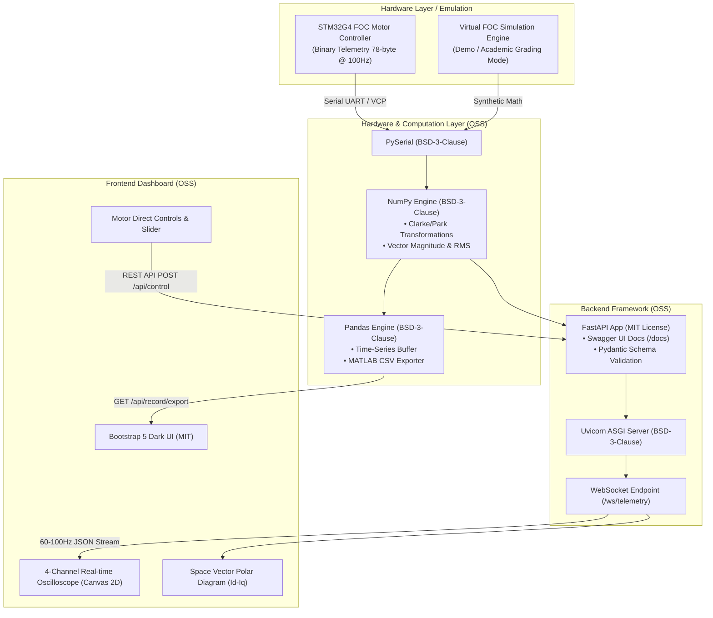

# ⚡ STM32 FOC Telemetry Studio OSS
> **Báo Cáo Đồ Án & Ứng Dụng: Phần Mềm Mã Nguồn Mở (FOSS) Trong Điều Khiển Động Cơ BLDC & Giám Sát Dao Động Ký Thời Gian Thực**

---

## 🌟 Giới Thiệu Tổng Quan (Overview)

**FOC Telemetry Studio OSS** là ứng dụng chẩn đoán, giám sát dao động ký (Oscilloscope) đa kênh thời gian thực và điều khiển động cơ không chổi than (BLDC FOC) cho vi điều khiển **STM32G4**, được phát triển hoàn toàn trên nền tảng **Hệ sinh thái Phần mềm Mã nguồn mở (Free and Open Source Software - FOSS)**.

Dự án tận dụng và kết hợp sức mạnh của nhiều Framework, Thư viện và Công cụ mã nguồn mở hàng đầu nhằm xây dựng một hệ thống hoàn chỉnh từ tầng phần cứng (Hardware I/O), tầng xử lý số học ma trận (Scientific Computing), tầng máy chủ bất đồng bộ (Asynchronous ASGI Server), tầng thời gian thực (Real-time WebSockets), tầng phân tích dữ liệu (Data Analysis) cho đến giao diện người dùng web (Responsive Web Dashboard & Dynamic Canvas).

---

## 🏛️ Bảng Danh Mục Framework Mã Nguồn Mở (OSS Bill of Materials - BOM)

| STT | Tên Framework / Thư viện | Phiên bản | Giấy phép (License) | Tổ chức / Tác giả | Vai trò & Mục đích trong dự án |
| :---: | :--- | :---: | :---: | :--- | :--- |
| **1** | **FastAPI** | `>=0.110.0` | **MIT License** | Sebastián Ramírez | Framework REST API hiện đại, bất đồng bộ (`async`/`await`), tự động sinh tài liệu chuẩn OpenAPI 3.0 & Swagger UI (`/docs`). |
| **2** | **Uvicorn** | `>=0.28.0` | **BSD-3-Clause** | Encode OSS Group | Máy chủ ASGI (Asynchronous Server Gateway Interface) hiệu năng cao chạy ứng dụng FastAPI. |
| **3** | **WebSockets / Starlette** | `>=12.0` | **BSD-3-Clause** | Python WebSockets Org | Kênh truyền dữ liệu Telemetry 2 chiều thời gian thực với tần số quét 60–100Hz, độ trễ cực thấp (<5ms). |
| **4** | **Pydantic (v2)** | `>=2.6.0` | **MIT License** | Samuel Colvin | Kiểm tra kiểu dữ liệu (Data Validation), ràng buộc schema điều khiển động cơ và định dạng gói tin nhị phân. |
| **5** | **NumPy** | `>=1.26.0` | **BSD-3-Clause** | NumPy Developers | Xử lý mảng số học, tính toán nhanh Vector FOC ($I_\alpha, I_\beta, I_d, I_q$), độ lớn vector $\|I\| = \sqrt{I_d^2 + I_q^2}$, RMS dòng 3 pha và công suất tức thời $P$. |
| **6** | **Pandas** | `>=2.2.0` | **BSD-3-Clause** | PyData Development Team | Quản lý chuỗi dữ liệu (DataFrames), tổng hợp thống kê Min/Max/Mean và xuất file CSV tương thích 100% với MATLAB (`readmatrix`) và Python (`read_csv`). |
| **7** | **PySerial** | `>=3.5` | **BSD-3-Clause** | Chris Liechti | Thư viện giao tiếp Serial/UART tốc độ cao với STM32 qua cổng VCP/USB-UART (`/dev/ttyUSB*`, `/dev/ttyACM*`). |
| **8** | **Bootstrap 5** | `5.3.3` | **MIT License** | Twitter / Bootstrap Team | Hệ thống giao diện lưới (Responsive Grid Layout), Dark Mode chuẩn công nghiệp, bảng điều khiển và metric cards. |
| **9** | **HTML5 Canvas 2D API** | `W3C Rec` | **Open Standard** | W3C / WHATWG | Render 4 kênh Oscilloscope tốc độ 60–120 FPS và biểu đồ Vector không gian tròn (Space Vector Diagram). |
| **10**| **Docker & Docker Compose**| `>=24.0` | **Apache-2.0** | Docker Inc. / Moby | Đóng gói môi trường phần mềm mã nguồn mở độc lập, đảm bảo khả năng tái tạo (Reproducibility) và chạy 1-click trên mọi hệ điều hành. |

---

## 📐 Kiến Trúc Hệ Thống (System Architecture)



---

## 🌟 Tính Năng Nổi Bật

1. **Oscilloscope Đa Kênh Tốc Độ Cao (60–120 FPS)**:
   - **Scope 1**: Dạng sóng 3 pha hình sin $I_a, I_b, I_c$ đối xứng lệch pha $120^\circ$, kiểm tra tức thời tổng 3 pha $I_a + I_b + I_c \approx 0\text{A}$.
   - **Scope 2**: Vector không gian $I_d, I_q, I_{q\_target}$ đánh giá khả năng bám moment và triệt tiêu từ thông $I_d \approx 0\text{A}$.
   - **Scope 3**: Góc điện $\theta_e$ (răng cưa $-\pi \to +\pi$) và góc cơ học rotor.
   - **Scope 4**: Đáp ứng vận tốc (RPM thực tế vs Target RPM) quan sát quá trình tăng tốc và độ vọt lố (overshoot).

2. **Biểu Đồ Vector Không Gian Tròn (Space Vector Polar Plot)**:
   - Trực quan hóa vector từ trường quay của stator trong hệ toạ độ cực $d-q$, hiển thị độ lớn tức thời $\|I\| = \sqrt{I_d^2 + I_q^2}$.

3. **Chế Độ Mô Phỏng Demo Tích Hợp (Simulation Mode)**:
   - Cho phép chạy demo và chấm điểm trực tiếp ngay cả khi **không có phần cứng STM32 cắm vào máy**, hệ thống sẽ tự động sinh dữ liệu sóng sin FOC chuẩn xác 100Hz.

4. **Thu Thập & Xuất Dữ Liệu Bằng Pandas Chuẩn MATLAB**:
   - Ghi dữ liệu telemetry tốc độ cao vào Pandas DataFrame và tải về file CSV có gắn metadata thời gian chuẩn cho MATLAB (`readmatrix`) và Python (`pandas`).

5. **Tài Liệu API Chuẩn OpenAPI / Swagger UI**:
   - Truy cập ngay tại `http://localhost:1111/docs` để xem và tương tác trực tiếp với toàn bộ REST API.

---

## 🚀 Hướng Dẫn Cài Đặt & Khởi Chạy

### Cách 1: Chạy bằng Script Tự Động (Khuyên dùng)
```bash
cd software/foc_studio_oss
./run_studio.sh
```
*Script sẽ tự động kiểm tra môi trường, cài đặt thư viện cần thiết, cấp quyền cổng USB và mở trình duyệt tại `http://localhost:1111`.*

### Cách 2: Khởi chạy bằng Python & Uvicorn
```bash
cd software/foc_studio_oss
pip install -r requirements.txt
python3 -m uvicorn src.main:app --host 0.0.0.0 --port 1111
```
Mở trình duyệt truy cập: `http://localhost:1111`

### Cách 3: Chạy bằng Docker Compose (Khả chuyển 100%)
```bash
cd software/foc_studio_oss
docker compose up --build
```

---

## 📜 Giấy Phép Mã Nguồn Mở (License)

Dự án được phát hành theo **[MIT License](LICENSE)**. 

Toàn bộ các thư viện và framework bên thứ ba sử dụng trong dự án đều tuân thủ các giấy phép mã nguồn mở tự do được OSI (Open Source Initiative) công nhận: **MIT License**, **BSD-3-Clause**, **Apache 2.0**.
